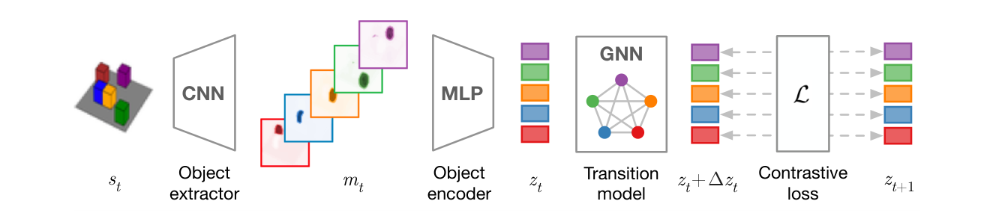

# C-SWM 原理总结

论文：**Contrastive Learning of Structured World Models**，Thomas Kipf、Elise van der Pol、Max Welling，ICLR 2020。[论文信息](https://arxiv.org/abs/1911.12247)

## 原文方法图

原文图 1：$s_t$ 经 CNN object extractor 产生 $K$ 张特征图（每个 slot 对应一个物体），共享 MLP 编码成 object latent $z_t$；GNN transition model 在这些 latent 上前进一步得到 $z_t+\Delta z_t$；对比损失 $\mathcal L$ 把"加了转移的预测"与真实后继 $z_{t+1}$ 拉近，与批次里其他候选状态推远。[图片来源：论文 PDF 第 3 页](https://arxiv.org/pdf/1911.12247#page=3)

## 做了什么

从原始像素学结构化世界模型：每个状态嵌入是一组对象表征及其关系，关系由图神经网络建模，物体发现不需要任何标注。环境是组合性场景：可推动方块、两个 Atari 游戏（Pong、Space Invaders）、三体引力模拟，全部用随机策略采集经验。[原文摘要、第 4.1 节](https://arxiv.org/pdf/1911.12247#page=5)

## 对象因子 + 图转移

抽象状态空间按物体因子化（原文第 2.3 节）：

$$
\mathcal Z=\mathcal Z_1\times\cdots\times\mathcal Z_K,\qquad
\bar z_t=(z_t^1,\ldots,z_t^K),
$$

转移模型在因子化状态上做一步更新，等价于让物体图从 $G_t$ 滚到 $G_{t+1}$；动作以 per-object one-hot 进入转移（某物体无动作则为零向量）。训练用 energy-based hinge 损失（原文式 1）：

$$
\mathcal L=d\big(z_t+T(z_t,a_t),\,z_{t+1}\big)+\max\big(0,\,\gamma-d(\tilde z_t+T(\tilde z_t,a_t),\,z_{t+1})\big),
$$

其中 $\tilde z_t$ 是批次中采样的其他状态；hinge 只放在负样本项上。[原文第 2—2.3 节](https://arxiv.org/pdf/1911.12247#page=3)

## 为什么对比而不重建像素

重建目标会把模型容量耗在与决策无关的纹理细节上，而对比目标只要求在抽象状态空间里区分"真后继"和"其他可能后继"。作者以此解释 C-SWM 在结构化环境里超过典型像素重建世界模型（E2C 类）的实验结果；这是其受测环境范围内的结论，不是普适证明。[原文摘要、第 4 节](https://arxiv.org/pdf/1911.12247#page=5)

## 它没有的东西

输入始终是单视角序列，相机固定，所以"同一物体在别的视角长什么样"这个问题在其设定里不存在；图节点的跨帧身份靠同一视角下物体外观与位置的连续性隐式保证；物体 slot 来自 CNN 特征图的隐式竞争（主实验每个 slot 一张特征图），不是显式检测。[原文第 2.3 节](https://arxiv.org/pdf/1911.12247#page=3)

## 对当前研究的意义

**强相关（另一半拼图）：它给出"对象因子 × 图交互动力学"的标准形态 $G_t, a_t\to G_{t+1}$，但完全没碰跨视角对应。**

对跨车世界模型的启发是推论性的：如果本车与邻车观测都能因子化成物体图，跨车对应就可以升格为"图节点对应"（同一辆真实车辆 = 两张图中的对应节点），可能比像素级对应更稳；但 C-SWM 本身没有做这件事，这属于本文要补的桥，不是它的结论。

**一句话：C-SWM 证明可以从像素学到"object latent + GNN 转移"的结构化世界模型，并用对比目标免去像素重建；它的世界里只有一个视角，图节点的身份从不需要跨视角对齐。**

相关：[[G-SWM总结]]（把这条线推向生成式想象与多模态未来）；总笔记：[[跨Agent视角对应的训练价值与单车推理结论]]。
