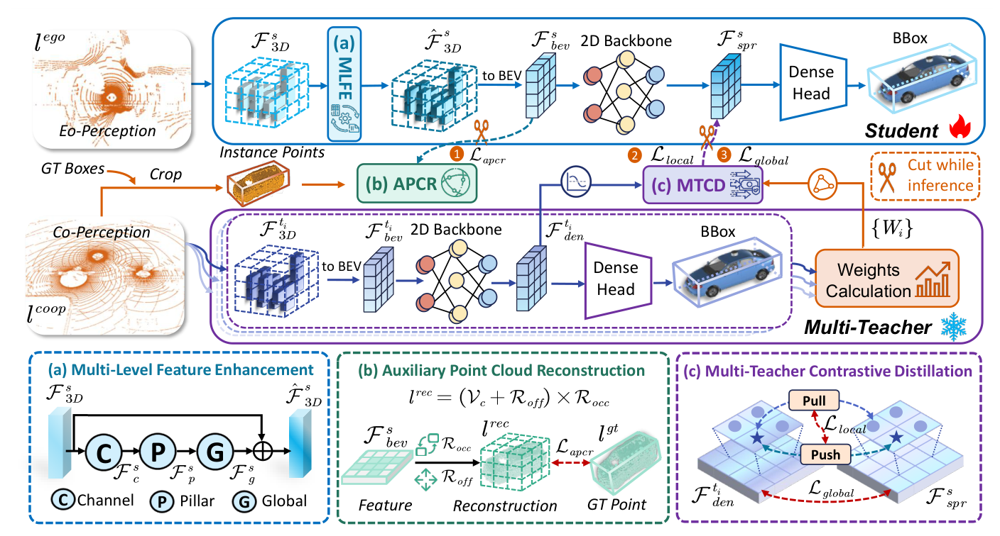

# C2E 原理总结

论文：**C2E: Boosting Ego-Only 3D Object Detection via Multi-Teacher Contrastive Knowledge Distillation**，2026 年 7 月预印本。C2E 表示 Co-Perception to Ego-Perception，方法框架称为 M2S。[论文](https://arxiv.org/abs/2607.01827)

## 原文方法图

原文图 2：上方是本车学生分支，下方是多 Agent 协同教师分支，通过 MLFE、APCR 与 MTCD 等模块传递训练监督。教师侧拥有的协同信息不等于学生推理时仍需接收其他车辆输入。[图片来源：论文 PDF 第 4 页](https://arxiv.org/pdf/2607.01827#page=4)

## 做了什么

训练时借助多 Agent 协同感知教师，提升只接收本车点云的学生检测器；推理时只运行学生，不再交换其他 Agent 的信息。

它正面研究“其他车辆的信息能否变成本车模型的训练监督”，但任务是 LiDAR 3D 目标检测，不是未来状态预测。[原文第 1、3.1 节](https://arxiv.org/html/2607.01827)

## 教师和学生分别看到什么

机制示意：

$$
T(P_{\mathrm{ego}},P_{\mathrm{others}})
\xrightarrow{\text{训练监督}}
S(P_{\mathrm{ego}}).
$$

教师处理同场景的多 Agent 点云，学生始终只接收本车点云。对应关系体现为：用同一场景的协同特征，监督本车稀疏观测产生的特征，而不是把其他车辆的数据当成无关独立样本。[第 3.1 节、图 2](https://arxiv.org/html/2607.01827#S3.SS1)

## 为什么不是直接做普通蒸馏

多车点云更完整，本车点云更稀疏，两者的输入和特征分布存在差距。论文组合三项设计：

- **MLFE**：增强学生的多层次特征；
- **APCR**：辅助点云重建，帮助缩小点云层面的差距；
- **MTCD**：多教师对比蒸馏，向学生传递协同表征知识。

这里的对比蒸馏服务于教师到学生的知识迁移，不是多车在线协商动作。[第 3 节](https://arxiv.org/html/2607.01827#S3)

## 为什么推理可以只使用本车

学生的训练输入与部署输入都是本车点云，其他 Agent 的信息在训练时通过监督影响学生参数。[第 3.1 节](https://arxiv.org/html/2607.01827#S3.SS1)

https://arxiv.org/html/2607.01827)

