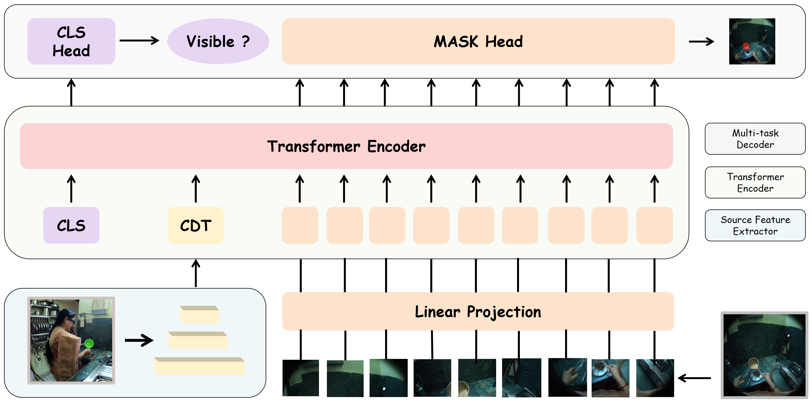

# CCMP 原理总结

论文：**Learning Cross-View Object Correspondence via Cycle-Consistent Mask Prediction**，Shannan Yan, Leqi Zheng, Keyu Lv, Jingchen Ni, Hongyang Wei, Jiajun Zhang, Guangting Wang, Jing Lyu, Chun Yuan, Fengyun Rao，**CVPR 2026**。[CVF openaccess PDF](https://openaccess.thecvf.com/content/CVPR2026/papers/Yan_Learning_Cross-View_Object_Correspondence_via_Cycle-Consistent_Mask_Prediction_CVPR_2026_paper.pdf)；[arXiv:2602.18996](https://arxiv.org/abs/2602.18996)；[代码](https://github.com/shannany0606/CCMP)。

## 原文方法图

原文 Figure 1（从作者上传的 arXiv 源码 `fig/overview.png` 取得）：源视图查询掩码经模型转到目标视图得到预测掩码，再反投影回源视图重构原始查询掩码；该双向约束构成自监督，并支持推理时的测试时训练（TTT）。[图片来源：CVF 论文 PDF / arXiv 源码](https://openaccess.thecvf.com/content/CVPR2026/papers/Yan_Learning_Cross-View_Object_Correspondence_via_Cycle-Consistent_Mask_Prediction_CVPR_2026_paper.pdf)

## 做了什么

CCMP 把跨视角物体对应形式化为条件二值分割：给定源视图的物体查询掩码 $M_q$ 和目标视图图像 $I_t$，模型预测目标视图中同一物体的掩码 $\hat M^t$。它不依赖传统共视或静态场景假设，而是用 DINOv3 作骨干，引入一个 Cross-view Directional Token（CDT）把源图像信息注入 ViT，用极小改动实现跨视角对齐。核心创新是循环一致性训练目标。

## 条件二值分割与 CDT

查询掩码 $M_q$ 被编码进单个条件令牌 CDT，注入视觉 Transformer 以引导目标视图的二值掩码预测。骨干为 DINOv3，改动保持与预训练权重兼容。这与 V²-SAM 不同：CCMP 不用 SAM2、不显式生成坐标/视觉提示，而是把源信息压缩进一个令牌、直接做分割。

## 循环一致性损失：A→B 找物体，B→A 重构掩码

前向用目标视图真值做标准二值分割监督（$\mathcal{L}_{\text{aux}}$）；额外引入循环一致性：把预测的目标掩码 $\hat M^t$ 反投影（back-project）回源视图，重构原始查询掩码，并与已知查询掩码比较：

$$\mathcal{L}_{\text{cycle}}=\mathcal{L}_{\text{mask}}\!\big(M_q,\ \Psi(\hat M^t)\big),$$

其中 $\Psi$ 是把目标视图掩码映射回源视图的（几何/可学习）反投影。总训练目标为：

$$\mathcal{L}=\mathcal{L}_{\text{aux}}+\lambda\,\mathcal{L}_{\text{cycle}}.$$

$\mathcal{L}_{\text{cycle}}$ 不需要目标视图真值，只用源查询掩码（训练时已给定），因此是无额外标注的自监督信号。

## 为什么循环一致性强迫 view-invariant object latent

query 掩码 $M_q$ 编码成一个隐表示 $z$；前向把它"翻译"成目标掩码，再经 $\Psi$ 译回源视图。若 $z$ 携带了视角相关的外观或机位捷径，往返一次就会失配；只有对视角不变的物体语义才能让 $\hat M^t$ 反投影后高保真重构 $M_q$。循环约束因此把 $z$ 推向 view-invariant 的物体 latent，而非记忆某一视角的外观。

## 测试时训练（TTT）

由于 $\mathcal{L}_{\text{cycle}}$ 不依赖目标真值，推理时可用它在本样本上继续优化（几个梯度步）即 TTT：

$$\theta^*=\arg\min_\theta\ \mathcal{L}_{\text{cycle}}\big(M_q,\ \Psi(f_\theta(I_t;M_q))\big).$$

默认 Ego2Exo 用 2 步、Exo2Ego 用 6 步。

## 关键实验与对照

- **Ego-Exo4D（Table 1）**：CCMP 的 mIoU 44.57，超过此前 SOTA O-MaMa 的 43.32 与 ObjectRelator 的 37.79；在 VA/CA 上显著更高（Ego VA 98.92 vs O-MaMa 50.00）。同评测协议下的直接对照，支持循环一致性 + TTT 优于前 SOTA。
- **HANDAL-X（Table 2 / 8）**：仅用 Ego-Exo4D 微调 IoU 78.8（Table 2），加 HANDAL-X 微调达 85.0；Table 8 显示 TTT 把仅 Ego-Exo4D 微调从 78.8 提到 80.6、联合微调从 85.0 提到 85.3。
- **消融（Table 3）**：去掉 $\mathcal{L}_{\text{cycle}}$，mIoU 从 44.57 降到 43.05（-1.52）；去掉 TTT，mIoU 从 44.57 降到 42.99（-1.58）。这支持两点因果主张：循环一致性自监督本身有用，且 TTT 在推理时进一步生效。

注意：这些提升都来自对应/分割精度对照，不是面对遮挡动力学或未来轨迹；消融是移除组件的相对下降，支持"该组件贡献了收益"，但不是与无关基线的严格单因素实验。

## 与单车世界模型的关系及边界

它支持：① 把一个视角的物体掩码"翻译"成另一视角同一物体的掩码，并用循环一致性把物体表示逼成视角不变——这正是跨车对应要做的事：把邻车视角下某物体的观测，对应回本车视角下同一物体；② 循环一致性可作为不依赖目标真值的自监督，与本项目"把互补观测转成本车训练监督"的机制一致；③ TTT 表明这类自监督约束在部署样本上仍可继续生效。

它没有证明：① 数据是 ego–exo（可穿戴 + 固定第三人称），不是车–车跨 Agent，也无自动驾驶场景；② 模型是逐帧对应/分割，没有动作、没有时序动力学、没有未来预测或 rollout；③ view-invariant 物体 latent 不等于可预测该物体未来的动力学状态，未涉及遮挡下的轨迹外推。

**一句话：CCMP 用"A→B 预测掩码、B→A 重构原掩码"的循环一致性把物体表示逼成视角不变，并借测试时训练进一步提升，但它止步于跨视角物体对应，没有进入单车未来预测。**

整体结论与拟议实验见 [[跨Agent视角对应的训练价值与单车推理结论]]。相关：[[V2-SAM总结]]（同任务、但用 DINOv3 几何锚点 + SAM2 多专家）、[[ObjectRelator总结]]（其直接基线）、[[O-MaMa总结]]（前 SOTA 基线）、[[XVWM总结]]（跨视角世界模型，已把对应推进到未来预测）、[[C2E总结]]（跨 Agent 知识蒸馏到单车感知）。
