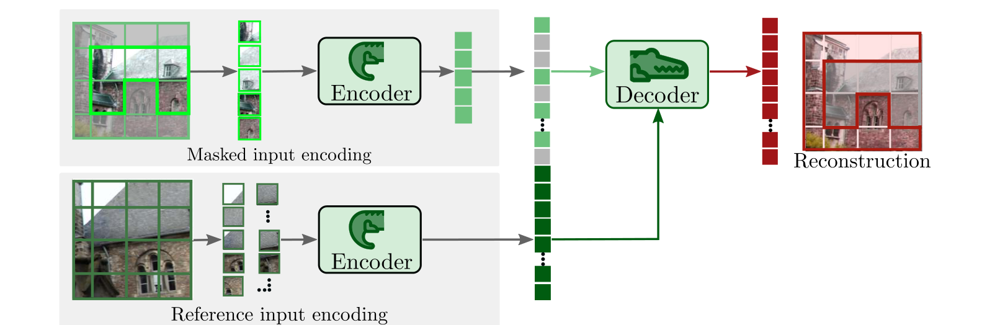

# CroCo 原理总结

论文：**CroCo: Self-Supervised Pre-training for 3D Vision Tasks by Cross-View Completion**，Philippe Weinzaepfel 等，NeurIPS 2022；本笔记对应 arXiv v2。[论文信息](https://arxiv.org/abs/2210.10716v2)

## 原文方法图

原文图 3：被遮掩的目标图像与参考视角分别经过共享编码器，解码器利用两者的特征重建目标图像。这是跨视角预训练架构，不表示下游单目任务也必须输入参考视角。[图片来源：论文 PDF 第 3 页](https://arxiv.org/pdf/2210.10716v2#page=3)

## CroCo 做了什么

CroCo 用同一场景的另一视角，帮助重建当前视角中被 mask 的图像区域，从而预训练适合几何任务的视觉表征。它不是未来帧预测模型，也不是联合动作条件下的多智能体世界模型。[原文摘要](https://arxiv.org/abs/2210.10716v2)

## 为什么需要另一视角

单图像补全时，被遮住的区域可能存在多种合理内容，模型容易依赖外观和语义先验猜测。若另一视角恰好看到了相关区域，跨视角几何对应就能为重建提供更具体的依据。

另一视角并不保证解除所有歧义：收益仍取决于场景重叠、可见性和模型是否能理解两个视角的空间关系。[原文引言](https://arxiv.org/pdf/2210.10716v2#page=2)

## 两个视角怎样进入模型

目标图像 $x^A$ 大部分 patch 被 mask，参考图像 $x^B$ 保持完整；两者分别经过共享参数的编码器，解码器结合两个视角的信息重建 A：

$$
\hat x^A=D_\phi\big(E_\theta(\tilde x^A),E_\theta(x^B)\big).
$$

简化后的训练目标为：

$$
\mathcal L_{\mathrm{CroCo}}
=
\frac{1}{|M|}
\sum_{p\in M}
\|\hat x_p^A-x_p^A\|_2^2,
$$

其中 $M$ 是 A 中被 mask 的 patch 集合，原文还比较了目标 patch 归一化的版本。[第 3 节、公式 1—2](https://arxiv.org/pdf/2210.10716v2#page=4)

这个写法也解释了“显式关联”：虽然编码器分别处理两张图，但 A 的预测依赖与它配对的 B。不是两个视角各算各的重建 loss。

## 为什么下游可以只用单张图像

跨视角预训练完成后，单目任务丢弃原来的跨视角解码器，只保留编码器并接下游任务头进行微调。测试时输入单张图像，例如预测单目深度；其收益来自预训练参数，而不是部署时仍访问参考视角。[第 3 节末及第 4.1 节](https://arxiv.org/pdf/2210.10716v2#page=6)

## 相同图像数据下的关键对照

论文用同一批 Habitat 图像、相同 ViT-Base 骨干训练 MAE 作为对照。NYUv2 单目深度的 $\delta_1$ 指标中，MAE 为 **79.0%**，CroCo 为 **85.6%**，提高 **6.6 个百分点**；语义分割结果则相近。这支持跨视角预训练对几何迁移的价值，而不是“所有任务都显著提升”。[第 4.1 节、表 3](https://arxiv.org/pdf/2210.10716v2#page=8)

同数据、同编码器不等于所有计算条件完全相同：两种方法的解码结构、输入组织和训练目标有差异，不能把它写成仅改变配对关系的严格单因素实验。

## 与单车世界模型的关系及边界

它支持：训练时利用相关视角的几何信息，收益可以保留在单图像模型中。它没有证明：跨车配对必然改善动作条件预测、行人未来轨迹或世界模型多步 rollout。将几何表征收益转化为动力学收益，仍需要专门实验。

**一句话：CroCo 用另一视角把“凭上下文猜补全”变成“利用场景几何找依据”，并验证了这种预训练能改善单视角下游几何任务。**

整体结论与拟议实验见 [[跨Agent视角对应的训练价值与单车推理结论]]。
