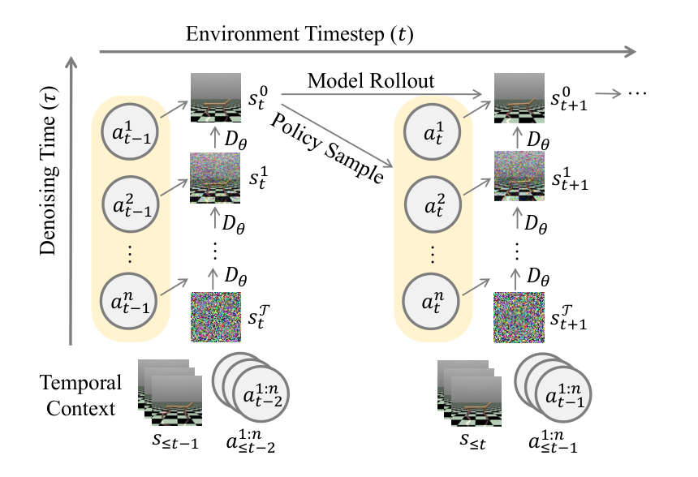
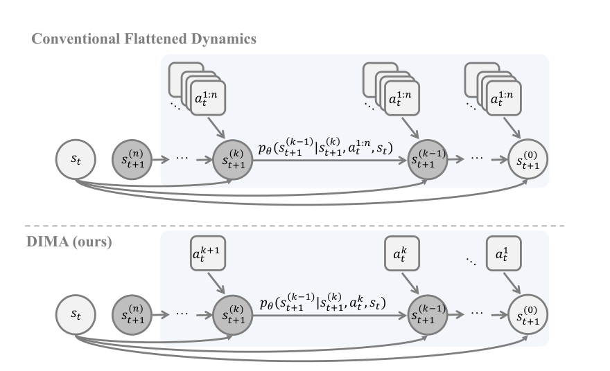
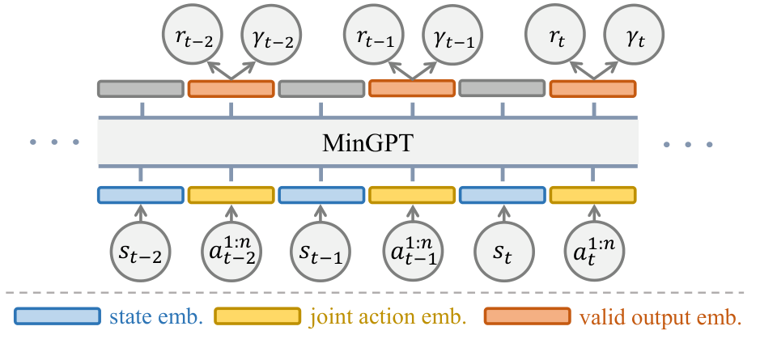

# DIMA 原理总结

## DIMA 做了什么

DIMA 的任务是根据当前全局状态和所有 Agent 的动作，预测下一时刻的全局状态：

$$
P(s_{t+1}\mid s_t,a_t^1,a_t^2,\ldots,a_t^n).
$$

传统方法把所有 Agent 的动作一次性输入世界模型：

$$
(s_t,a_t^1,a_t^2,\ldots,a_t^n)\rightarrow s_{t+1}.
$$

DIMA 没有一次性融合所有动作，而是让每个 Agent 的动作依次参与一次 diffusion 去噪，在多次去噪中逐步确定下一全局状态。

*图 1：横向表示环境时间步，纵向表示 diffusion 去噪过程；每个环境时间步内部依次使用各 Agent 的动作完成下一全局状态预测。*

它的核心思想可以概括为：

$$
\boxed{\text{把 Agent 维度变成 diffusion 的逐步去噪维度}}
$$

*图 2：传统方法在每个去噪步骤中输入完整 joint action；DIMA 在每一步只输入一个 Agent 的动作，逐步修正同一个下一全局状态。*

## 逐步去噪过程

假设系统中有三个 Agent，它们的动作为：

$$
a_t^1,a_t^2,a_t^3.
$$

DIMA 首先生成一个带有强噪声的下一状态：

$$
s_{t+1}^{(3)}\sim\mathcal N(0,I).
$$

然后依次使用三个 Agent 的动作进行去噪：

$$
s_{t+1}^{(3)}
\xrightarrow[a_t^3]{s_t}
s_{t+1}^{(2)}
\xrightarrow[a_t^2]{s_t}
s_{t+1}^{(1)}
\xrightarrow[a_t^1]{s_t}
s_{t+1}^{(0)}=s_{t+1}.
$$

其概率分解为：

$$
p(s_{t+1}^{(n)})
\prod_{k=1}^{n}
p_\theta\left(
s_{t+1}^{(k-1)}
\mid
s_{t+1}^{(k)},a_t^k,s_t
\right).
$$

这个过程可以这样理解：

1. 没有输入任何 Agent 的动作时，模型对下一状态几乎一无所知；
2. 输入第一个 Agent 的动作后，模型排除一部分不可能的未来；
3. 输入第二个 Agent 的动作后，下一状态进一步明确；
4. 所有 Agent 的动作都进入后，得到最终的下一全局状态。

这与 diffusion 从噪声逐渐恢复干净样本的过程相似：

$$
\text{noise}\rightarrow\text{less noise}\rightarrow\text{clean state}.
$$

## 它不是依次预测每个 Agent

DIMA 并不是先预测 Agent 1 的状态，再预测 Agent 2 和 Agent 3 的状态。

整个去噪过程中，被处理的变量始终是同一个：

$$
\boxed{s_{t+1}}
$$

也就是下一时刻的全局状态。

$s_{t+1}^{(3)}$、$s_{t+1}^{(2)}$ 和 $s_{t+1}^{(1)}$ 只是这个全局状态在不同噪声强度下的中间版本。每次去噪使用一个 Agent 的动作作为条件，中间状态负责保存前面动作已经提供的信息。

因此，DIMA 的变化不在于“每一步预测哪个 Agent”，而在于“每一步使用哪个 Agent 的动作来修正同一个全局未来”。

## Agent 动作如何进入模型

传统 diffusion 世界模型通常在每个去噪步骤都输入完整的 joint action：

$$
a_t^{1:n},a_t^{1:n},a_t^{1:n},\ldots
$$

DIMA 在不同去噪步骤中依次输入不同 Agent 的动作：

$$
a_t^n,a_t^{n-1},\ldots,a_t^1.
$$

每一步的 denoiser 可以写成：

$$
D_\theta
\left(
s_{t+1}^{\tau};
\sigma(\tau),s_t,a_t^k
\right)
\rightarrow s_{t+1}.
$$

它接收四类信息：

- 当前带噪的下一状态 $s_{t+1}^{\tau}$；
- 当前噪声强度 $\sigma(\tau)$；
- 当前全局状态 $s_t$；
- 本次去噪所对应的 Agent 动作 $a_t^k$。

模型的训练目标是从任意噪声强度和任意 Agent 动作条件下恢复真实的 $s_{t+1}$。

## 为什么要随机打乱动作顺序

给定相同的当前状态和联合动作，最终的下一状态不应该因为动作的输入顺序不同而变化。

DIMA 在训练时随机采样 Agent 的排列：

$$
\rho\sim\mathrm{Perm}(1,2,\ldots,n).
$$

模型可能先看到 Agent 3，也可能先看到 Agent 1，但所有排列都被要求恢复同一个真实下一状态。这样可以让模型学习对 Agent 输入顺序保持稳定。

## DIMA 如何进行世界模型 Rollout

DIMA 预测的是全局状态，但每个 Agent 的策略只接收自己的局部观测。因此系统还需要一个 state decoder，把全局状态转换为各 Agent 的 observation：

$$
s_t
\xrightarrow{g_\phi}
(o_t^1,o_t^2,\ldots,o_t^n).
$$

每个 Agent 根据自己的局部观测选择动作：

$$
a_t^i\sim\pi_i(a\mid o_t^i).
$$

所有动作组成 joint action 后，DIMA 通过逐步去噪预测下一全局状态：

$$
(s_t,a_t^{1:n})
\xrightarrow{\text{DIMA}}
s_{t+1}.
$$

另外一个 Transformer 根据状态和联合动作的历史序列预测：

$$
(r_t,\mathrm{done}_t).
$$

*图 3：Transformer 交替接收 global state embedding 和 joint action embedding，并分别预测每个时间步的 reward $r_t$ 与 termination $\gamma_t$。*

得到 $s_{t+1}$ 后，state decoder 再生成下一时刻各 Agent 的局部观测，所有 Agent 继续选择动作，从而形成多步 imagined rollout。

完整过程是：

$$
s_t
\rightarrow
(o_t^1,\ldots,o_t^n)
\rightarrow
(a_t^1,\ldots,a_t^n)
\rightarrow
s_{t+1}
\rightarrow
(o_{t+1}^1,\ldots,o_{t+1}^n).
$$

## DIMA 与策略训练的关系

DIMA 的世界模型使用 global state 和 joint action，因此它是中心化的。

策略部分采用 Actor-Critic：

- Actor 只使用各自的 local observation；
- Critic 使用 global state；
- DIMA 在全局状态空间中生成 imagined trajectories；
- Actor 和 Critic 使用这些 imagined trajectories 更新。

因此，DIMA 的整体训练方式属于：

$$
\boxed{\text{Centralized Training, Decentralized Execution（CTDE）}}
$$

需要区分的是：去中心化的是每个 Agent 的 Actor，DIMA 世界模型本身仍然是中心化的。

## 为什么要使用多智能体世界模型

DIMA **关注的是多个 Agent 的动作如何共同影响同一个环境**。各 Agent 的动作及其影响存在关联，因此需要在联合动力学中建模这些交互，而不能只把每个 Agent 的变化孤立地预测。论文通过逐 Agent 动作条件化的去噪过程，逐步预测统一的下一全局状态（原文引言及第 3.1 节）。

## CTDE 下的优势：保留全局状态信息

论文第 3.2 节明确指出：DIMA 直接预测全局状态，因此在 imagined rollout 中仍能利用全局状态提供的额外信息，训练 centralized critic，再由 critic 指导只使用局部观测的 decentralized actors。

这一优势依赖训练阶段能够获得相应的全局状态；执行阶段，各 Agent 的 actor 仍只使用允许获得的局部观测，并不是把全局信息直接交给每个 Agent。

## 是否讨论了多视角相对于单视角的优势

没有直接讨论或验证视觉意义上的多视角优势。附录 G.1 明确说明，其实现处理的是连续、非视觉的全局状态和联合局部观测。因此，不能把这篇论文作为“多摄像头视角融合、遮挡互补或跨视角一致性优于单视角”的直接证据。

DIMA 中的 state decoder 是从全局状态生成各 Agent 的局部观测，并非把多个局部视觉视角融合成全局状态；随机打乱 Agent 动作顺序所追求的稳定性，也不是视觉视角变化下的表征不变性。

因此，DIMA 可以支持“联合建模多个 Agent 的动作影响”以及“利用全局状态改善 CTDE 训练”的讨论，但不能直接支持前面第四点所说的“通过显式关联不同 Agent 视角，学习跨视角一致表征”。后者需要另外的研究依据。

## 最后总结

DIMA 的完整逻辑是：

1. 把下一全局状态加噪；
2. 在每次去噪时只输入一个 Agent 的动作；
3. 用中间的 noisy global state 累积不同 Agent 动作的影响；
4. 所有动作依次进入后，恢复下一全局状态；
5. 将该过程重复多次，生成 imagined trajectory；
6. 使用 imagined trajectory 训练各 Agent 的策略。

最核心的一句话是：

> DIMA 不再把所有 Agent 动作一次性塞进世界模型，而是让它们依次参与对同一个下一全局状态的逐步修正。
