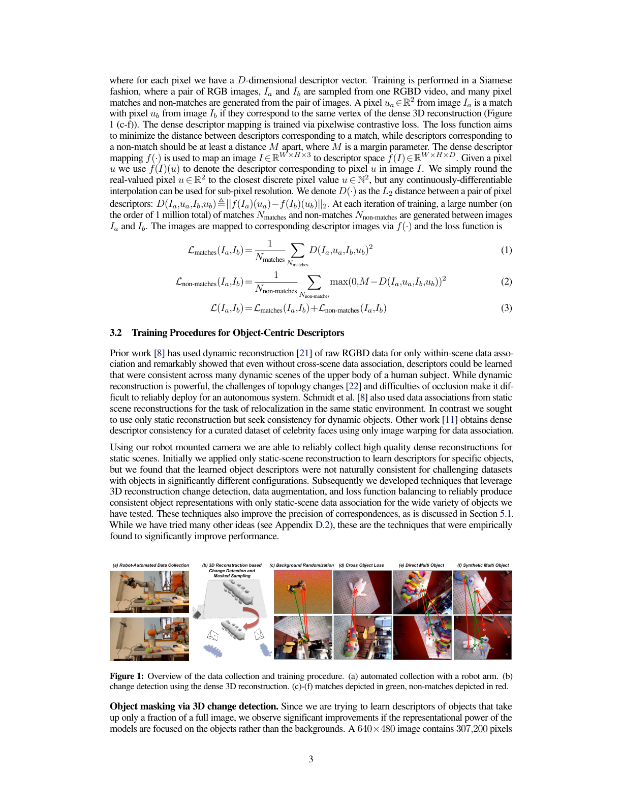

# Dense Object Nets 原理总结

论文：**Dense Object Nets: Learning Dense Visual Object Descriptors By and For Robotic Manipulation**（DON），Peter R. Florence、Lucas Manuelli、Russ Tedrake，CoRL 2018，PMLR 87:373–385。[PMLR 页面](https://proceedings.mlr.press/v87/florence18a.html) ｜ [PDF](http://proceedings.mlr.press/v87/florence18a/florence18a.pdf) ｜ [代码](https://github.com/RobotLocomotion/pytorch-dense-correspondence)

## 原文方法图

原文图 1 一类的总览：用相机位姿与深度把不同视角的像素反投影到同一三维重建上，自动生成 match / non-match 监督，训练稠密 descriptor。[图片来源：论文 PDF](http://proceedings.mlr.press/v87/florence18a/florence18a.pdf)

## 做了什么

学一个从整张 RGB 图到稠密 descriptor 图的映射 $f:\mathbb{R}^{W\times H\times 3}\mapsto \mathbb{R}^{W\times H\times D}$，使得**同一个物理点在不同视角、不同形变状态下**的 descriptor 接近，不同物理点的 descriptor 至少相距一个 margin。得到的 descriptor 直接用于机器人抓取指定部位、以及把抓取在同类物体之间迁移。[摘要、§3.1](http://proceedings.mlr.press/v87/florence18a/florence18a.pdf)

## 对应关系从哪来

不需要人工标注。采集时用机械臂举着 RGB-D 相机绕物体运动，得到一段注册好的 RGB-D 视频；利用**深度 + 相机位姿**把像素反投影到稠密三维重建上：两个视角的像素若对应三维重建的同一个顶点，就是 match，否则是 non-match。这一步自动生成监督，单次迭代就能产生约百万量级的正负样本对。[§3.1—3.2](http://proceedings.mlr.press/v87/florence18a/florence18a.pdf)

## 损失

用 Siamese 方式采样图像对 $(I_a, I_b)$，先定义 descriptor 距离

$$
D(I_a,u_a,I_b,u_b)\triangleq \lVert f(I_a)(u_a)-f(I_b)(u_b)\rVert_2,
$$

训练目标是 match 项与 non-match 项之和：

$$
\mathcal L_{\text{matches}}=\frac{1}{N_{\text{matches}}}\sum D(\cdot)^2,\qquad
\mathcal L_{\text{non-matches}}=\frac{1}{N_{\text{non-matches}}}\sum \max\big(0,\,M-D(\cdot)\big)^2,
$$

$$
\mathcal L=\mathcal L_{\text{matches}}+\mathcal L_{\text{non-matches}}.
$$

$M$ 是 margin。第一项把同一物理点拉近，第二项防止所有像素塌缩成同一个 descriptor。[原文式 1—3](http://proceedings.mlr.press/v87/florence18a/florence18a.pdf)

这个形式值得记住：它是**"跨视角配对 → 监督信号"最朴素的写法**——配对不是靠标签给的，是靠几何（位姿 + 深度）算出来的。

## 关键实验与边界条件

- 训练一个新物体约 **20 分钟**，可用于此前未见过的物体，包括非刚性物体（如鞋子、毛绒玩具）。
- 改变训练流程可以在两种 descriptor 之间切换：**跨类别通用**或**实例级区分**。原文表明在已知类别标签时可以让不同物体的 descriptor 子集分离，但没有给出去掉真值类别标签的实现方案。
- 机器人实验：跨形变构型抓取物体上的指定点；用类别通用 descriptor 在同类物体间迁移特定抓取。[摘要、§5](https://proceedings.mlr.press/v87/florence18a.html)

注意这套方法的监督质量**依赖深度图质量**：后续工作指出消费级深度相机在小物体上会明显限制匹配精度，融合重建还会过度平滑、丢失几何细节。

## 与单车世界模型的关系及边界

它支持：**"同一物理点在不同视角下应当有一致表示"这件事可以被学出来**，而且是最早一批把它接到真实机器人任务上的证据。它提供的是局部/部件级别的一致，比全局视角对齐更细，这正是"跨车对应"里"同一个行人的同一部位"这一层想要的粒度。

它没有证明：场景层面的动力学收益。DON 是**单物体、准静态**设定：场景里基本只有一个目标物体，没有多物体交互、没有时间转移、没有动作条件、更没有未来预测。它的跨视角一致靠的是显式几何（位姿 + 深度），在跨车场景里等价于要求跨车外参与时间同步，这本身就是一套前置代价，不能直接假设成立。

**一句话：DON 用多视几何自动生成像素级对应监督，学出"同一物理点跨视角一致"的稠密 descriptor 并接到真实抓取上；它是部件级跨视角一致性的经典证据，但没有场景、没有多物体、没有动力学。**

整体结论与拟议实验见 [[跨Agent视角对应的训练价值与单车推理结论]]。相关：[[NeuralDescriptorFields总结]]（把 2D dense descriptor 推到 SE(3) 等变的 3D descriptor field，并以 DON 作为主基线）、[[F3RM总结]]、[[GARField总结]]。
