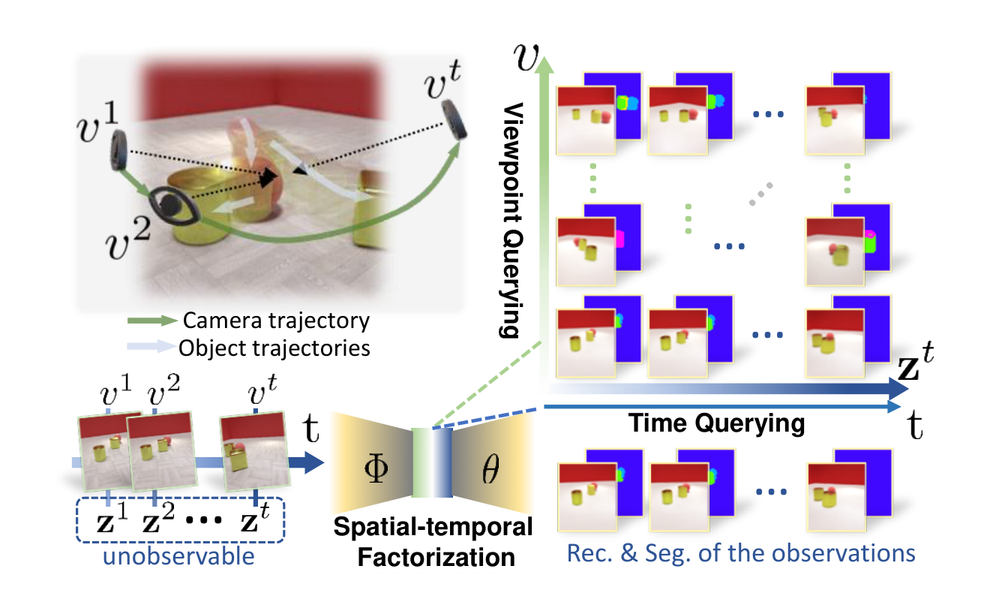

# DyMON 原理总结

论文：**Object-Centric Representation Learning with Generative Spatial-Temporal Factorization**（模型名 DyMON，Dynamics-aware Multi-Object Network），Li Nanbo、Muhammad Ahmed Raza、Hu Wenbin、Zhaole Sun、Robert B. Fisher，NeurIPS 2021；本笔记对应 arXiv v1。[论文信息](https://arxiv.org/abs/2111.05393)

## 原文方法图

原文图 1：左上是"观察者与物体同时在动"的多视角动态场景，绿色箭头是相机轨迹、白色箭头是物体轨迹；底部是把图像序列因子化成按时间索引的物体 latent $z^t$；右侧网格表示训练后可以沿视角轴（Viewpoint Querying）和时间轴（Time Querying）独立查询、重建并分割观测。[图片来源：论文 PDF 第 3 页](https://arxiv.org/pdf/2111.05393#page=3)

## 做了什么

把 [[MulMON总结|MulMON]] 的多视角物体因子化推广到动态场景：输入是相机本身也在移动的多视角动态观测序列，模型要在无监督下把"观察者运动"和"场景物体运动"这两种效应从混合观测里分离开，得到按时间索引的对象中心 latent；之后可以沿空间（任意视角）和时间（观测区间内任意时刻）两个方向独立查询生成。[原文摘要、第 3 节](https://arxiv.org/pdf/2111.05393#page=3)

## 它要解开的纠缠：temporal entanglement

GQN 和 MulMON 都依赖静态场景假设：固定场景 latent、干预视角。动态场景下这一招失效——同一个时刻 $t$，观察者不可能从两个不同视角各拍一张，所以数据里 $z^t$ 与 $v^t$ 纠缠在一起（$z^t \not\perp v^t \mid x^t$），作者称之为 temporal entanglement。[原文第 2—3 节](https://arxiv.org/pdf/2111.05393#page=3)

## 怎么把相机运动和物体运动分开

原文把场景和观察者写成两个独立的动力系统（概念模型，不是被学习的网络）：

$$
z_{t+\Delta t}-z_t=f_z(z_t,t)\,\Delta t,\qquad
v_{t+\Delta t}-v_t=f_v(v_t,t)\,\Delta t,
$$

并附加两个训练假设：**A1 高帧率**（$\Delta t\to 0$，短窗内近似静止）与**A2 速度差大**（数据属于慢相机快物体 SCFO 或快相机慢物体 FCSO 之一）。满足 A2 后，一段序列可以近似看成"单视角动态场景"或"多视角静态场景"二者之一，纠缠就解开了。训练时把长的移动相机动态序列切成短子序列，并只按视角速度 $|f_v|$ 把样本聚成 SCFO/FCSO 两簇分别处理。[原文第 3.1、3.3 节](https://arxiv.org/pdf/2111.05393#page=4)

## 场景怎么分解成物体 latent

空间因子化沿用 MulMON：生成模型是视角条件的空间高斯混合，$K$ 个物体 slot 竞争解释每个像素（soft 分割）；推断用迭代摊销推断，上一步的后验当作下一步的先验，$q_\Phi(z^t\mid x^t,v^t,z^{<t})$，因此时间推进就发生在推断本身里。训练目标是 ELBO 加查询视角的对数似然：

$$
\mathcal L=\mathrm{ELBO}+\beta\cdot \mathrm{LL}_{\mathrm{query}}.
$$

[原文第 3.2、3.3 节、式 2—4](https://arxiv.org/pdf/2111.05393#page=5)

## 与单车世界模型的关系及边界

它支持：多视角动态观测中，自车（观察者）运动与他车（物体）运动的分离可以无监督地完成，并保留在对象因子化的 latent 里——"把自车视角变化从场景动态中剥出来"正是跨车对应要解的纠缠之一。

它没有证明：这种分离在速度差不大的真实路况（如路口同速会车）仍然成立，也没有把物体动态建成可外推 rollout 的交互动力学，更没有动作条件。

**一句话：DyMON 证明在多视角动态序列里可以无监督地把"相机在动"和"物体在动"分进按时间索引的物体 latent，并支持换视角、换时刻的生成；但它没有物体关系图，连显式转移模型也没有，时间推进靠推断本身。**

整体结论与拟议实验见 [[跨Agent视角对应的训练价值与单车推理结论]]。相关：[[MulMON总结]]（同团队前作，DyMON 直接构建在其架构上）。
