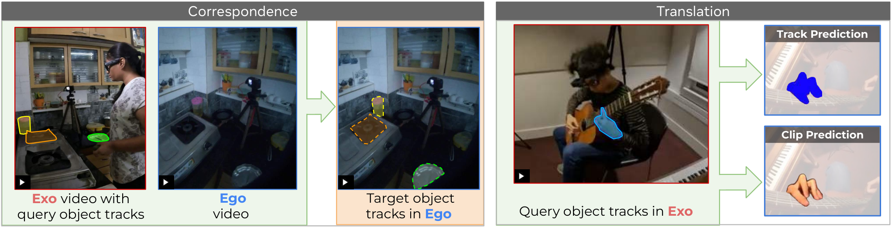

# Ego-Exo4D Correspondence 原理总结

任务来源：**Ego-Exo4D: Understanding Skilled Human Activity from First- and Third-Person Perspectives**（Grauman 等，CVPR 2024；IJCV 2025 期刊版 doi:10.1007/s11263-025-02557-6）；本笔记写的是其中的 **Ego-Exo Correspondence** 基准任务，不是一篇独立方法论文。[任务文档](https://docs.ego-exo4d-data.org/benchmarks/relations/correspondence/) ｜ [IJCV 版论文](https://link.springer.com/article/10.1007/s11263-025-02557-6) ｜ [CVPR 2024 PDF](https://www.cs.utexas.edu/~grauman/papers/ego-exo4d-CVPR2024.pdf)

## 原文方法图

原文图 15：ego-exo relation 任务族由 correspondence（物体级匹配，本笔记对象）与 translation（由一视角合成另一视角）组成。[图片来源：Ego-Exo4D 论文 PDF](https://www.cs.utexas.edu/~grauman/papers/ego-exo4d-CVPR2024.pdf)

## 任务定义

给定一对**时间同步**的第一人称（ego）与第三人称（exo）视频，以及其中一个视角里某个物体的一串 query mask，要求模型在另一视角的每一同步帧中，输出**同一物体实例**的 mask（在该物体可见的帧上）。查询可以放在 ego 视角也可以放在 exo 视角，两个方向各有难点：ego 视角遮挡严重，exo 视角物体极小。[任务文档](https://docs.ego-exo4d-data.org/benchmarks/relations/correspondence/)

关键在于"同一实例"：不是"看起来像的物体"，不是语义类别，是这一个物体。

## 输入里被刻意排除的东西

任务明确排除三类输入：

- 物体的语义标签或名称；
- 两视角之间的相机位姿关系；
- IMU 与主动测距（深度）测量。

官方理由是希望推动"开放世界"的对应方法，而不是依赖预定义物体集合或消费级相机拿不到的模态。[任务文档 Input 说明](https://docs.ego-exo4d-data.org/benchmarks/relations/correspondence/)

这一条对本研究有直接用处：**训练时可以用位姿与几何，评测/部署时不许用**——这正是"跨车配对作为训练期监督、推理时只有本车"想要的形式化协议。

## 数据规模

| 项目 | 数值 |
| --- | --- |
| 标注 mask 数 | 约 1.8M（1 fps） |
| 物体数 | 约 5.6k |
| take 数 | 1335 |
| 每个 take 有跨视角对应的物体 | 平均 5.5 个 |
| 每个物体的跟踪长度 | 平均 173 帧（不含遮挡帧） |
| 场景 | Cooking、Bike Repair、Health、Music、Basketball、Soccer |

Bouldering 与 Dance 因物体多样性不足被排除。[IJCV 版 §5.1.1](https://link.springer.com/article/10.1007/s11263-025-02557-6)

## 评测指标

- **Location Error (LE)**：预测 mask 与真值 mask 质心之间的归一化距离；
- **IoU**：预测与真值 mask 的交并比；
- **Contour Accuracy (CA)**：先把质心对齐，再比较 mask 形状相似度；
- **Visibility Accuracy**：用 balanced accuracy 评估模型能否判断目标视角里该物体**是否可见**（这个指标在全部 query 帧上计算，其余三个只在两视角都可见的帧上计算）。

可见性这一项值得注意：它把"对应关系不存在"本身变成一个要预测的量，而不是默认处处有对应。[任务文档 Metrics](https://docs.ego-exo4d-data.org/benchmarks/relations/correspondence/)

## 为什么它是"最干净"的对应定义

它把跨视角对应从"表征好不好的间接证据"（如 TCN 用表征做奖励、CroCo 用下游深度指标）变成了**可直接打分的任务**：输入明确、输出明确、指标明确、排行榜公开（[EvalAI challenge](https://eval.ai/web/challenges/challenge-page/2288/)），[基线代码](https://github.com/EGO4D/ego-exo4d-relation) 也放出来了。后续 ObjectRelator、O-MaMa、V²-SAM、CCMP 都在这个榜上报数，所以跨视角 object correspondence 已经是一个可比的独立赛道。

## 与单车世界模型的关系及边界

它支持：**"同一物体跨视角对应"是可以被定义、被标注、被量化的任务**，而且可以在不给位姿、不给语义的前提下做。这给本研究提供了评测蓝本：跨车对应不必只当作隐式的辅助损失，可以单独设一个可打分的对应任务。

它没有证明：这类对应监督能改善未来预测。任务本身是**同一时刻的 mask 匹配**，没有动作、没有时间外推、没有动力学；场景是人与物（ego-exo），不是车与车；视角差异来自穿戴相机与固定相机，而不是两个都在运动的 Agent。把它的协议搬到跨车场景，需要重新定义同步、实例 ID 与可见性判定。

**一句话：Ego-Exo4D Correspondence 把"在另一个视角里找到同一个物体"定义成了一个有数据、有指标、有排行榜的正式任务，并在输入里显式排除了位姿与语义，是本研究"跨车对应"最直接的评测蓝本。**

整体结论与拟议实验见 [[跨Agent视角对应的训练价值与单车推理结论]]。相关：[[PredictiveCycleConsistency总结]]、[[ObjectRelator总结]]、[[O-MaMa总结]]、[[CCMP总结]]。
