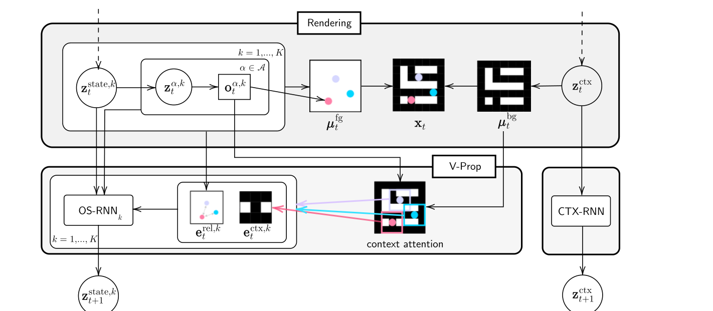

# G-SWM 原理总结

论文：**Improving Generative Imagination in Object-Centric World Models**（模型名 G-SWM，Generative Structured World Model），Zhixuan Lin、Yi-Fu Wu、Skand Peri、Bofeng Fu、Jindong Jiang、Sungjin Ahn，ICML 2020。[PMLR 正式版](https://proceedings.mlr.press/v119/lin20f.html)

注意：G-SWM 是文中模型的名字，不是论文标题；引用时标题应写 Improving Generative Imagination in Object-Centric World Models。

## 原文方法图

原文图 1：上半是 Rendering——每个物体的分层 latent（state → 属性 → 位置）解码成前景图像 $\mu^{fg}_t$，与背景 $\mu^{bg}_t$ 合成观测 $x_t$；下半是 V-Prop——OS-RNN 结合自身相对编码 $e^{rel,k}_t$、成对交互编码 $e^{pr,k}_t$（来自其他物体）和情境编码 $e^{ctx,k}_t$（context attention 从环境中抓取），把每个物体推进到下一时刻；CTX-RNN 同步更新背景。[图片来源：论文 PDF 第 4 页](https://proceedings.mlr.press/v119/lin20f/lin20f.pdf#page=4)

## 做了什么

针对对象中心生成式世界模型，回答两个问题：已有工作到底实现了"时间想象"还是只做了检测加跟踪；想要忠实的想象还缺什么能力。G-SWM 把场景分解（前景 $K$ 个物体 + 背景）、物体动力学、交互传播统一进一个生成式框架，并补上两种能力：**多模态不确定性**（同一历史可以分叉出不同未来）与 **situation-awareness**（物体行为依赖其所处局部环境，如吃豆人要贴着走廊走）。实验环境是反弹小球（含物体间碰撞交互）、迷宫、3D 真实物理场景。[原文第 1 节](https://proceedings.mlr.press/v119/lin20f/lin20f.pdf#page=2)

## 物体交互怎么进入动力学

每个物体先算自交互编码，再加权汇总其他物体对它的影响（原文式 3）：

$$
e^{pr,k}_t = e^{rel,k}_t+\sum_{j\neq k} w^{k,j}_t\, e^{k,j}_t,
\qquad
w^{k,j}_t=\mathrm{softmax}\ \text{归一化}.
$$

即每个物体的下一状态显式读入"其他物体对我的影响"，相当于一张软邻接的交互图（按注意力加权，不是严格的消息传递 GNN）；V-Prop 把它连同情境编码一起送进各物体自己的 OS-RNN。[原文第 3.3 节](https://proceedings.mlr.press/v119/lin20f/lin20f.pdf#page=4)

## 多模态未来怎么实现

高斯潜变量只能给单峰的"平均未来"。G-SWM 引入分层 latent：高层随机物体状态 latent $z^{stoch}$ 负责选模式，低层确定性 latent 负责该模式内的演化。作者的例子：同一个历史，模型能生成"向左转"或"向右转"两种不同的合理未来，而不是两者的高斯平均。[原文第 3.3.3 节](https://proceedings.mlr.press/v119/lin20f/lin20f.pdf#page=4)

## 它没有的东西

输入是单一视角的视频序列；物体对应的跨帧身份靠同视角连续性隐式保证；没有跨视角监督，也没有相机运动与物体运动的分离问题（相机不动）；实验以合成场景为主。[原文图 1、第 3 节](https://proceedings.mlr.press/v119/lin20f/lin20f.pdf#page=4)

## 对当前研究的意义

**强相关（另一半拼图）：它把"对象因子 + 交互动力学 + 生成式想象"做成完整闭环，是"图/交互动力学"这条边最完整的代表；但没有跨视角这一边。**

对跨车世界模型的启发是推论性的：G-SWM 的成对交互项正是"邻车行为影响本车未来"所需的原型能力；若跨车对应问题解决，本车看不见的交互对（如被遮挡的两车博弈）可以由邻车观测补上交互边的监督——这是本文方向要检验的假设，G-SWM 没有做。

**一句话：G-SWM 把物体 latent、成对交互、情境注意和分层随机 latent 拼成能想象多种未来的生成式结构化世界模型；它的输入始终是单一视角视频，跨视角对应不在其问题里。**

相关：[[C-SWM总结]]；总笔记：[[跨Agent视角对应的训练价值与单车推理结论]]。
