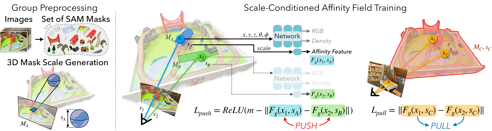

# GARField 原理总结

论文：**GARField: Group Anything with Radiance Fields**，Chung Min Kim\*、Mingxuan Wu\*、Justin Kerr\*、Matthew Tancik、Ken Goldberg、Angjoo Kanazawa，CVPR 2024，pp. 21530–21539。[CVF 页面](https://openaccess.thecvf.com/content/CVPR2024/html/Kim_GARField_Group_Anything_with_Radiance_Fields_CVPR_2024_paper.html) ｜ [项目页](https://www.garfield.studio/) ｜ [ML Anthology](https://mlanthology.org/cvpr/2024/kim2024cvpr-garfield/)

## 原文方法图

原文方法图：来自多视角的多级 SAM mask 被赋予物理三维尺度，用对比损失与包含性损失优化一个尺度条件的三维亲和场，再递归聚类出层级分组。[图片来源：项目页](https://www.garfield.studio/)

## 做了什么

给一组**带位姿的多视角图像**，把 SAM 在各个视角、各个层级产生的 2D mask 融合成一个 **scale-conditioned 三维 affinity field**，从而把三维场景分解成"物体簇 / 物体 / 子部件"的层级。训练完成后，既可以用点 + 尺度交互查询，也可以在各个尺度上自动聚类出全局一致的分组。[摘要、项目页 Overview](https://www.garfield.studio/)

## 为什么需要"尺度"这个条件

分组本身有歧义：两瓣西瓜彼此独立，又都属于同一个西瓜。SAM 的 2D mask 之间会互相冲突（同视角内和跨视角都会），强行要求单一分组标签就会打架。GARField 的处理方式是把物理尺度作为条件输入：**同一个三维点可以同时属于不同尺度的不同组**。

## 场与损失

学一个特征场 $F_g(\mathbf x, s)$，$\mathbf x$ 是三维位置，$s$ 是物理尺度（由 mask 经 NeRF 深度反投影后算出其三维尺寸得到）。两点在尺度 $s$ 下的亲和度为

$$
A(\mathbf x_1,\mathbf x_2,s)=-\lVert F_g(\mathbf x_1,s)-F_g(\mathbf x_2,s)\rVert_2 .
$$

训练用对比损失：一批 ray 中，落在**同一** 2D mask 内的点被拉近，落在**不同** mask 的点被推远。为了让层级连续、自洽，另加两项：

- **连续尺度监督**：不只在离散 mask 尺度上监督，还在相邻尺度之间随机插值增广；
- **包含性辅助损失（containment）**：若两个点在小尺度上同组，则在所有更大的尺度上仍须同组——保证层级是嵌套的，而不是几套互不相干的分组。

推理时对亲和度递归跑 HDBSCAN，由粗到细切出层级。[项目页 Approach、论文方法节](https://www.garfield.studio/)

## 关键实验与对照

论文在 Nerfstudio、LERF 的 in-the-wild 场景以及自采的 teatime、bouquet 等场景上评测，报告的结果包括：

- **三维完整性**：bouquet 场景在 fine 尺度上，GARField 的 mIoU 约 **76.0**，而作为监督来源的输入 SAM mask 只有约 **17.4**——也就是说融合后的结果比监督本身更完整；
- **层级分组召回**：ramen 场景上 GARField 约 **85.6** mIoU，去掉层级（非 scale-conditioned）版本掉到约 **64.1**。

（以上数字依据论文实验与项目页整理，具体表号以原文为准；引用时建议回查 CVF 版论文表格。）[项目页](https://www.garfield.studio/) ｜ [NSF PAR 摘要](https://par.nsf.gov/biblio/10579938-garfield-group-anything-radiance-fields)

这里最有意思的一点被作者明确点出来了：**多视角一致性会过滤掉单视角噪声**。3D 一致性要求使得个别视角里错误或随机的 SAM mask 被平均掉，输出的组比输入监督更干净。

## 局限

需要**带位姿的多视角图像**与静态场景；每个场景单独优化（per-scene optimization），不是前馈模型；分组质量受 SAM 掩码质量限制；极小的组仍然容易失败。

## 与单车世界模型的关系及边界

它支持：**"跨视角一致 → 对象/部件因子化"这条链是走得通的**，而且是多视角一致性本身在充当噪声过滤器——多车互补观测的价值主张与此同构：不是简单多了几张图，而是单视角下不确定的分组在多个视角的约束下变确定了。它同时给出了 object→part 的层级，这对"行人整体 vs. 行人肢体"这种粒度问题有参考意义。

它没有证明：任何动力学或未来预测上的收益。场景静态、无动作、无时间维度、无转移模型；而且它**要求已知位姿**——在跨车场景里这等于要求跨车标定与时间同步，不能当作免费前提。

**一句话：GARField 用物理尺度作为条件，把各视角互相冲突的 SAM mask 融合成一个多视角一致的三维亲和场，得到 object→part 的层级分组；它是"跨视角对应驱动对象因子化"的强证据，但停在静态三维理解，没有动力学。**

整体结论与拟议实验见 [[跨Agent视角对应的训练价值与单车推理结论]]。相关：[[F3RM总结]]（同为 posed multi-view → 3D feature field）、[[RSRD总结]]（直接用 GARField 的 part field 做动态场景）、[[NeuralDescriptorFields总结]]、[[DenseObjectNets总结]]。
