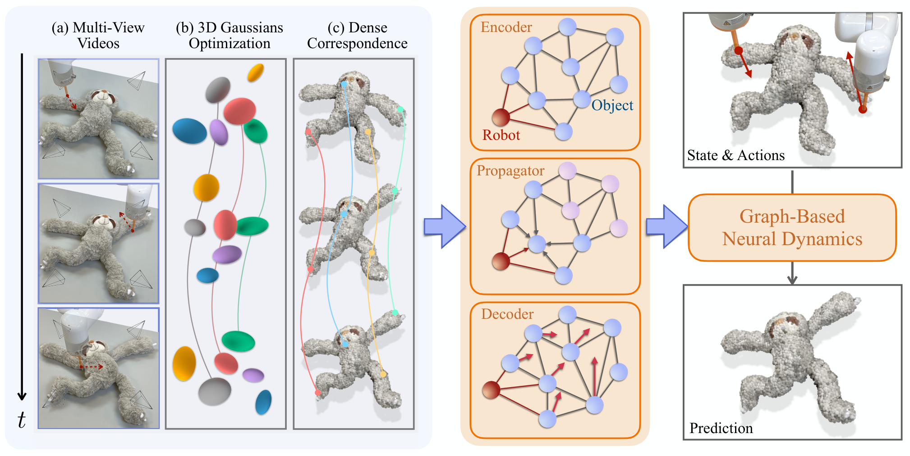

# Gaussian Dynamics 原理总结

论文：**Dynamic 3D Gaussian Tracking for Graph-Based Neural Dynamics Modeling**，CoRL 2024，Mingtong Zhang、Kaifeng Zhang、Yunzhu Li。[论文](https://arxiv.org/abs/2410.18912)、[代码](https://github.com/robo-alex/gs-dynamics)

## 原文方法图

原文图 2：多视角视频经 3D Gaussians 优化得到稠密对应，再送入 Encoder–Propagator–Decoder 结构的图神经网络；图中 Robot 节点（红）与 Object 粒子节点（蓝）在同一张图里做 message passing。[图片来源：论文 HTML 版方法图](https://arxiv.org/html/2410.18912v1)

## 做了什么

从多视角机器人交互视频中先做动态 3DGS 重建与追踪，得到跨视角、跨帧一致的 3D Gaussian 轨迹；把稠密 Gaussians 下采样成 sparse control particles，每个粒子是图节点、机器人末端执行器也是节点，GNN 预测每个粒子的未来运动；最后把粒子运动插值回全部 Gaussians，渲染未来视频并支持 model-based planning。

$$
\{I_t^v\}_{v=1}^V
\rightarrow
\text{3D Gaussian tracking}
\rightarrow
G_t=(V_t,E_t)
\rightarrow
G_{t+1}.
$$

必须先分层：**multi-view → 3D state 是感知，graph → dynamics 是预测**。多视角融合在 3DGS 优化阶段就完成了，GNN 从头到尾没有接触过图像。

## 多视角怎么变成 3D 粒子追踪

- 基于 Dyn3DGS（Luiten et al., 3DV 2024）：固定一组带朝向的 Gaussian 核，逐时间步优化它们的空间变换去拟合多视角视频；渲染损失为 $\mathcal{L}_1$ + D-SSIM（$\lambda=0.2$）。
- 数据：4 台 RealSense 相机（工作区四角、俯视）同步采集 RGB-D 与机器人动作，15 FPS；深度只用来初始化 Gaussian 点云。物体为绳、布、毛绒玩具 3 类共 8 个实例。
- 这个稠密跨帧对应是**逐场景离线优化**得到的，不是一个可跨场景泛化的学习式感知模块；原文 Limitation 也承认大遮挡或无纹理物体时感知会失败。

## 图与 GNN 动力学

- 用最远点采样（FPS）从 Gaussians 中抽出 $n$ 个 control particles 作为图节点；机器人末端执行器位置 $a_t$ 也是节点；两节点距离低于阈值 $d_e$ 就连一条双向边。
- GNN 用共享 vertex/edge 编码器、$p=3$ 步 message passing、共享解码器，输出每个粒子的 3D 运动，残差形式：

$$
\hat{X}_{t+1,\mathrm{pred}}=\hat{X}_{t}+f_{\theta}(\hat{X}_{t-k:t},\hat{E}_{t}).
$$

- 训练损失是前瞻 $\tau=5$ 步循环 rollout 的 MSE；部分复杂物体额外加边长正则和刚度正则。

## 粒子运动怎么变回未来视频

- 每个粒子的旋转由其邻居的运动最小二乘解出（SO(3)）；再用 Linear Blend Skinning 按空间邻近权重把稀疏粒子运动插值到所有 Gaussian 的中心与旋转，渲染即得动作条件视频预测。

## 规划

多视角 RGB-D → 分割与点云融合 → FPS 建图 → 在学到的动力学上用 MPPI 做 MPC，目标是最小化预测状态与目标构型的误差。作者指出 MPM/FleX 基线的仿真太慢，难以用于真机规划。

## 实验与基线

- 基线是两个物理仿真器：MPM（用 CMA-ES 优化摩擦系数 $\mu$ 与杨氏模量 $E$）与 FleX（软体模式，alpha-shape 重建网格后同样优化参数）。
- 指标：3D Chamfer Distance、3D EMD、2D 分割 $\mathcal{J\&F}$、LPIPS。所有指标显著优于两个基线；作者的归因是从真实数据学习避免了 sim-to-real gap。

## 训练多视角，推理能否单视角

不能。训练与部署都需要多视角 RGB-D 建立初始 3D 状态（分割、点云融合、Gaussian 表示）；只有 rollout 预测阶段才只用动作序列。它证明的是"多视角 → 统一 3D 状态"，不是 [[MV-MWM总结|MV-MWM]]、[[C2E总结|C2E]] 那类"多视角训练、单视角部署"——多视角信息在感知层就被消费完了，而不是被转移进了可在单视角下使用的表征。

## graph 学到的是什么：动力学，不是因子解耦

图节点是显式的物理粒子（Gaussian 下采样），不是 latent factor；边的含义是空间邻近，不是统计依赖。整套流程中，跨视角互补被 3DGS 的几何优化"硬"解决，GNN 只需要学粒子间的动力学传播。**它没有做 shared/private factor disentanglement，也没有任何机制从多视角里"发现"潜在因子**——这与 latent 层面的跨视角世界模型（如 [[XVWM总结|XVWM]]）是两类不同的方案。

## 对当前研究的意义

**边界例证：跨视角融合可以完全放在显式 3D 重建层完成，对应关系由几何而非学习目标给出。**

但它不提供"辅助视角训练 → 单视角使用"的证据：初始 3D 状态仍需多视角 RGB-D；对象是单个可形变物体的桌面操作，没有多 Agent、没有遮挡互补观测。作为对照路线放进跨车世界模型讨论时，应重点检验其感知初始化在遮挡下的鲁棒性（原文自己承认的短板）。

总笔记：[[跨Agent视角对应的训练价值与单车推理结论]]。
