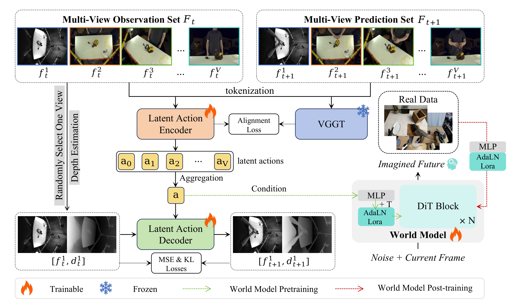

# LAWM-3D 原理总结

论文：**LAWM-3D: Learning 3D-Aware Latent Actions from Human Videos for Generalizable Robot World Models**，2026 年 8 月预印本。[论文](https://arxiv.org/abs/2608.05706)

## 原文方法图

原文图 2：将多视角观测、潜在动作编码与解码、三维几何对齐和世界模型联系起来。图中的几何教师与重建监督也是方法组成部分，不能将全部收益只归因于增加视角。[图片来源：论文 PDF 第 3 页](https://arxiv.org/pdf/2608.05706#page=3)

## 做了什么

从多视角与单视角人类视频中学习具有几何含义的 latent actions，再用这些伪动作标签预训练世界模型，随后用机器人交互数据微调。

这里先学习的是“视频状态变化对应什么动作表征”，不是对多个独立 Agent 的联合动作进行 credit assignment。[原文方法部分](https://arxiv.org/html/2608.05706)

## 随机mask 视角数量  + action转换因子 

从前后帧反推 latent action 时，编码器可能把未来画面的外观压进 latent，而不是提取运动因素。不同相机的外观与视角差异会进一步干扰这种学习。

因此，多视角视频既带来几何线索，也带来额外差异；有配对数据不等于模型已经有效利用配对。[原文引言](https://arxiv.org/html/2608.05706)

随机选一个 view，加入decoder的action进行下一次的frame + depth 预测，颜色、纹理、光照比较容易因为 camera 变化而变，但「物体从这里移动到那里」对应的 depth/geometry 更接近真实物理变化，所以 depth reconstruction 会逼 aa 更多编码 motion geometry  
（**但注意这里的随机  与 depth 都不能真正 剔除 action因子提取的后门捷径**）
![[Pasted image 20260906025452.png]]
## 约束关联视角
论文组合三类设计：
1. **统一动作 tokenization**：让不同视角围绕同一次动作变化形成共享语义；
2. **几何特征对齐**：利用预训练三维基础模型提供几何监督；
3. **RGB-D 联合重建**：结合深度目标，减少把未来 RGB 外观当成动作信息的捷径。
可以概括为：
$$
\text{同步多视角变化}
\rightarrow
\text{受几何约束的 latent action}
\rightarrow
\text{动作条件未来预测}.
$$
## 单视角使用

论文的 latent action 模型支持混合单／多视角训练及单视角输入；正文世界模型预训练设置使用单视角视频。因此辅助多视角知识不必以多相机同时输入的形式保留到所有下游阶段。

需要区分 latent action 提取器与世界模型 rollout：不能把训练时用于观察前后帧的动作编码器，误当成推理时已经知道未来画面的模块。[Joint Training 与训练设置](https://arxiv.org/html/2608.05706)
