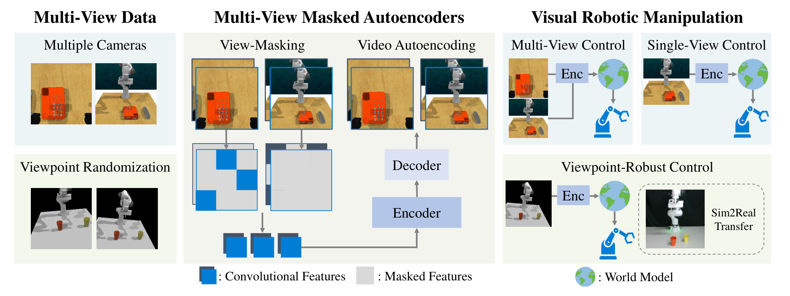

# MV-MWM 原理总结

论文：**Multi-View Masked World Models for Visual Robotic Manipulation**，ICML 2023。[论文及正式发表信息](https://proceedings.mlr.press/v202/seo23a.html)

## 原文方法图

原文图 1：先从多视角视频中进行遮掩表征学习，再将表征用于多视角、单视角及视角变化下的控制。图中单视角控制分支正是“训练利用多视角，使用时可以只保留一个视角”的相关证据。[图片来源：论文 PDF 第 2 页](https://proceedings.mlr.press/v202/seo23a/seo23a.pdf#page=2)

## 做了什么

MV-MWM 先利用多相机视频学习视觉表征，再在该表征上学习世界模型和控制策略。它同时研究多视角控制、单视角控制以及相机视角变化下的控制，不只是把多张图像拼接输入策略。[原文第 3 节](https://proceedings.mlr.press/v202/seo23a/seo23a.pdf)

## 怎样关联多个视角

核心是 view-masking：遮住特定视角的特征，要求自编码器从其余可见信息中恢复。视频上下文还提供同一视角的邻近帧，降低整视角重建的困难。

以下是机制示意，不是原文损失函数的逐项复写：

$$
\{\text{可见视角、可见时间帧}\}
\xrightarrow{\mathrm{MV\text{-}MAE}}
\text{被遮住视角的重建}.
$$

因此，监督联系的是同一段经历的多个观测；但不能把重建全归因于另一相机，因为同视角邻近帧也提供信息。[第 3.1 节](https://proceedings.mlr.press/v202/seo23a/seo23a.pdf#page=3)

## 世界模型怎样使用这些表征

表征学习与世界模型学习分开更新：自编码器用重建目标学习，世界模型在编码特征上学习动力学，再用 imagined rollout 训练行为。世界模型更新不把梯度传回编码器，但编码器仍随在线采样在自己的学习阶段继续更新。

跨视角目标主要作用在表征层，不是直接要求动力学模型“用 A 的历史预测 B 的未来”；后一种目标更接近 [[XVWM总结|XVWM]]。[第 3.2 节及算法 1](https://proceedings.mlr.press/v202/seo23a/seo23a.pdf#page=4)

## 训练多视角，执行能否单视角

可以。论文单独设置了单视角控制实验：表征学习使用前置和腕部相机，世界模型与 RL Agent 使用前置相机观测。部署不需要把训练用的辅助相机也交给策略。

这是单机器人多相机学习，不是多个决策 Agent 的 CTDE；它支持的是辅助视角训练向单视角控制的迁移。[第 4.1 节](https://proceedings.mlr.press/v202/seo23a/seo23a.pdf#page=6)

## 最相关的实验证据

单视角控制中，MV-MWM 优于 MWM；去掉 view-masking、改用普通随机特征 masking 后表现下降。论文也发现所测 TCN 基线在不少任务上表现差，不能因为 TCN 在倾倒实验成功，就认为对比式跨视角目标适合所有任务。[第 4.1、4.4 节](https://proceedings.mlr.press/v202/seo23a/seo23a.pdf)

## 对当前研究的意义

**强相关：它提供了“辅助视角表征学习 → 单视角世界模型控制”的直接先例。**

但控制成功率提升不等于已证明每种多步动力学误差都下降，也不是跨车遮挡场景的实验。迁移到自动驾驶仍需检验轨迹、占用和长时预测。

总笔记：[[跨Agent视角对应的训练价值与单车推理结论]]。
