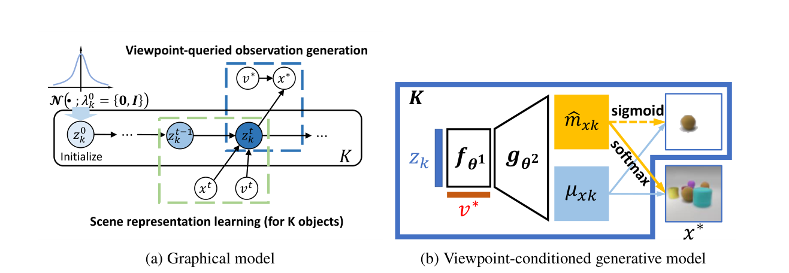

# MulMON 原理总结

论文：**Learning Object-Centric Representations of Multi-Object Scenes from Multiple Views**（模型名 MulMON，Multi-View and Multi-Object Network），Nanbo Li、Cian Eastwood、Robert B. Fisher，NeurIPS 2020。[论文及正式发表信息](https://proceedings.neurips.cc/paper/2020/hash/3d9dabe52805a1ea21864b09f3397593-Abstract.html)

## 原文方法图

原文图 2：(a) 跨视角迭代的图形模型——$K$ 个物体 slot 的 latent 沿观测步递归更新，每个新观测 $(x^t,v^t)$ 都更新**同一组** $z_k$，查询视角 $v^*$ 生成新观测 $x^*$；(b) 视角条件生成模型——$z_k$ 经 $f_{\theta^1}$ 变换到查询视角，解码器 $g_{\theta^2}$ 输出像素均值与 mask，经 softmax 组合成渲染图。[图片来源：论文 PDF 第 3 页](https://proceedings.neurips.cc/paper/2020/file/3d9dabe52805a1ea21864b09f3397593-Paper.pdf#page=3)

## 做了什么

从同一静态场景的多个随机视角观测中，无监督地学对象中心场景表征。作者把这个问题命名为 multi-object-multi-view（MOMV），并明确指出其核心困难就是**跨视角保持物体对应**（maintaining object correspondences across views）；MulMON 的做法是让多个视角迭代更新同一组物体 latent。[原文摘要、第 2.2 节](https://proceedings.neurips.cc/paper/2020/file/3d9dabe52805a1ea21864b09f3397593-Paper.pdf#page=3)

## 多个视角怎样共同形成同一个 object latent

外循环把多视角后验写成递归形式（原文式 1）：

$$
p\big(z=\{z_k\}\mid x_{1:T},v_{1:T}\big)=p(z^0)\prod_{t=1}^{T}p\big(z^t\mid x^t,v^t,z^{t-1}\big),
$$

即"多视角问题变成递归的单视角问题"，理论上支持在线吸收任意多观测而不溢出内存。内循环是 IODINE 式的迭代摊销推断，但关键差别是：IODINE 每次都从标准高斯出发，MulMON 的先验是**上一次的后验**，因此不同视角的信息在同一个 latent 里累积。[原文第 3.1 节](https://proceedings.neurips.cc/paper/2020/file/3d9dabe52805a1ea21864b09f3397593-Paper.pdf#page=4)

## 新视角预测

训练目标（原文式 5）= ELBO + 查询视角似然 − 信息增益（Bayesian surprise）项；训练时把场景的 $T$ 个观测随机分成推断集和查询集，要求模型预测**没见过视角**的外观与分割。原文的理由：只有这样才能保证迭代更新"确实在聚合跨视角的空间信息"，因为要做好新视角预测必须有完整的 3D 场景理解。[原文第 3.4 节](https://proceedings.neurips.cc/paper/2020/file/3d9dabe52805a1ea21864b09f3397593-Paper.pdf#page=6)

## 对当前研究的意义

**强相关：它是"多视角共同形成同一组 object latent、且 correspondence 被显式当作核心困难"的直接先例。**

它证明对应关系可以建立在对象因子层（物体 latent 本身跨视角一致），不必是像素对齐；但推理时需要多视角观测序列，且没有把 latent 建成图、没有动力学。同一团队次年把它推广到动态场景。

**一句话：MulMON 用"新视角预测"强迫 $K$ 个物体 slot 在多视角递归更新中聚合成 3D 一致的同一组 latent，把"跨视角物体对应"变成可训练的目标；但它停在静态场景，没有动力学。**

总笔记：[[跨Agent视角对应的训练价值与单车推理结论]]。
