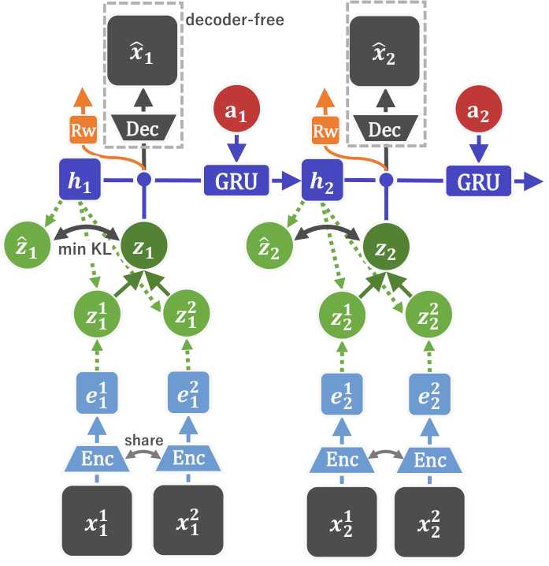
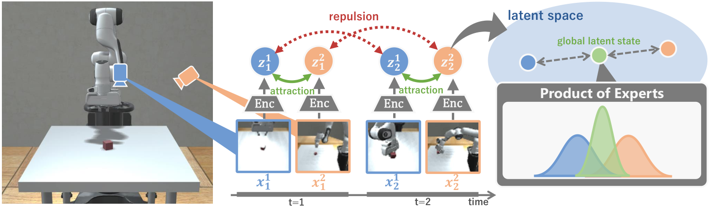

# Multi-View Dreaming 原理总结

论文：**Multi-View Dreaming: Multi-View World Model with Contrastive Learning**，Akira Kinose、Masashi Okada、Ryo Okumura、Tadahiro Taniguchi，arXiv:2203.11024v1（Submitted 15 Mar 2022，7 页，8 图）。本笔记依据 arXiv 预印本。[论文](https://arxiv.org/abs/2203.11024) ｜ [HTML 版](https://arxiv.org/html/2203.11024v1)

## 原文方法图

原文图 3（架构图）：每个视角的图像经共享编码器得到表征，Representation model 为每个视角推断后验状态，再用 Products of Experts 把多视角后验融合为全局潜在状态 $z_t$，Transition predictor 仅基于循环隐状态做 latent 转移，用于想象 rollout。[图片来源：arXiv HTML 版 Figure3](https://arxiv.org/html/2203.11024v1)

原文图 2（对比学习目标）：同一时刻不同视角图像对作为正样本，不同时刻图像对作为负样本，把不同相机视图拉到共享潜在空间。[图片来源：arXiv HTML 版 Figure2](https://arxiv.org/html/2203.11024v1)

## 做了什么

Multi-View Dreaming 把单视角世界模型 Dreaming 扩展到多视角观测：用**对比学习**训练不同相机视图之间的共享潜在空间，再用 **Products of Experts (PoE)** 把多个视角的后验分布融合成一个全局潜在状态，并在该 latent 上做 RSSM 风格的转移与想象，用于强化学习控制。还提出 **Multi-View DreamingV2**，把高斯潜在换成 categorical 潜在。论文在 DeepMind Control Suite 与 Robosuite 的真实机器人模拟任务上验证。[原文摘要、第 III 节](https://arxiv.org/html/2203.11024v1)

## 怎样把多视角对齐到共享 latent

对比学习沿用了 Dreaming 的“无重构”目标（源自 ELBO）。其 NCE 项区分正样本对 $(z_t, x_t)$ 与负样本对 $(z_t, x')$：

$$
\mathcal J_k^{\mathrm{NCE}}
=
\mathbb E\Big[\log p(z_t\mid x_t)-\log\sum_{x'}p(z_t\mid x')\Big].
$$

正样本是**同一时刻不同视角**的图像对，负样本是不同时刻的图像对；直觉是“同一场景的不同视角潜在表示应彼此接近”，从而把多相机观测对齐到共享空间。[原文公式 5–6、图 2](https://arxiv.org/html/2203.11024v1)

## 世界模型如何使用这些表征

潜在状态沿用 RSSM：

$$
\begin{aligned}
h_t &= f_\phi(h_{t-1},z_{t-1},a_{t-1}),\\
z_t &\sim q_\phi(z_t\mid h_t,x_t),\\
\hat z_t &\sim p_\phi(\hat z_t\mid h_t).
\end{aligned}
$$

多视角扩展下，每个视角推断自己的后验 $z_t^v$，再用 PoE 融合为全局 $z_t$。高斯版 PoE 是对均值/方差的加权调和平均：

$$
\mu_V=\frac{\sum_{v=1}^V \mu_v/\sigma_v^2}{\sum_{v=1}^V 1/\sigma_v^2},
\quad
\sigma_V^2=\frac{1}{\sum_{v=1}^V 1/\sigma_v^2}.
$$

Transition predictor 只依赖循环隐状态 $h_t$，不依赖图像，因此可在 latent 中做无解码器的想象 rollout；演员-评论家在 $\hat z_t$ 上学习策略。DreamingV2 变体把潜在改为 categorical，PoE 改为对各维分类分布取平均。[原文第 III 节、公式 1–4](https://arxiv.org/html/2203.11024v1)

## 关键实验与对照

实验对比“拼接基线”（把多视角图像沿通道叠加，如 64×64×6 作为输入）对 Dreamer / Dreaming 等的简单扩展，以及单视角 Dreaming。表 I 的回报（均值±标准差）：

- **Reacher（multi-view，遮挡）**：MVDreaming **588.6±356.0**、MVDreamingV2 **936.1±95.9**，拼接 DreamingV2 仅 860.9±285.6；
- **Pendulum（multi-view，俯视+侧视）**：MVDreaming **812.2±130.4**，拼接 Dreaming 831.6±126.4（相近），V2 明显变差（256.5±304.5）；
- **Lift（Robosuite，Panda 抓取，multi-view）**：MVDreamingV2 **345.0±133.6** 优于拼接 DreamingV2 的 254.7±104.2；单视角 Dreaming 为 150.5±78.5。

这些对照支持“共享 latent + PoE 融合”优于简单拼接，但 Pendulum 上 MVDreaming 与拼接基线相近、V2 反而下降，说明收益并非在所有任务一致，且对比的是“拼接输入”而非“独立单视角训练 + 跨视角配对”的严格单因素消融。[原文表 I、第 IV 节](https://arxiv.org/html/2203.11024v1)

## 与 MV-MWM 的区别

两者都是单机器人多相机、把多视角用于世界模型，但方式不同：[[MV-MWM总结|MV-MWM]] 用 **view-masking 视频重建**学习兼顾当前视角与跨视角信息的表征；Multi-View Dreaming 用**对比学习（NCE）把不同视角拉到共享 latent**，再显式用 PoE 融合多视角后验。Multi-View Dreaming 更“直接属于跨视角 latent alignment + world model”：对齐发生在潜在空间，且多视角以概率融合方式进入每一步状态推断，而不是靠重建目标间接获得跨视角信息。它还沿用 Dreaming 的**无解码器**世界模型，MV-MWM 则在编码特征上重建。

## 与单车世界模型的关系及边界

**它支持**：本项目论证链中“跨视角对应/对齐→世界模型训练监督”这一环，Multi-View Dreaming 提供了早期实例——用对比式跨视角对齐构造共享 latent，并在其上训练可做 rollout 的动力学模型，且 PoE 融合让“多视角观测”在推理时仍能合成单一状态。它比 MV-MWM 更接近“跨视角 latent alignment + world model”的范式。

**它没有证明**：① 它是单机器人多相机（Reacher/Pendulum/Lift 遮挡场景），不是跨车（跨 Agent）时空对应，没有“用他车互补观测监督本车”的设置；② 评测是控制回报，不是本车未来轨迹/占用的多步预测误差；③ 对照只对比“拼接输入”，没有打乱配对或单视角等价监督的消融，不能确认收益严格来自对应关系的正确性；④ 环境为模拟、规模小，未触及自动驾驶的长时、开放场景。

**一句话：Multi-View Dreaming 用对比学习把多相机对齐到共享 latent、以 Products of Experts 融合进 RSSM 世界模型，是“跨视角 latent alignment + world model”的直接先例，但停留在单机器人多相机控制、未验证跨车对应与未来预测。**

整体结论与拟议实验见 [[跨Agent视角对应的训练价值与单车推理结论]]。相关：[[MV-MWM总结]]、[[XVWM总结]]、[[CroCo总结]]。
