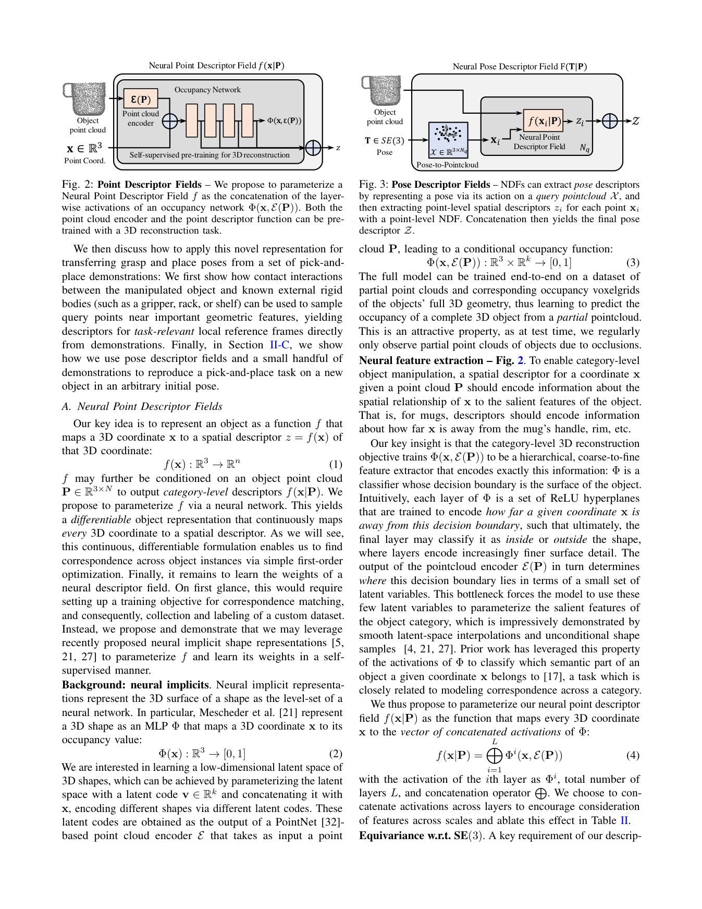

# Neural Descriptor Fields 原理总结

论文：**Neural Descriptor Fields: SE(3)-Equivariant Object Representations for Manipulation**（NDF），Anthony Simeonov、Yilun Du、Andrea Tagliasacchi、Joshua B. Tenenbaum、Alberto Rodriguez、Pulkit Agrawal、Vincent Sitzmann，ICRA 2022。[arXiv:2112.05124](https://arxiv.org/abs/2112.05124) ｜ [项目页](https://yilundu.github.io/ndf/) ｜ [代码](https://github.com/anthonysimeonov/ndf_robot)

## 原文方法图

原文图 2 一类的架构示意：点描述符场由 occupancy 网络各层激活拼接而成，姿态描述符由 query 点云逐点描述符拼接而成。[图片来源：arXiv HTML 版](https://arxiv.org/html/2112.05124v1)

## 做了什么

把物体表示成一个**连续的三维 descriptor 场**：$f(\mathbf x|\mathbf P)$ 把任意三维坐标 $\mathbf x$（不要求落在物体表面，被遮挡处也可以）映射为一个空间 descriptor，且这个 descriptor 在**同一类别的不同实例之间**表达同一个相对几何位置。给定少量（约 5–10 个）演示，新物体即使处在训练时从未见过的 6-DoF 位姿，也能通过优化求出对应的抓取/放置位姿。[摘要、§I](https://arxiv.org/html/2112.05124v1)

## descriptor 从哪来：把 occupancy 网络的中间激活当特征

不需要标注关键点。作者先把 occupancy 网络 $\Phi(\mathbf x,\mathcal E(\mathbf P))$ 用三维重建任务训练起来（PointNet 编码器 $\mathcal E$ 吃部分点云，$\Phi$ 预测占据概率），然后把它**各层的激活拼接**起来当作 descriptor：

$$
f(\mathbf x|\mathbf P)=\bigoplus_{i=1}^{L}\Phi^{i}\big(\mathbf x,\mathcal E(\mathbf P)\big).
$$

理由：occupancy 网络的决策边界就是物体表面，每一层 ReLU 超平面本质上在编码"$\mathbf x$ 离表面有多远"，逐层由粗到细；编码器把物体压进少量隐变量，被迫用它们参数化该类物体的显著几何特征。消融实验显示：随机初始化的 occupancy 网络 overall 成功率 0.00，只用最后一层 0.65，只用第一层 0.65，**用全部层 0.88**。[§II-A、表 II](https://arxiv.org/html/2112.05124v1)

## SE(3) 等变怎么保证

$$
f(\mathbf x|\mathbf P)\equiv f(\mathbf R\mathbf x+\mathbf t\,|\,\mathbf R\mathbf P+\mathbf t).
$$

- **平移**：把点云质心 $\mu$ 从坐标与点云里同时减掉，$f(\mathbf x|\mathbf P)=f(\mathbf x-\mu|\mathbf P-\mu)$；
- **旋转**：把 $\Phi$ 与 $\mathcal E$ 换成 **Vector Neurons**（Deng 等，2021）的 SO(3) 等变架构，于是 $f(\mathbf x|\mathbf P)\equiv f(\mathbf R\mathbf x|\mathbf R\mathbf P)$。

两者合起来就是完整 SE(3) 等变——这是一个**结构性保证**，不是靠数据增强凑出来的。[§II-A 式 5—7](https://arxiv.org/html/2112.05124v1)

## 从点到姿态：pose descriptor field

位姿用一组**刚性 query 点云** $\mathcal X$ 表示：把 $\mathbf T$ 作用在 $\mathcal X$ 上，把每个点的 descriptor 拼起来，得到姿态描述符

$$
\mathcal Z=F(\mathbf T|\mathbf P)=\bigoplus_{\mathbf x_i\in\mathcal X_h} f(\mathbf T\mathbf x_i|\mathbf P).
$$

新实例上的位姿通过一阶优化求出：

$$
\bar{\mathbf T}=\arg\min_{\mathbf T}\ \lVert F(\mathbf T|\mathbf P)-F(\hat{\mathbf T}|\hat{\mathbf P})\rVert .
$$

也就是说，跨实例、跨视角的对应被写成**在同一个连续场上做最近邻检索**，而不是先检测关键点再做配准——少了一步，就少了一处误差来源。query 点放在哪（靠近把手还是靠近杯口）决定了对齐到哪个特征，因此它是任务相关的。[§II-B 式 10—11、图 6](https://arxiv.org/html/2112.05124v1)

## 关键实验与对照

仿真 pick-and-place（每类 10 个演示， unseen instance）：

| 设定 | 方法 | Mug 整体 | Bowl 整体 | Bottle 整体 |
| --- | --- | --- | --- | --- |
| Upright pose | DON | 0.45 | 0.11 | 0.24 |
| Upright pose | **NDF** | **0.88** | **0.91** | **0.87** |
| Arbitrary pose | DON | 0.17 | 0.00 | 0.01 |
| Arbitrary pose | **NDF** | **0.58** | **0.78** | **0.77** |

演示数量的影响（upright mug 整体成功率）：1 / 5 / 10 个演示时，DON 为 0.32 / 0.36 / 0.45，NDF 为 **0.46 / 0.70 / 0.88**。真实机器人上仅用直立位姿的演示，就在新实例的多种姿态下完成了 pick 与 place。[表 I、表 IV、§IV-C](https://arxiv.org/html/2112.05124v1)

对照组是同一套流程下的 [[DenseObjectNets总结|DON]]，两者训练数据都来自同一批渲染（每类物体 300 个 RGB-D 视角 / NDF 用四个静态深度相机的点云），可比性较好；差距主要来自"2D CNN 只对图像平面平移等变"与"3D 场对完整 SE(3) 等变"这一结构性差别。

## 局限（原文自述）

非刚性物体未测试；只定义了**点与位姿上的能量景观**，没有接到轨迹优化，更没有动力学；假设放置目标静止；PointNet 编码器对训练时没见过的遮挡模式不鲁棒（只见过直立杯子，就没见过杯底），这是 arbitrary pose 下性能下降的主因。[§VI](https://arxiv.org/html/2112.05124v1)

## 与单车世界模型的关系及边界

它支持：**跨视角/跨实例的一致表示可以不依赖具体相机视角，而是建立在 viewpoint-independent 的三维场之上**，并且这种一致性是可以被结构性保证（SE(3) 等变）而非仅靠数据覆盖得到的。对"两辆车在同一时刻看到同一个行人"这一设定，NDF 给出了一种比 image feature 更合适的目标表示形态。

它没有证明：任何关于未来的事。没有动作条件、没有时间维度、没有转移模型，场景被假设为静态，物体已分割。它解决的是"对应关系长什么样"，不是"对应如何改善预测"。

**一句话：NDF 把跨实例、跨视角的对应从图像特征升级为 SE(3) 等变的连续三维 descriptor 场，用结构性等变而非数据增强换取对任意位姿的泛化；但它只有点与位姿的匹配，没有动力学。**

整体结论与拟议实验见 [[跨Agent视角对应的训练价值与单车推理结论]]。相关：[[DenseObjectNets总结]]（前作与主基线）、[[F3RM总结]]（把特征蒸馏进 3D field 的机器人路线）、[[GARField总结]]（同类 3D affinity field，层级分组）。
