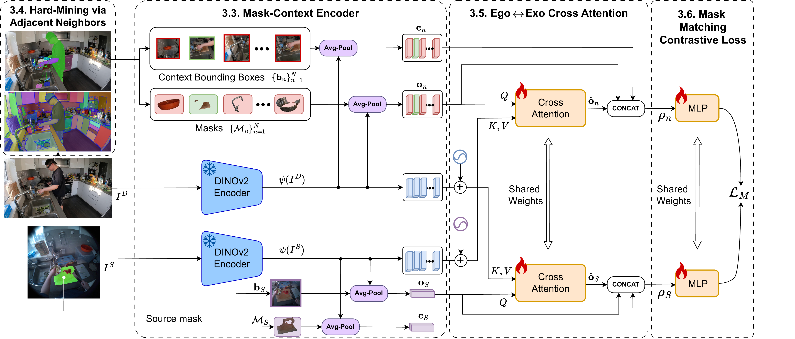

# O-MaMa 原理总结

论文：**O-MaMa: Learning Object Mask Matching between Egocentric and Exocentric Views**，Lorenzo Mur-Labadia、Maria Santos-Villafranca、Jesus Bermudez-Cameo、Alejandro Perez-Yus、Ruben Martinez-Cantin、Jose J. Guerrero，ICCV 2025；[CVF 论文页](https://openaccess.thecvf.com/content/ICCV2025/html/Mur-Labadia_O-MaMa_Learning_Object_Mask_Matching_between_Egocentric_and_Exocentric_Views_ICCV_2025_paper.html) / [arXiv:2506.06026](https://arxiv.org/abs/2506.06026) / [项目页](https://maria-sanvil.github.io/O-MaMa/)

## 原文方法图

原文图 2：完整 pipeline，从目标视图 FastSAM 生成候选掩码，经 Mask-Context Encoder 池化 DINOv2 特征，Ego↔Exo Cross-Attention 融合全局跨视图信息，Mask Matching Contrastive Loss 在共享 latent 对齐。[图片来源：CVF 出版论文 PDF 第 3 页（出版页码 6894）](https://openaccess.thecvf.com/content/ICCV2025/papers/Mur-Labadia_O-MaMa_Learning_Object_Mask_Matching_between_Egocentric_and_Exocentric_Views_ICCV_2025_paper.pdf#page=3)

## 做了什么

O-MaMa 把跨视角（ego-exo）物体分割重定义为 mask matching：不在像素级从零预测，而是先用 FastSAM 在目标视图生成候选掩码，再用学习到的视角不变特征选出与源掩码最匹配的候选。四个部件：Mask-Context Encoder、Ego↔Exo Cross-Attention、Mask Matching Contrastive Loss、Hard Negative Adjacent Mining。核心主张是 object-level 对齐而非全局 view alignment——对齐发生在单个物体掩码的描述符上，而非整图的全局特征。[原文摘要、第 3 节](https://arxiv.org/html/2506.06026)

## Mask-Context Encoder：DINOv2 物体级特征

在目标视图 $I^{D}$ 上用 FastSAM 生成 $N$ 个候选掩码 $\{\mathcal M_n\}_{n=1}^N$。用 DINOv2（ViT-B/14）提取密集特征 $\psi(I^{D})$ 并上采样 $4\times$ 保留细节。对每个候选取两类描述符：

$$
\mathbf o_n=\mathrm{Avg\text{-}Pool}(\mathcal M_n,\psi(I^{D})),\qquad
\mathbf c_n=\mathrm{Avg\text{-}Pool}(\mathbf b_n,\psi(I^{D})),
$$

$\mathbf o_n$ 是物体描述符（在掩码区域平均池化），$\mathbf c_n$ 是上下文描述符（$\mathbf b_n$ 为掩码扩展边界框，捕捉周围场景以辅助跨视图定位）。论文验证 Avg-Pool(mask) 优于 Avg-Pool(bbox)、Max-Pool(bbox)、质心特征和 CLIP 特征。源视图查询掩码同样取 $\mathbf o_S,\mathbf c_S$。[第 3.3 节](https://arxiv.org/html/2506.06026#S3.SS3)

## Ego↔Exo Cross-Attention

为候选注入源视图的语义对应，以候选描述符为 Q、源图特征为 K/V：

$$
\hat{\mathbf o}_n=\mathrm{Softmax}\!\left(\frac{\mathbf o_n W_Q\cdot(\psi(I^{S})W_K)^{\top}}{\sqrt d}\right)\cdot \psi(I^{S})W_V,
$$

其中 $\psi(I^{S})$ 是源视图 DINOv2 特征图，注入可学习位置嵌入并做 Layer Norm。源掩码 $\hat{\mathbf o}_S$ 同理（以 $\mathbf o_S$ 作 Q，以 $\psi(I^{D})$ 作 K/V）。这一步把跨视图全局信息融进物体描述符。[第 3.5 节](https://arxiv.org/html/2506.06026#S3.SS5)

## Mask Matching Contrastive Loss（重点）

最终描述符拼接并经浅层 MLP 映射到共享 latent（维度 $d_f$）：

$$
\rho_n=\mathrm{concat}(\hat{\mathbf o}_n,\mathbf c_n,\mathbf o_n),\qquad
\rho_S=\mathrm{concat}(\hat{\mathbf o}_S,\mathbf c_S,\mathbf o_S),
$$

正例为跨视图同一物体的目标掩码，负例主要来自硬负样本（见下）。损失为 InfoNCE 变体：

$$
\mathcal L_M(\rho^{+},\rho_S)=-\log\frac{\exp(\mathrm{sim}(f_\theta(\rho^{+}),f_\theta(\rho_S))/\tau)}{\sum_{n=1}^{|\mathcal B|}\exp(\mathrm{sim}(f_\theta(\rho_n),f_\theta(\rho_S))/\tau)},
$$

$\mathrm{sim}$ 为余弦相似度，$f_\theta$ 是把描述符映射到共享 latent 的 MLP，$\tau$ 为温度。该损失把同一物体在两视图的描述符拉近、与所有负例（含邻近物体）拉远，从而在共享 latent 里对齐跨视角物体特征。[第 3.6 节](https://arxiv.org/html/2506.06026#S3.SS6)

## 为什么是 object-level 而非全局 view alignment

关键在两点。其一，对齐对象是**单个物体掩码的描述符**，不是整图全局特征，因此学到的是物体身份判别而非整图级别的视角映射。其二，Hard Negative Adjacent Mining 用 Delaunay 三角剖分在目标视图建 mask 邻接图，把一阶/二阶邻居集合 $\mathcal O_n^{-}=\mathcal N(\mathbf o_n)\cup\mathcal N^{2}(\mathbf o_n)$ 作为硬负例，迫使模型区分"看起来近但身份不同"的物体。这直接针对物体级判别，而非把两视图整体压进同一个全局表示。

## 关键实验与对照

- **Table 1（Ego-Exo4D Correspondences v2 test split，第 4.1/4.3 节）**：O-MaMa Ego2Exo 42.6 / Exo2Ego 44.1 IoU；官方组合基线 XMem+XSegTx 34.9 / 25.0；相对增益 **+22.1% / +76.4%**。
- **vs 先前 SOTA（表 2，v1 val）**：相对先前 SOTA（ObjectRelator）+13.1% / +6.5%，仅用约 **1% 训练参数**（11.6M vs 1587.3M）。
- 即便最简 k-NN 基线也达 31.9 / 30.9，说明 DINOv2 特征本身已含强跨视角语义。

因果说明：这些是对比与效率对照，支持"object-level 对比匹配在跨视角对应上优于全局/像素方法、且极省参数"；度量仍是对应 IoU，**不是未来预测误差或 rollout 误差**，不能推出对动力学预测或世界模型的收益。

## 与单车世界模型的关系及边界

它支持：用 DINOv2 物体特征 + 跨注意力 + 对比损失，可以把同一物体在 ego/exo 的描述符拉到共享 latent，且是 object-level（保留物体身份判别），为"跨视角对象级表征"提供了可学习、低参数、可迁移的实例，呼应本研究"跨视角对应 → 训练监督"的前提。

它没有证明：这种匹配改善未来预测或世界模型 rollout；任务停留在单帧对应，无时间维度、无动作条件、无多步预测；也未涉及自车历史用于预测，或跨车时间同步配对用于动力学监督。

**一句话：O-MaMa 把跨视角分割变成 object-level mask matching，用 DINOv2 特征 + 跨注意力 + InfoNCE 对比损失把同一物体在两视图的描述符拉进共享 latent，以 1% 训练参数在 Ego-Exo4D 上达到 SOTA，但它证明的是"物体级跨视角对应可学"，不是未来预测。**

整体结论与拟议实验见 [[跨Agent视角对应的训练价值与单车推理结论]]。相关：[[ObjectRelator总结]]（同会议 ego-exo 对应，但用欧氏对齐而非对比损失）、[[Ego-Exo4D-Correspondence总结]]、[[CroCo总结]]。
