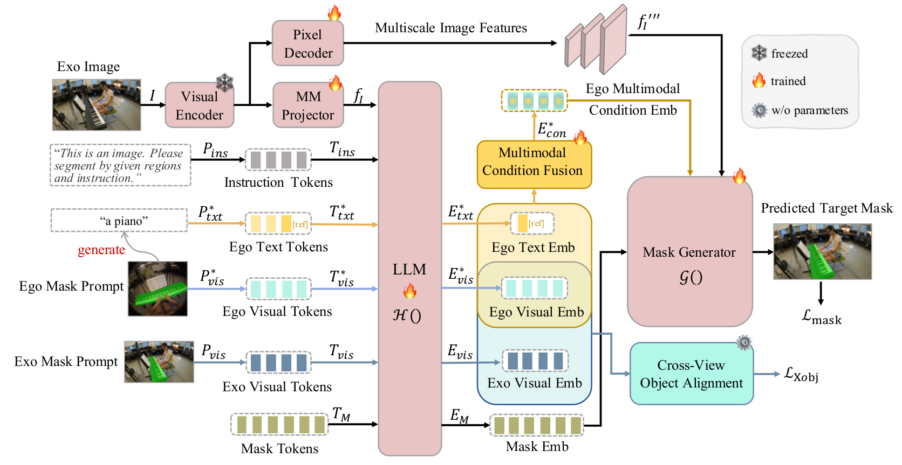

# ObjectRelator 原理总结

论文：**ObjectRelator: Enabling Cross-View Object Relation Understanding Across Ego-Centric and Exo-Centric Perspectives**，Yuqian Fu、Runze Wang、Bin Ren、Guolei Sun、Biao Gong、Yanwei Fu、Danda Pani Paudel、Xuanjing Huang、Luc Van Gool，ICCV 2025（Highlight）；[CVF 论文页](https://openaccess.thecvf.com/content/ICCV2025/html/Fu_ObjectRelator_Enabling_Cross-View_Object_Relation_Understanding_Across_Ego-Centric_and_Exo-Centric_ICCV_2025_paper.html) / [arXiv:2411.19083v2](https://arxiv.org/abs/2411.19083v2) / [代码](https://github.com/lovelyqian/ObjectRelator)

## 原文方法图

原文图 2：以 Ego2Exo 为例的整体框架，基于 PSALM（粉色块）加入 MCFuse（多模态条件融合）与 XObjAlign（跨视角物体对齐）。[图片来源：CVF 出版论文 PDF 第 4 页（出版页码 6533）](https://openaccess.thecvf.com/content/ICCV2025/papers/Fu_ObjectRelator_Enabling_Cross-View_Object_Relation_Understanding_Across_Ego-Centric_and_Exo-Centric_ICCV_2025_paper.pdf#page=4)

## 做了什么

ObjectRelator 解决 Ego-Exo Object Correspondence：给定某一视角（ego 或 exo）的查询物体，预测另一视角中对应物体的掩码。它建立在 PSALM（一个支持文本/掩码提示的分割大模型）之上，针对剧烈视角变化下 PSALM 定位与分割失败的问题，加入两个模块：MCFuse 用语言作为额外线索改善定位，XObjAlign 用自监督对齐增强对物体外观变化的鲁棒性。本笔记重点在 XObjAlign 如何把 ego/exo 中同一对象的 object feature 拉到共享 latent。[原文摘要、第 3 节](https://arxiv.org/html/2411.19083v2)

## MCFuse：多模态条件融合

把文本描述作为额外线索，与视觉掩码提示融合，改善物体定位、防止形状相似物体误关联（如篮球与相似圆形物体）。文本嵌入 $E_{txt}^{*}\in 1\times D$ 作 Query，视觉嵌入 $E_{vis}^{*}\in N\times D$ 作 Key/Value 做交叉注意力，并以残差方式保持视觉为主路径：

$$
\mathrm{CA}_{\mathrm{fuse}}=\mathrm{CrossAtt}(E_{txt}^{*}W_{Q},\,E_{vis}^{*}W_{K},\,E_{vis}^{*}W_{V}),
$$

$$
E_{\mathrm{con}}^{*}=k_{lea}\cdot E_{vis}^{*}+(1-k_{lea})\cdot \mathrm{CA}_{\mathrm{fuse}},
$$

其中 $k_{lea}$ 是可学习权重，自动平衡文本与视觉；文本由 LLaVA 基于查询图与掩码生成。[公式 4—5、第 3.2 节](https://arxiv.org/html/2411.19083v2)

## XObjAlign：把 ego/exo 物体特征拉进共享 latent（重点）

XObjAlign 在 object-level embedding space 对同一物体在不同视角下的视觉嵌入施加一致性约束。三个要点：

- **自监督、零额外参数**：不引入新参数、不加额外人工标注，只用配对数据中同一物体的 ego-exo 对应关系；
- **非对比**：直接对两个视图的嵌入施加距离约束，而不是靠正负样本对比；
- **训练时借目标视图 GT 掩码提示取 exo 嵌入**，推理时不需要目标视图掩码。

设 $E_{vis}^{*}$ 为 ego 物体视觉嵌入（来自 query 视图掩码提示），$E_{vis}$ 为 exo 物体视觉嵌入（来自目标视图真实掩码提示，仅训练时用），则：

$$
\mathcal L_{\mathrm{Xobj}}=\mathrm{Dist}(E_{vis}^{*},\,E_{vis}),
$$

$\mathrm{Dist}$ 为欧氏距离。训练第二阶段总损失为：

$$
\mathcal L=\mathcal L_{\mathrm{mask}}+\mathcal L_{\mathrm{Xobj}}.
$$

补充材料表 E 消融确认欧氏距离优于余弦：Euclidean IoU 43.8 > Cosine 42.5 > 基线 PSALM 39.7，说明该一致性项本身有效且欧氏距离选择合理。[公式 6、第 3.3 节及补充材料表 E](https://arxiv.org/html/2411.19083v2)

## 关键实验与对照

- **Table 2（Ego-Exo4D Val 集）**：IoU（Ego2Exo / Exo2Ego），PSALM Small 39.7 / 44.1 → ObjectRelator 44.3 / 49.2；PSALM Full 41.3 / 47.3 → ObjectRelator 45.4 / 50.9。
- **Table 3 消融（Small）**：Base PSALM 39.7 / 44.1；仅 +MCFuse 43.2 / 47.4；仅 +XObjAlign 43.8 / 48.3；完整 44.3 / 49.2。XObjAlign 单独贡献 +4.1 / +4.2 IoU，且不增加参数。
- **Table 6（HANDAL-X）**：用 Ego-Exo4D 预训练直接迁移，ObjectRelator 42.8 vs PSALM 39.9；本数据集重训 84.7 vs 83.4。

因果说明：Table 3 是同数据、同骨干的模块消融，支持"XObjAlign 的跨视角对齐项本身贡献了提升"这一结论；HANDAL-X 跨数据集结果支持该对齐带来的泛化性。但这些度量都是分割对应的 IoU，**不是未来预测误差或动力学 rollout 误差**，不能据此声称改善预测。

## 与单车世界模型的关系及边界

它支持：用同一物体的跨视角配对，可以把 ego 与 exo 的物体级特征拉到共享 latent，证明"对象级跨视角一致性"是可学习的监督信号，且能迁移到新数据集（HANDAL-X 跨数据集泛化）。这与本研究的"跨视角对应 → 训练监督"前提直接相关。

它没有证明：这种对齐改善未来预测、世界模型 rollout 或动力学；它本质是分割对应，训练时借助目标视图 GT 掩码提示做监督，不产出现状态或可外推轨迹；也未涉及多 Agent 时间同步配对用于预测，更没有动作条件。

**一句话：ObjectRelator 用 XObjAlign（欧氏距离一致性、零额外参数）把同一物体在 ego/exo 的视觉特征拉进共享 latent，在 Ego-Exo4D 与 HANDAL-X 的跨视角物体对应上超过 PSALM，但它证明的是"对象级跨视角对应可学"，不是未来预测。**

整体结论与拟议实验见 [[跨Agent视角对应的训练价值与单车推理结论]]。相关：[[O-MaMa总结]]（同 ICCV 2025 的 ego-exo 物体对应工作，但用对比学习而非欧氏对齐）、[[Ego-Exo4D-Correspondence总结]]、[[CroCo总结]]、[[XVWM总结]]。
