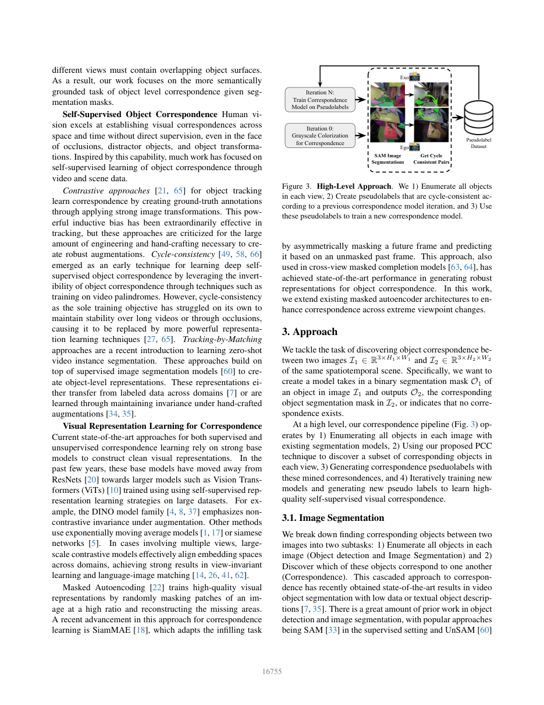

# PCC 原理总结

论文：**Self-Supervised Cross-View Correspondence with Predictive Cycle Consistency**（PCC），Alan Baade（UT Austin）、Changan Chen（Stanford），CVPR 2025，pp. 16753–16763，会议 Highlight。[CVF 论文 PDF](https://www.openaccess.thecvf.com/content/CVPR2025/papers/Baade_Self-Supervised_Cross-View_Correspondence_with_Predictive_Cycle_Consistency_CVPR_2025_paper.pdf) ｜ [代码](https://github.com/AlanBaade/PredictiveCycleConsistency)

## 原文方法图

原文方法框架：颜色扰动经条件着色模型产生对应热图，循环一致性筛选出往返闭合的伪标签，再用伪标签训练对应模型并迭代。[图片来源：CVF 论文 PDF](https://www.openaccess.thecvf.com/content/CVPR2025/papers/Baade_Self-Supervised_Cross-View_Correspondence_with_Predictive_Cycle_Consistency_CVPR_2025_paper.pdf)

## 做了什么

在两个**极端不连续**的视角之间（例如第一人称与第三人称），**不使用任何配对分割标注**，自举出物体级的对应关系。作者把对应拆成两个子问题：物体枚举（用 SAM 出 mask）与物体匹配（本文要解的）。[摘要、引言](https://www.openaccess.thecvf.com/content/CVPR2025/papers/Baade_Self-Supervised_Cross-View_Correspondence_with_Predictive_Cycle_Consistency_CVPR_2025_paper.pdf)

与 TCN 的区别很关键：TCN 让"看起来不同但属于同一事件"的帧在表征空间接近，学的是**状态相近**；PCC 直接问"这个物体在另一个视角里是哪个 mask"，学的是**同一对象**。

## 三步自举

**1）条件灰度着色作为探针。** 训练一个 ViT 的条件着色模型：源图给彩色，目标图给灰度，解码器用交叉注意力把源图信息融进去，预测目标图的颜色。推理时人为扰动源图中某个物体的颜色，看"颜色泄漏"出现在目标图的哪个区域，就得到一张粗糙的对应热图。

**2）循环一致性筛选。** 单方向的热图不可靠，于是做往返：A→B 得到的匹配，再从 B→A 映射回来，能回到原物体才保留为高质量伪标签。原文图 1 的主题就是 inconsistent vs. cycle consistent。

**3）自蒸馏迭代。** 用伪标签训练一个专门的对应 ViT，再用它生成更高质量的伪标签，循环。论文报告通常在三轮后饱和（一轮灰度 + 两轮迭代）。[方法部分、图 1—2](https://www.openaccess.thecvf.com/content/CVPR2025/papers/Baade_Self-Supervised_Cross-View_Correspondence_with_Predictive_Cycle_Consistency_CVPR_2025_paper.pdf)

形式化地，循环一致性约束可以写成：一对物体 $(m^A, m^B)$ 被接受为伪标签，当且仅当

$$
T_{B\to A}\big(T_{A\to B}(m^A)\big) \approx m^A,
$$

其中 $T_{A\to B}$ 是当前模型给出的视角间映射。只有往返闭合的对应才进入下一轮监督。

## 关键实验与对照

- **EgoExo4D correspondence benchmark**：相比此前最优（含监督与自监督方法）**Exo Query 上 +6.7 IoU**。
- **迭代的作用**：第一次到第二次迭代，IoU 从 **26.41 → 29.98**，说明自蒸馏确实在洗掉伪标签噪声，而不是原地打转。
- **大时间间隙**：在 DAVIS-2017 与 LVOS 上跨最大 400 帧的对应，优于 SiamMAE、DINO v1/v2；作者指出基于特征的方法（如 DINOv2）性能随帧间隔增大快速下滑，而 PCC 因以物体 mask 为整体、不受语义相似干扰物影响，衰减明显更缓。
- 初始自监督预训练用 Kinetics-400。[CVPR 2025 poster 摘要](https://cvpr.thecvf.com/virtual/2025/poster/33060)

这些是同一榜单、同一协议下的比较，可比性较好；但 PCC 与对照方法在骨干、分割器、训练轮次上并不完全一致，不能把它读成"只改了循环一致性这一项"的严格单因素实验。

## 与单车世界模型的关系及边界

它支持：**跨视角的同一对象对应可以在没有任何配对标注的前提下自举出来**，而且对极端视角差和长时间间隔都稳。对跨车场景尤其重要——真实车车数据几乎不可能拿到人工配对的实例标注，"能不能自举"决定了这条路走不走得通。循环一致性本身也是本研究可以直接借用的约束形式。

它没有证明：对应关系能转化为未来预测收益。PCC 的输出是匹配 mask，不含动作条件、不含动力学、不做 rollout；它依赖外部分割模型（SAM）提供物体枚举，且训练开销不小；"往返闭合"保证的是自洽，不是语义正确——若 A、B 两侧系统性错配且互逆，循环一致性同样会放行。

**一句话：PCC 用"颜色扰动探针 + 循环一致性筛选 + 自蒸馏"在极端不连续视角间自举出物体级对应，证明这种对应不需要人工配对标注就能学到；但它止步于匹配，不涉及动力学与未来预测。**

整体结论与拟议实验见 [[跨Agent视角对应的训练价值与单车推理结论]]。相关：[[Ego-Exo4D-Correspondence总结]]（评测基准）、[[CCMP总结]]（同为循环一致性路线）、[[TCN总结]]（对照：状态相近 vs. 同一对象）、[[CroCo总结]]。
