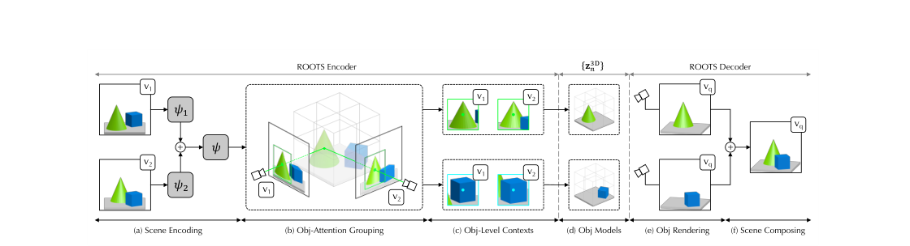

# ROOTS 原理总结

论文：**ROOTS: Object-Centric Representation and Rendering of 3D Scenes**，Chang Chen\*、Fei Deng\*、Sungjin Ahn，JMLR 22(259):1–36, 2021（arXiv:2006.06130）。[JMLR 页面](https://www.jmlr.org/papers/v22/20-1176.html) ｜ [PDF](https://www.jmlr.org/papers/volume22/20-1176/20-1176.pdf) ｜ [项目页](https://sites.google.com/view/roots3d)

## 原文方法图

原文管线：带视角的 context 观测经三维几何体素特征推断出各物体的三维表示，解码阶段可分别渲染单个物体或组合渲染整场景。[图片来源：JMLR 论文 PDF](https://www.jmlr.org/papers/volume22/20-1176/20-1176.pdf)

## 做了什么

从多物体场景的**部分观测**（若干带视角的二维观测）中，无监督、端到端地学出**模块化、可组合的三维物体模型**。两件事同时做到：

1. **推断**：反推各个物体的三维表示（学习搜索并分组属于同一物体的区域）；
2. **渲染**：从任意视角渲染单个物体，或把物体组合起来渲染整个场景。

作者把这个能力称为 object-centric inverse graphics。此前的工作要么能对象级地生成但推不出表示，要么能学三维场景表示但不具备对象级组合性。[摘要、§1](https://www.jmlr.org/papers/volume22/20-1176/20-1176.pdf)

## 与 MulMON 的分工差异

MulMON 是二维 slot + 多视角递归更新同一套 slot；ROOTS 走的是**显式三维几何**路线：

- 编码器输入是带视角标注的 context $\mathcal C=\{(\mathbf x_c,\mathbf v_c)\}_{c=1}^{K}$，即图像 + 对应的相机视角；
- 先在三维体素网格上构建 geometric volume feature map（分区分辨率 $N_x,N_y,N_z$），再在这个三维结构上**搜索与分组**物体区域，得到各物体的三维表示；
- 解码器按物体组合渲染。

因此 ROOTS 对相机几何的依赖比 MulMON 更重：视角是模型输入的一部分，不是可选的辅助信息。[附录 D 算法 1、§3](https://www.jmlr.org/papers/volume22/20-1176/20-1176.pdf)

## 实验与观测

实验在合成多物体三维场景（如 Multi-Shepard-Metzler、3-5 Shapes）上进行，报告的证据包括：

- 生成质量：给定若干 context 图像，从新的查询视角生成物体与整场景，并能分解出逐物体的渲染结果；
- **逐物体操作**：学到的表示支持对单个物体做编辑/操作（这是对象因子化的直接体现）；
- **新场景生成**：把学到的物体模型重组出训练中未出现的场景；
- **有限 context 下的不确定性**：context 从 1 个增加到 4 个时，模型对物体尺寸（尤其深度）与颜色的不确定性逐步收敛；只看到一两个视角时，它对物体大小和未见面的颜色会明显拿不准，这反过来说明跨视角信息确实在被用来消歧。[附录 A—C](https://www.jmlr.org/papers/volume22/20-1176/20-1176.pdf)

## 局限

静态场景：模型里没有时间、没有动作、没有转移，一集之内场景不变，只变观察视角；需要带位姿的多视角输入；实验在合成数据集上完成，没有真实动态场景与真实机器人/驾驶验证。

## 与单车世界模型的关系及边界

它支持：**多视角部分观测足以无监督地因子化出独立物体的三维表示**，并且这种表示是可组合、可单独操作的。它和 MulMON 一起构成"多视角 → 对象级三维表示"的证据基础，且 ROOTS 的证据更偏三维几何一端。

它没有证明：任何动力学。静态、无动作、无时间维度是它的硬边界——把时间维度补上需要 [[TGQN总结|TGQN]] 那一类显式转移模型，把动力学与交互补上需要 [[C-SWM总结|C-SWM]] / [[G-SWM总结|G-SWM]] 那一类图动力学。它也没有跨 Agent/跨车设定：这里的"多视角"是同一个静态场景的多个机位，不是各自运动的不同观察者。

**一句话：ROOTS 从带视角的多视角部分观测中无监督地推断出模块化、可组合的三维物体模型并支持任意视角渲染，是"多视角对象因子化"的静态三维路线代表；但它对相机几何依赖更重，且完全没有时间维度。**

整体结论与拟议实验见 [[跨Agent视角对应的训练价值与单车推理结论]]。相关：[[MulMON总结]]（同问题的 slot 路线，本笔记的主要对照）、[[DyMON总结]]（把 MulMON 推广到动态场景）、[[TGQN总结]]（补上有转移模型但无对象因子化的另一端）、[[GARField总结]]。
