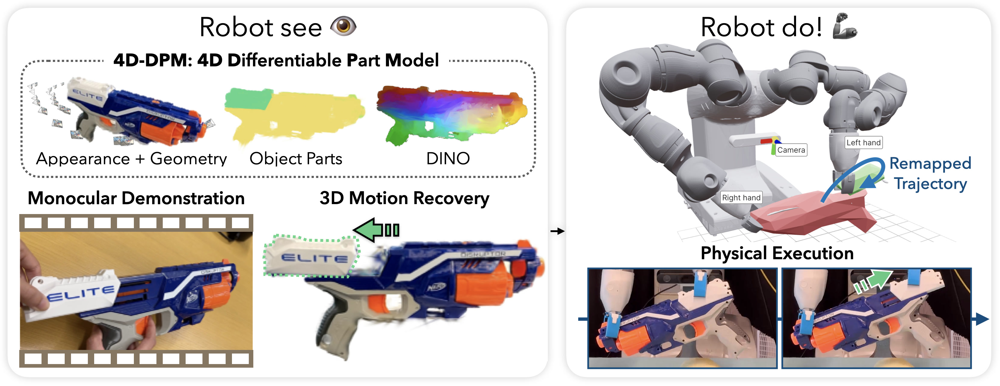

# RSRD 原理总结

论文：**Robot See Robot Do: Imitating Articulated Object Manipulation with Monocular 4D Reconstruction**（RSRD），Justin Kerr、Chung Min Kim、Mingxuan Wu、Brent Yi、Qianqian Wang、Ken Goldberg、Angjoo Kanazawa，CoRL 2024。[arXiv:2409.18121](https://arxiv.org/abs/2409.18121) ｜ [项目页](https://robot-see-robot-do.github.io)

## 原文方法图

项目页主图：系统以单目 RGB 人类演示 + 静态多视角物体扫描为输入，先恢复部件的三维运动，再让机器人复现该部件运动。[图片来源：项目页](https://robot-see-robot-do.github.io)

## 做了什么

让人只看一遍单目 RGB 的人类演示视频（外加一份静态的多视角物体扫描），就让机器人对铰接物体（抽屉、锅、剪刀这类）复现同样的操作。核心是把演示转成**部件级三维轨迹**，而不是去模仿人的手。[摘要](https://arxiv.org/abs/2409.18121)

## 两段式管线

**第一段：4D-DPM（4D Differentiable Part Models）。** 用 **part-centric feature fields**（基于 GARField / DINO 蒸馏出来的特征场）做 analysis-by-synthesis：用可微渲染迭代优化，从**单个单目视频**中恢复出各部件的三维运动，并借助几何正则化约束求解。这一步的输出是"每个部件在演示中怎么动"的 4D 重建。

**第二段：轨迹复现。** 机器人不做动作克隆，而是规划双臂运动，使得物体部件产生与演示相同的相对运动；因为目标表达成 part-centric 轨迹，机器人可以按自身形态限制（臂长、自由度）选择实现方式。作者强调：这样复制的是演示的**意图**，而不是手的具体轨迹。[摘要、§III—IV](https://arxiv.org/abs/2409.18121)

## 关键实验与对照

- 在带真值标注的三维部件轨迹上评测 4D-DPM 的跟踪精度；
- 在双臂 YuMi 机器人上，**9 个物体 × 每个 10 次试验 = 90 次**端到端实验：每个阶段平均成功率 **87%**，**端到端总成功率 60%**；
- 全部只用预训练视觉模型蒸馏出来的 feature fields，**没有任何任务特定的训练、微调、数据采集或标注**。[摘要](https://arxiv.org/abs/2409.18121)

这个数字要谨慎读：60% 是"每个阶段 87%"连乘下来的结果，说明失败主要来自阶段串联的累积，而不是单阶段能力缺失；同时它是物体中心的成功率，不涉及开放环境下的感知失败。

## 与单车世界模型的关系及边界

它支持：**跨视角 object/part 因子化 + 动态场景**可以同时成立。GARField 的 part field 本来是静态场景的产物，RSRD 把它接到单目视频的部件运动估计上，证明了这类部件级三维表示可以承载**运动**，不只是分组。这一步对本研究很关键：它说明"场"这种表示不是只能做静态对应，它确实能表达部件随时间的变化。

它没有证明：存在可外推的动力学。RSRD 做的是 **motion estimation**——对已经观测到的那段视频做 4D 重建，是"事后解释"；它没有任何 learned transition，不能回答"这个部件接下来会怎么动"，也没有动作条件与多步 rollout。它还需要一份静态的多视角扫描作为前置，规划阶段假定轨迹可行。

**一句话：RSRD 用 GARField/DINO 的部件级三维场从单目视频恢复铰接物体的部件运动并让机器人复现，是"跨视角部件因子化 + 动态场景"最接近本研究目标的工作；但它只有对已观测视频的运动估计，没有 learned transition，因此不能外推未来。**

整体结论与拟议实验见 [[跨Agent视角对应的训练价值与单车推理结论]]。相关：[[GARField总结]]（它依赖的 part field 来源）、[[F3RM总结]]、[[DyMON总结]]（同为动态 + 对象因子化，但无显式转移）、[[TGQN总结]]（补上有转移但无对象因子化的另一端）。
