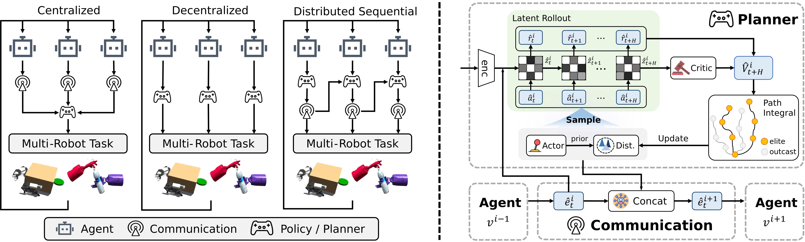

# SeqWM 原理总结

## SeqWM 做了什么

SeqWM 面向多机器人协作任务。它要解决的问题是：在每个机器人只能获得局部观测的情况下，如何利用 World Model 预测未来、规划动作，并让多个机器人形成协调行为。

传统中心化 Multi-Agent World Model 往往把所有 Agent 的 observation 和 action 一次性融合，在联合空间中预测未来：

$$
(o_t^{1:n},a_t^{1:n})
\rightarrow
(o_{t+1}^{1:n},r_{t+1}).
$$

随着 Agent 数量、观测维度和动作维度增加，联合动力学会越来越难建模，中心化方法还依赖完整、同步的信息交换。

SeqWM 不再用一个模型同时处理整个联合系统，而是为每个 Agent 配置一个独立 World Model，并按照 Agent 顺序进行自回归式预测和规划：

$$
v^1\rightarrow v^2\rightarrow\cdots\rightarrow v^n.
$$

前面的 Agent 先预测自己的未来轨迹并规划动作，后面的 Agent 再根据这些预测规划自己的行为。

它的核心思想可以概括为：

$$
\boxed{\text{把联合动力学拆成逐 Agent 的 World Model，并把预测轨迹作为显式协作意图向后传递}}
$$

*图：左侧比较 centralized、decentralized 与 distributed sequential 三种多机器人结构；右侧展示单个 Agent 使用本地 latent rollout、Actor、Critic 和 MPPI 优化动作计划，再将规划信息与已有消息拼接后传给下一个 Agent。*

## 顺序建模过程

在时间步 $t$，每个 Agent 的 observation-action pair 可以看作一个 token：

$$
(o_t^i,a_t^i).
$$

整个多 Agent 系统相应地构成一个序列：

$$
[(o_t^1,a_t^1),(o_t^2,a_t^2),\ldots,(o_t^n,a_t^n)].
$$

SeqWM 按照这个序列依次生成每个 Agent 的下一时刻结果。Agent 1 只依据自己的局部信息进行预测：

$$
(o_t^1,a_t^1)
\rightarrow
(\hat o_{t+1}^1,\hat r_{t+1}^1).
$$

Agent $i$ 除了使用自己的 observation 和 action，还会接收所有前驱 Agent 的预测：

$$
(o_t^i,a_t^i,
\{(\hat o_{t+1}^j,\hat r_{t+1}^j)\}_{j<i})
\rightarrow
(\hat o_{t+1}^i,\hat r_{t+1}^i).
$$

因此，联合预测可以理解为如下自回归分解：

$$
p(\hat o_{t+1}^{1:n},\hat r_{t+1}^{1:n}\mid o_t^{1:n},a_t^{1:n})
=
\prod_{i=1}^{n}
p_i\left(
\hat o_{t+1}^i,\hat r_{t+1}^i
\mid
o_t^i,a_t^i,
\{(\hat o_{t+1}^j,\hat r_{t+1}^j)\}_{j<i}
\right).
$$

它与完全独立的 Decentralized World Model 不同：后面的 Agent 并没有忽略其他机器人，而是通过前驱的预测显式获得它们的未来意图。

## 两个不同的“顺序”

SeqWM 同时包含两个维度的顺序，不能把它们混在一起。

第一个是 **Agent 维度**：

$$
v^1\rightarrow v^2\rightarrow\cdots\rightarrow v^n.
$$

后面的 Agent 根据前面 Agent 的计划进行条件预测。

第二个是 **时间维度**：每个 Agent 的 World Model 都会向未来 rollout $H$ 步：

$$
z_t^i
\rightarrow
\hat z_{t+1}^i
\rightarrow
\hat z_{t+2}^i
\rightarrow
\cdots
\rightarrow
\hat z_{t+H}^i.
$$

因此，SeqWM 并不只是“Agent 1 选一个动作，然后 Agent 2 再选一个动作”。它传递的是一段多步预测轨迹和动作计划，使后继 Agent 可以提前适应前驱 Agent 在未来多个时间步中的行为。

## 每个 Agent 的 World Model

SeqWM 为每个 Agent $v^i$ 维护一套独立参数，Agent 之间不共享 World Model。模型不重建高维原始 observation，而是在 latent space 中预测动力学。

首先，encoder 把局部观测编码成 latent state：

$$
z_t^i=E^i(o_t^i).
$$

然后，dynamics model 根据当前 latent state、候选动作和前驱消息预测下一 latent state：

$$
\hat z_{t+1}^i
=
D^i(z_t^i,a_t^i,e_t^i).
$$

同一组输入还用于预测 reward 和 action value：

$$
\hat r_{t+1}^i=R^i(z_t^i,a_t^i,e_t^i),
$$

$$
\hat q_t^i=Q^i(z_t^i,a_t^i,e_t^i).
$$

Actor 根据当前 latent state 和消息产生动作分布：

$$
\hat a_t^i\sim\pi^{i,\mathrm{Act}}(\cdot\mid z_t^i,e_t^i).
$$

这里的 Actor 不是最终直接执行的显式策略。它主要为后面的 MPPI planner 提供较好的初始动作，使搜索集中在更有希望的区域。

论文中的 encoder、dynamics、reward、critic 和 actor 均使用 MLP。通信内容采用简单的 concatenation，而不是额外的 attention 或 RNN。

## Agent 之间传递什么

$e_t^i$ 表示 Agent $i$ 从前驱 Agent 收到的消息。消息的核心不是原始传感器数据，而是前驱 Agent 已经规划出的动作及其 World Model 预测的 latent trajectory。

可以把 Agent $j$ 的计划写成：

$$
\Gamma_t^j
=
\{(\hat z_h^j,a_h^j,\hat r_h^j)\}_{h=t}^{t+H}.
$$

Agent $i$ 接收到的意图信息可理解为：

$$
e_t^i
=
\bigoplus_{j<i}\Gamma_t^j,
$$

其中 $\oplus$ 表示拼接。

因此，后继 Agent 知道的不只是“前驱现在做了什么”，还包括“前驱预计自己接下来会怎样运动”。论文把这种机制称为 **explicit intention sharing**。

## SeqWM 如何训练

每个 Agent 的模型都独立训练，主要同时优化三类目标：

$$
\mathcal L_i
=
\sum_{h=0}^{H-1}\lambda^h
\left[
\left\|\hat z_{t+h+1}^i-operatorname{sg}(z_{t+h+1}^i)\right\|_2^2
+
\operatorname{SoftCE}(\hat r_{t+h}^i,r_{t+h})
+
\operatorname{SoftCE}(\hat q_{t+h}^i,G_{t+h})
\right].
$$

三项分别对应：

- latent dynamics prediction；
- reward prediction；
- Q-value prediction。

$\operatorname{sg}(\cdot)$ 表示 stop-gradient。真实下一 observation 经 encoder 得到监督目标，但梯度不会沿这个 target 分支反向传播，从而避免循环梯度。

Actor 使用 HASAC 目标训练，在提高 $Q$ value 的同时保留 entropy。模型训练也遵循 Agent 的顺序：更新 Agent $i+1$ 时，使用前 $i$ 个 Agent 最近更新后的模型输出作为条件，使训练结构与实际的自回归依赖保持一致。

还有两个重要约束：

1. 每个 Agent 的 World Model 独立更新，梯度不会穿过通信通道传播；
2. 训练时随机打乱 Agent 顺序，并以一定概率跳过通信，用来模拟通信中断并提高对丢包和扰动的鲁棒性。

## SeqWM 如何规划动作

SeqWM 使用基于 MPPI 的 sequential planner。对 Agent $i$，一次规划过程可以概括为：

1. 接收前驱 Agent 的预测轨迹和动作计划；
2. 在 Actor 给出的先验附近采样 $N$ 组长度为 $H$ 的候选动作序列；
3. 用自己的 World Model 对每组候选动作执行 latent rollout；
4. 用预测 reward 与终点 critic value 评价每条轨迹；
5. 选出价值最高的 $M$ 条 elite trajectories；
6. 根据 elite trajectories 更新动作分布并重复搜索；
7. 将优化后的动作计划和预测轨迹传给下一个 Agent。

一条候选轨迹的价值写成：

$$
V_i
=
\sum_{h=t}^{t+H-1}
\gamma^{h-t}\hat r_h^i
+
\gamma^H
Q^i(\hat z_{t+H}^i,a_{t+H}^i,e_{t+H}^i).
$$

前一项是规划视界内的预测累计 reward，后一项是视界末端的 critic value。后者用于补偿有限 rollout 无法看到的更长期收益。

这个过程使搜索不必直接在所有 Agent 的联合动作空间中同时进行。每个 Agent 只搜索自己的动作空间，同时用前驱计划把搜索限制在与已有协作意图一致的区域。

## 顺序依赖不等于串行阻塞

从逻辑上看，Agent $i$ 的计划依赖前驱 Agent 的消息，但实现时不要求所有 planner 严格排队等待。

SeqWM 为通信消息建立 cache。每个 Agent 的 MPPI planner 按固定控制频率独立运行，直接读取 cache 中最新可用的前驱预测。如果新消息尚未到达或通信暂时失败，就继续使用缓存的多步轨迹。

因此，每步决策延迟近似为：

$$
T_{\mathrm{step}}
\approx
\max_i T_{\mathrm{MPPI}}^{(i)}+T_{\mathrm{comm}},
$$

而不是所有 Agent 规划时间之和。SeqWM 的“sequential”描述的是信息依赖和 cache 更新顺序，不代表物理执行时必须发生线性增长的串行等待。

## 面向真实机器人的设计

为了把 World Model planner 部署到真实机器人，SeqWM 还加入了三个工程机制：

- **Low-pass action smoothing**：对采样动作噪声进行低通滤波，减少高频控制变化造成的机械冲击和动作抖动；
- **Heuristic early-stopping**：当相邻两轮动作分布的 KL divergence 小于阈值时提前停止 MPPI 迭代；
- **Communication cache**：通信中断时使用缓存的前驱预测，避免规划停顿。

这些机制不是顺序 World Model 的理论核心，但直接影响它能否以稳定控制频率运行在物理机器人上。

## 实验说明了什么

论文在两类仿真环境中测试 SeqWM：

- **Bi-DexHands**：两个 Agent 控制一双高维灵巧手，完成物体传递、开瓶盖、拔笔帽和剪刀操作等任务；
- **Multi-Quad**：多个四足机器人完成 Gate、PushBox 和 Shepherd 等协作任务。

对比方法包括 model-free 的 MAPPO、HASAC，model-based 的 MARIE，以及顺序决策方法 MAT。论文报告 SeqWM 在测试任务上取得更高的最终表现和更快的收敛速度；在 Over、CatchOver2Underarm 和 Scissors 中，它在约 2--4M environment steps 内接近最优表现。在 Gate 和 Shepherd 中，它也较早达到接近 $100\%$ 的成功率。

行为可视化显示了三类协作模式：

1. **Predictive adaptation**：接球的灵巧手依据投掷手的未来轨迹，提前调整抓取姿态；
2. **Temporal alignment**：两只手利用相互传递的动作预测，使抓取和拔取动作在时间上对齐；
3. **Role division**：两个四足机器人推箱子时，一个主要提供前向推力，另一个负责横向修正方向。

在扩展到五个机器人的 Gate 任务后，机器人形成了“预测、等待、通过、让行”的动态次序，说明顺序机制不只适用于两个 Agent。

论文还将策略部署到两台 Unitree Go2-W 上，在真实 PushBox、Gate 和 Shepherd 任务中复现了让行、方向修正和动态角色分工等行为。

## 消融实验说明了什么

论文的消融实验支持了三个关键判断：

1. **顺序预测确实改善了动力学建模**：在相同参数量下，sequential model 与 centralized model 的多步 dynamics/reward prediction error 接近，并且都明显优于完全独立、无通信的 decentralized model；
2. **简单拼接比复杂融合更稳定**：concat 在实验中优于 MLP、cross-attention 和 RNN 通信模块；
3. **World Model 和多步意图共享缺一不可**：去掉顺序轨迹传递的 DecWM 会下降，完全去掉 World Model、只交换单步消息的 SeqFree 下降更多。

默认配置下，SeqWM 在单张 RTX A6000 上的每步推理时间约为 $12.8\,\mathrm{ms}$。论文报告，当 early-stopping 阈值设为 $0.5$ 时，推理时间减少约 $57.3\%$，相应的性能损失约为 $5.9\%$。

## SeqWM 的局限

论文明确指出两项主要限制：

1. SeqWM 针对共享 reward 的完全合作任务设计，尚未验证竞争或 mixed-motive 场景；
2. Agent 顺序目前采用固定顺序或随机排列，执行时不能根据任务状态动态调整顺序。

从自回归结构还可以进一步推断：由于后继 Agent 依赖前驱预测，前驱的模型误差可能沿通信链传播。论文通过随机顺序、通信 masking 和 cache 提高鲁棒性，但没有专门给出消除这类误差累积的机制。

## 为什么要使用多智能体世界模型

SeqWM 的动机来自两头都有缺陷的现成做法（引言）：完全去中心化的方法给每个 Agent 各建一个独立 World Model，忽略了 Agent 之间的动力学耦合，协调因此受限；中心化方法则假设完全可观测，把所有 Agent 的 observation 和 action 融进联合空间建模，在高维机器人系统里联合建模复杂度过高，难以部署到真实机器人。
- 考虑交互，考虑去中心化

SeqWM 采取第三条路线（图 1 称为 distributed sequential）：把联合动力学分解为逐 Agent 的自回归 World Model，后继 Agent 条件于前驱的预测轨迹。这样既通过显式意图共享保留了 Agent 间的耦合，又把每个 Agent 的建模与规划约束在自己的低维动作空间内。引言还引用顺序范式文献指出三点收益：更一致的联合推理、更细粒度的 credit assignment、部署时降低对通信同步的依赖并提高对丢包的鲁棒性——这三点来自顺序决策已有工作的结论，SeqWM 把它们引入了 World Model 建模与规划。

这里的“多智能体”同样指多个决策主体及其动作与消息传递，不等于多个摄像头或视觉视角。

## 是否属于 CTDE：执行时仍交换预测轨迹

不属于标准 CTDE，不能把 DIMA 那一节的结论照搬过来。区别有两点：

第一，执行阶段就依赖通信。论文把任务建模为 dec-POMDP，并把顺序通信协议写进决策过程（第 3 节）：每个 Agent 的策略是 $\pi^i: \mathcal O^i \times \mathcal E \to \mathcal A^i$，动作显式依赖前驱传来的消息；执行时传递的正是多步预测轨迹（explicit intention sharing），消融实验中去掉顺序轨迹传递的 DecWM 明显变差，说明通信是方法的核心组成，不是可有可无的附加物。因此执行不是“各决策各的”去中心化执行，论文的定位是图 1 中与 centralized、decentralized 并列的第三种 distributed sequential 范式。

第二，训练阶段也没有全局信息优势。与 DIMA 用 global state 训练 centralized critic 不同，SeqWM 的 critic 输入是本 Agent 的 latent state、动作和收到的消息（$Q^i(z_t^i,a_t^i,e_t^i)$），全文不使用 global state；训练时的随机排序和通信 masking，目的恰恰是让模型适应执行时通信可能缺失的情况，而不是提供执行时拿不到的额外信息。

SeqWM 论述的范式优势在于结构而不是信息量：与 centralized 相比，避免联合空间建模复杂度并摆脱对完整同步信息的依赖；与 decentralized 相比，通过前驱预测保留 Agent 间耦合；工程上再以消息 cache 保证通信中断时规划不停顿（见前文“顺序依赖不等于串行阻塞”）。

## 是否讨论了多视角相对于单视角的优势

没有。SeqWM 处理的是 dec-POMDP 下每个 Agent 的局部状态观测，Bi-DexHands 和 Multi-Quad 的观测都是状态向量而非图像，论文没有讨论视觉视角、多摄像头融合或跨视角表征一致性问题。

真实机器人部署部分提到的八台 Mars 相机属于 NOKOV 动作捕捉定位系统，为实验提供外部定位真值，并不构成 Agent 自身的多视角视觉输入，因此不能当作多视角证据。

与 DIMA 一样，这篇论文可以支持“多个决策主体通过通信完成协作”的讨论，但不能直接支持 MAWM.md 第四点所说的“通过显式关联不同 Agent 的观测，学习跨视角一致表征”。另外两者建立 Agent 间关联的方式也不同：SeqWM 靠执行时的显式消息传递，DIMA 是在单一中心化模型内部逐步条件化各 Agent 的动作。

## 最后总结

SeqWM 的完整逻辑是：

1. 每个 Agent 用自己的 encoder 把局部 observation 编码为 latent state；
2. 前驱 Agent 用独立 World Model 对候选动作进行多步 rollout；
3. MPPI 根据预测 reward 和 terminal value 优化动作序列；
4. 将计划动作和预测 latent trajectory 作为显式意图传给后继 Agent；
5. 后继 Agent 在前驱意图的条件下重复预测和规划；
6. 所有 Agent 通过最新消息 cache 持续重规划，从而形成多机器人协作。

最核心的一句话是：

> SeqWM 不在高维联合空间里一次性预测并规划所有机器人的行为，而是让每个机器人维护独立 World Model，并沿 Agent 顺序共享未来轨迹，使后继机器人能够根据前驱机器人的显式意图进行预测和规划。

## 原文与代码

- 论文：[Empowering Multi-Robot Cooperation via Sequential World Models](https://arxiv.org/abs/2509.13095v3)
- 代码：[zhaozijie2022/seqwm](https://github.com/zhaozijie2022/seqwm)
