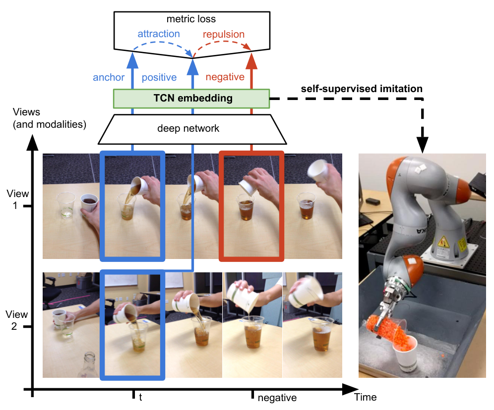

# TCN 原理总结

论文：**Time-Contrastive Networks: Self-Supervised Learning from Video**，Pierre Sermanet 等；2017 年首次发布，本笔记对应 2018 年更新的 arXiv v3。TCN 在这里指 Time-Contrastive Networks，不是 Temporal Convolutional Networks。[论文信息](https://arxiv.org/abs/1704.06888v3)

## 原文方法图

原文图 1：同步不同视角构成正样本，时间上不同的状态提供负样本，通过三元组目标学习表征，再服务于模仿任务。对应关系进入了训练目标，而非仅将各视角作为互不关联的数据输入。[图片来源：论文 PDF 第 1 页](https://arxiv.org/pdf/1704.06888v3#page=1)

## TCN 做了什么

TCN 从同步多视角视频中学习表征：让同一时刻、不同视角的画面靠近，同时区分时间相邻但任务状态不同的画面。目标是保留物体状态、姿态和交互信息，减少相机视角、背景等因素的干扰；随后将表征用于机器人模仿学习。[原文摘要及第 III 节](https://arxiv.org/pdf/1704.06888v3)

## 如何利用跨视角对应

以三元组训练为例：

- Anchor：视角 A 在时刻 $t$ 的画面；
- Positive：视角 B 在同一时刻 $t$ 的画面；
- Negative：另一个时刻、通常外观相似但交互状态可能不同的画面。

其距离约束可等价写为常用 hinge 形式：

$$
\mathcal L_{\mathrm{triplet}}
=
\max\left(
0,\,
\|f(x^a)-f(x^p)\|_2^2
-
\|f(x^a)-f(x^n)\|_2^2
+m
\right).
$$

其中 $m$ 是距离间隔。正样本约束“外观不同，也可能是同一状态”；负样本约束“外观相近，也可能处于不同阶段”。时间邻近只是构造监督的依据，不代表任意两个相邻帧必然具有不同语义。[第 III-A 节；作者方法介绍](https://sermanet.github.io/tcn/)

## 它消除了什么歧义

以倒水为例，画面变化既可能来自相机移动，也可能来自杯子倾斜、液面变化或倒水阶段变化。

同步跨视角配对提供了一个锚点：这两张看起来不同的图，其实对应同一时刻的物理状态。结合时间方向上的区分，模型有机会把“拍摄方式变化”与“任务状态变化”分开。这里是对方法机制的解释，不是说所有隐藏状态都能被唯一识别。

## 与只把多视角数据混在一起训练有什么区别

TCN 的单视角版本也能使用来自多个相机的视频，但正负样本在单条视频的时间邻域内构造；多视角版本则显式使用同步跨相机正样本。因此，“训练数据包含多视角”与“训练目标利用跨视角对应”不是同一件事。[第 III-A 节](https://arxiv.org/pdf/1704.06888v3#page=3)

多个图像可以分别经过同一个编码器；是否建立对应关系，取决于训练目标是否联系这些对应项，而不取决于是否给每个视角单独建一个模型。

## 最贴近这个论点的实验

第 IV-B 节、图 7 的真实机器人倾倒实验中，多视角 TCN 在约 10 次 PILQR 策略优化迭代后形成稳定成功的倾倒行为，所比较的单视角目标基线未能完成任务。作者明确说明：这些单视角模型也使用了相同的多视角数据。

注意三个细节：机器人倾倒的是颗粒珠，人类演示倾倒的是液体；每轮迭代包含 10 次 rollout；10 轮指策略学习过程，不包含此前的表征训练。[第 IV-B 节、图 7，PDF 第 7 页](https://arxiv.org/pdf/1704.06888v3#page=7)

因此，这个实验支持“在该任务与基线设置下，显式利用跨视角对应比仅接触这些图像更有效”，不能扩大为对所有单视角学习方法的普遍否定。

## 为什么收益能够用于单视角输入

TCN 学到的是单幅图像编码器 $f(x)$。多视角对应参与训练后，单张新图像仍能通过这个编码器获得表征；机器人可用自身相机图像与演示视频的表征距离构造模仿奖励，不需要每次编码都提供同步配对图像。[第 III-B 节](https://arxiv.org/pdf/1704.06888v3#page=4)

这不是“直接看一段视频就零样本执行”：论文还进行了策略优化。它也不是 CTDE 多智能体强化学习方法，而是可用于讨论“多视角训练监督能否迁移到单视角使用”的表征学习证据。

## 与多智能体世界模型的关系及边界

与 [[MAWM]] 中第四点的跨视角表征学习直接相关；不直接证明联合动作建模、反事实 credit assignment 或多步世界模型 rollout 的优势。TCN 的多相机采集也不要求每个相机属于一个独立决策 Agent。

**一句话：TCN 说明，同步跨视角对应可以帮助模型区分视角差异与任务状态差异，而不仅仅是增加训练图像的来源。**

与 [[CroCo总结]] 的对照及自动驾驶推论见 [[跨Agent视角对应的训练价值与单车推理结论]]。
