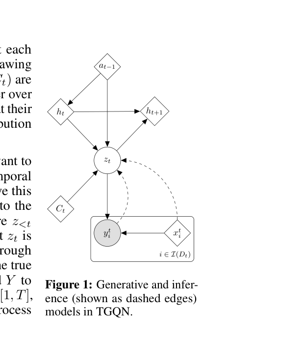

# TGQN 原理总结

论文：**Sequential Neural Processes**（SNP；用于动态三维场景的实例称 **TGQN**，Temporal Generative Query Networks），Gautam Singh\*、Jaesik Yoon\*、Youngsung Son、Sungjin Ahn，NeurIPS 2019 Spotlight。[arXiv:1906.10264](https://arxiv.org/abs/1906.10264) ｜ [HTML 版](https://arxiv.org/html/1906.10264v4) ｜ [NeurIPS 页面](https://proceedings.neurips.cc/paper/2019/hash/110209d8fae7417509ba71ad97c17639-Abstract.html)

## 原文方法图

原文图 1：TGQN 的生成过程与推断过程，场景 latent $z_t$ 由 $(C_t,h_t,a_{t-1})$ 决定，确定态 $h_t$ 用 ConvLSTM 转移。[图片来源：arXiv HTML 版 Figure 1](https://arxiv.org/html/1906.10264v4)

## 做了什么

Neural Processes（NP）能从 context 集合快速推断一个随机过程，但**不建模时间上的演化**。SNP 在 NP 之上加了一层**时间状态转移**，用来建模"一串随时间变化的随机过程"；把它接到 GQN 上做动态三维场景，就是 TGQN。作者称这是第一个能处理三维场景时间动态的 4D 生成模型。[摘要、§1](https://arxiv.org/html/1906.10264v4)

## 生成过程

每个时刻 $t$ 有一批 context 观测 $C_t$（相机视角—图像对），并可选地有动作 $a_t$。场景潜变量 $z_t$ 不再只由当前 context 决定，而是同时依赖过去：

$$
P(Y,Z|X,C)=\prod_{t=1}^{T} P(Y_t|X_t,z_t)\,P(z_t|z_{<t},C_t),\qquad z_0=\texttt{null}.
$$

实现上采用 RSSM 风格：$h_t$ 用 ConvLSTM 转移，$z_t$ 用 Temporal-ConvDRAW 以 $(C_t,h_t,a_{t-1})$ 为条件自回归采样，渲染器从 $(z_t,h_t)$ 与查询视角生成图像。训练目标是 ELBO：

$$
\mathcal L_{\text{SNP}}=\sum_{t=1}^{T}\mathbb E_{Q_\phi(z_t|\mathcal V)}\big[\log P_\theta(Y_t|X_t,z_t)\big]
-\mathbb E_{Q_\phi(z_{<t}|\mathcal V)}\big[\mathbb{KL}\big(Q_\phi(z_t|z_{<t},\mathcal V)\,\|\,P_\theta(z_t|z_{<t},C_t)\big)\big].
$$

[§3.1—3.3、式 4—6](https://arxiv.org/html/1906.10264v4)

作者还专门处理了一个训练病态：转移模型会因为 $z_{<t}$ 已经携带了足够信息而**干脆忽略当前 context $C_t$**（称为 transition collapse），解决办法是 posterior-dropout ELBO——随机挑一部分时刻只用先验转移采样 $z_t$，强迫转移模型去用 $C_t$。[§3.4](https://arxiv.org/html/1906.10264v4)

## 关键实验与对照

两种 context 供给方式，正好对应本研究关心的两种情形：

- **prediction（预测）**：前 5 个时刻给最多 4 个观测，之后**完全不给 context**，只靠动作驱动转移模型外推，并且外推到训练序列长度（$T=10$）之外，直到 $t=29$；
- **tracking（跟踪）**：长度 $T=20$ 的 rollout 中，每个时刻只给最多 2 个观测，考察"部分观测 + 先验知识"如何随时间累积。

负对数似然（$-\log P(Y|X,C)$，K=40 重要性采样）：

| 数据集 | 设定 | T | GQN | TGQN | TGQN+PD |
| --- | --- | --- | --- | --- | --- |
| Color Shapes | Predict | 20 | 5348 | **489** | 564 |
| Color Cube (Det.) | Predict | 10 | 380 | **221** | 226 |
| Multi-Object (Det.) | Predict | 10 | 844 | **346** | 357 |
| Color Shapes | Track | 20 | 5285 | **482** | 513 |
| Color Cube (Jit.) | Track | 20 | 783 | **153** | 156 |
| Multi-Object (Jit.) | Track | 20 | 1777 | **450** | 475 |

[表 1](https://arxiv.org/html/1906.10264v4)

两点值得单独拎出来：一是**基线 GQN 能直接访问全部历史 context**（作者为了公平还额外给 GQN 加了动作序列的 RNN 编码），即便如此仍在所有环境上被 TGQN 超过，且在 tracking 设定下随着时间推移反而变差——说明差距来自"有没有显式转移"，不是"能不能看到更多数据"；二是预测质量的优势**在超出训练长度后依然保持**，这是外推能力而非记忆。

（注意：TGQN+PD 的 NLL 略高于不带 PD 的版本，作者解释这是合理的——带 PD 的模型不忽略 context，需要额外建模能力来先容纳"错误的旧信念"再修正。）

## 与单车世界模型的关系及边界

它支持：**多视角 context + 显式动力学 + 动作条件**这条组合是可行的，而且能在只有稀疏当前观测时靠转移动力学维持对场景的信念，并在新观测到达时修正（tracking 设定）。这恰好是"训练时借用他车观测、部署时只有本车观测"想要的结构：context 是可选的、可稀疏的，动力学是共享的。它也是本研究论证链条上**唯一同时具备多视角与显式转移**的一项。

它没有证明：对象因子化。$z_t$ 是**整体场景的单一 latent**，没有 slot、没有物体图、没有交互项，因此无法表达"某辆车与某辆车之间的相互作用"，只能整体地想象未来。它也不是跨 Agent 设定：多视角是同一场景的多个相机，没有各自运动的观察者，也没有跨视角的实例级对应约束——对应关系在它是隐式的、被转移模型顺带吸收的。实验环境全是合成场景（MuJoCo + Gym），没有真实世界验证。

**一句话：TGQN 用 RSSM 式的显式时间转移把 Neural Processes 推广到动态场景，证明"多视角稀疏 context + 动作条件动力学"可以外推到训练长度之外；但它只有一个整体场景 latent，没有对象因子化，也没有跨视角的实例级对应。**

整体结论与拟议实验见 [[跨Agent视角对应的训练价值与单车推理结论]]。相关：[[ROOTS总结]]、[[MulMON总结]]、[[DyMON总结]]（有对象因子化但无显式转移，正好互补）、[[MV-MWM总结]]、[[XVWM总结]]。
