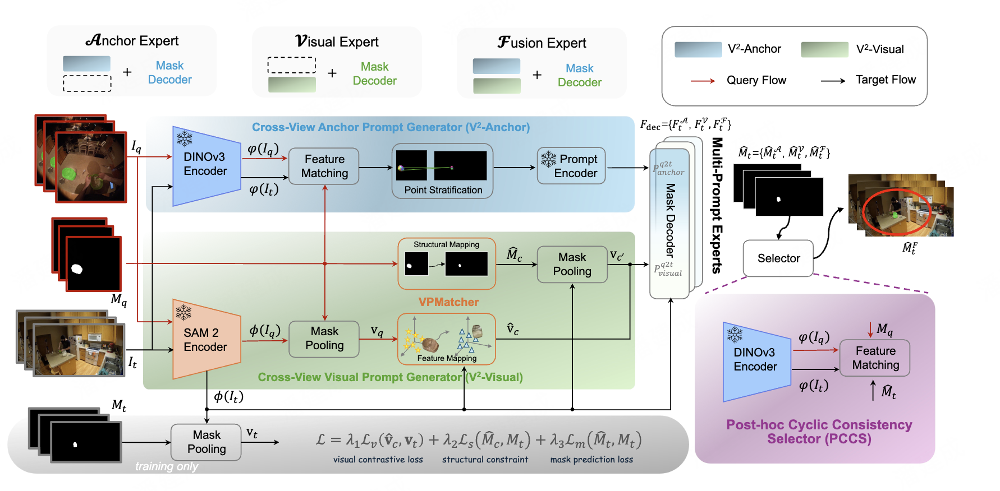

# V²-SAM 原理总结

论文：**V²-SAM: Marrying SAM2 with Multi-Prompt Experts for Cross-View Object Correspondence**，Jiancheng Pan, Runze Wang, Tianwen Qian, Mohammad Mahdi, Yanwei Fu, Xiangyang Xue, Xiaomeng Huang, Luc Van Gool, Danda Pani Paudel, Yuqian Fu，**CVPR 2026 Highlight**。[CVF 虚拟页](https://cvpr.thecvf.com/virtual/2026/poster/38132)；[arXiv:2511.20886](https://arxiv.org/abs/2511.20886)；[代码](https://github.com/jaychempan/V2-SAM)；[项目页](http://jianchengpan.space/projects/V2-SAM)。

## 原文方法图

原文框架图（官方代码仓库 `assets/v2sam-framework.png`）：给定时间对齐的查询—目标图像对 $(I_q, I_t)$ 与查询视图物体掩码 $M_q$，V²-Anchor 用 DINOv3 几何匹配产生坐标提示，V²-Visual 用视觉提示匹配器产生外观提示；三类专家（Anchor / Visual / Fusion）各自预测候选掩码，PCCS 按循环一致性选出最可靠的一个。[图片来源：GitHub 仓库](https://github.com/jaychempan/V2-SAM)

## 做了什么

跨视角物体对应（典型如 ego–exo）要把同一物体从查询视角迁移到目标视角。SAM2 这类基础分割模型依赖空间提示（坐标/框），但跨视角下物体位置剧烈变化，直接把查询视角的坐标搬过去无效；纯视觉提示（如 Ref-SAM）又丢掉了 SAM2 最强的定位能力。V²-SAM 把 SAM2 改造成跨视角对应框架，用两个互补提示生成器分别回答"目标在哪"（几何）和"目标长什么样"（外观），再用多专家与循环一致性选择器结合二者。

## V²-Anchor：用 DINOv3 把跨视角对应变成 SAM2 的坐标提示

关键观察：DINOv3 的 patch 特征具有几何感知，同一物体跨视角的 patch 在特征空间仍可匹配。于是用 DINOv3 稠密特征在目标视图找与查询点最相似的 patch，把得到的坐标当作 SAM2 的点提示：

$$p_t=\arg\max_{p\in\Omega_t}\ \phi_{\text{DINOv3}}(I_t;p)^\top\,\phi_{\text{DINOv3}}(I_q;q),$$

其中 $q$ 来自查询掩码 $M_q$ 给出的物体位置，$\Omega_t$ 为目标视图 patch 网格。这是首次在跨视角场景为 SAM2 解锁基于坐标的 prompting。消融中，去掉 V²-Anchor 后 Anchor Expert 的 Total-IoU 从 40.1 跌到 1.5（Table 4），说明该几何锚点是跨视角定位的核心。

## V²-Visual：外观引导的视觉提示

V²-Visual 在 SAM2 特征上做区域池化，并通过一个 Visual Prompt Matcher（VPMatcher）从特征与结构两个层面对齐 ego–exo 表示，把查询视角的外观信息映射为目标视图的视觉提示。它擅长"知道目标长什么样"；消融中 Visual Expert 加上 V²-Visual 后 Total-IoU 从 3.0 升到 41.4（Table 4）。Anchor 与 Visual 各有所长，因此天然适合多专家融合。

## 多专家 + PCCS 循环一致性选择

三个专家（Anchor / Visual / Fusion）共享解码器架构但参数独立，各预测一个候选掩码。最后用 Post-hoc Cyclic Consistency Selector（PCCS）无参数地选出最可靠预测：把候选目标掩码 $\hat M_e^t$ 反投影回源视图，与原始查询掩码 $M_q$ 比较循环一致性，选分数最高者：

$$s_e=\mathrm{IoU}\!\big(M_q,\ \Phi_{\text{back}}(\hat M_e^t)\big),\qquad \hat M^{\text{final}}=\hat M_{e^*},\ e^*=\arg\max_e s_e.$$

训练时各专家用 SAM2 标准掩码损失（focal + dice）对目标掩码监督：

$$\mathcal{L}_{\text{seg}}=\mathcal{L}_{\text{focal}}(M^t,\hat M)+\mathcal{L}_{\text{dice}}(M^t,\hat M).$$

PCCS 的 Cycle-Points 选择比先验的 Cycle-Mask 在更高 IoU 下还更低耗时与 FLOPs（A+B+C：46.31 / 49.61 vs 46.27 / 49.43，运行时 760 vs 820 ms）。

## 关键实验与对照

- **Ego-Exo4D（Table 1）**：V²-SAM Multi-Experts 的 Total-IoU 48.0，超过此前 SOTA O-MaMa 的 43.4（Ego2Exo 46.3 vs 42.6，Exo2Ego 49.6 vs 44.1）；且可训练参数仅 15.3M，约为 ObjectRelator（1587.3M）的 1%。这是同数据、同评测协议下的直接 SOTA 对照，支持"几何锚点 + 外观提示 + 循环选择"确实优于只用单一提示或外部分割模型匹配。
- **DAVIS-2017（Table 2，帧间间隔 20 帧的视频物体对应）**：$\mathcal{J\&F}_m$ 78.8，超过此前最佳 PCC 的 70.2，说明方法在视频时序跨度上也成立。
- **HANDAL-X 零样本（Table 3）**：Multi-Experts IoU 77.2，远超 ObjectRelator 的 42.8、PSALM 的 39.9。

这些对照支持"跨视角对应可以被可靠学到"，但都是对应/分割精度指标，不是动力学或未来预测指标；SOTA 提升不能直接推出对单车世界模型的收益。

## 与单车世界模型的关系及边界

它支持：① 跨视角"同一物体"的关联可以不依赖相机位姿或 3D 几何标注，仅凭视觉特征（DINOv3 几何匹配 + 循环一致性）建立——这正是把邻车观测对应到本车经历所需的"对应"环节；② 循环一致性选择/训练提供了不依赖目标视图真值的自监督信号，与本项目"用跨车对应产生训练监督"的思路同构。

它没有证明：① 任务停在 ego–exo（可穿戴第一人称 + 第三人称固定机位）的物体对应，不是车–车跨 Agent 场景，也没有自动驾驶数据；② 没有任何动作条件、未来帧预测或 rollout 实验，未把"对应"接到动力学；③ 它解决的是"同物体跨视角定位"，不能自动给出被遮挡物体未来的运动。

**一句话：V²-SAM 用 DINOv3 几何锚点把 SAM2 的坐标提示搬到跨视角场景、用循环一致性融合多专家，把"同物体跨视角定位"做到 SOTA，但它只提供跨视角对应这一环节，没有触及单车未来预测。**

整体结论与拟议实验见 [[跨Agent视角对应的训练价值与单车推理结论]]。相关：[[ObjectRelator总结]]（其直接基线）、[[O-MaMa总结]]（前 SOTA 基线）、[[CCMP总结]]（同样做 ego–exo 对应、用循环一致性但走条件分割路线）、[[XVWM总结]]（跨视角世界模型）、[[C2E总结]]（跨 Agent 感知蒸馏到单车）。
