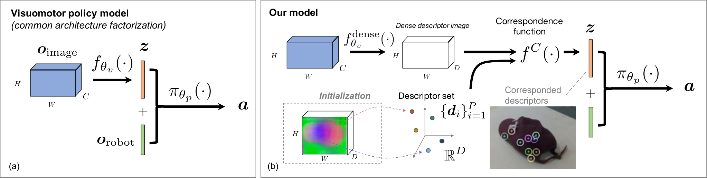

# 自监督对应与视觉运动策略学习总结

论文：**Self-Supervised Correspondence in Visuomotor Policy Learning**，Peter Florence、Lucas Manuelli、Russ Tedrake；本笔记依据 2019 年 arXiv 版本。[论文](https://arxiv.org/abs/1909.06933)

## 原文方法图

原文图 2：左侧是常规的“图像编码—视觉特征—策略”分解；右侧使用对应学习得到的稠密描述子及参考描述子集合提取视觉特征，再结合机器人状态输出动作。跨视角对应主要影响视觉表征，而不是引入未来世界状态预测模块。[图片来源：论文图 2，PDF 第 3 页](https://arxiv.org/pdf/1909.06933#page=3)

## 做了什么

把自监督稠密对应模型接入视觉运动策略：先学会识别物体上的稳定部位，再用这些部位的位置和机器人自身状态决定动作。

与 [[DenseObjectNets总结|Dense Object Nets]] 相比，重点从“学描述子并找抓取点”推进到“让对应表征服务于闭环策略学习”。[原文第 III 节](https://arxiv.org/html/1909.06933)

## 对应怎样变成策略输入

稠密编码器对当前图像输出描述子图；利用选定的参考描述子，定位对应部位，形成较低维的状态 $z_t$，再结合机器人状态输入策略：

$$
I_t\rightarrow f_{\mathrm{dense}}(I_t)
\rightarrow z_t,
\qquad
a_t=\pi(z_t,o_t^{\mathrm{robot}}).
$$

论文比较固定描述子集合、优化描述子集合及端到端更新等方案；并不是所有变体都要求固定视觉编码器。[第 III-B 节](https://arxiv.org/html/1909.06933)

## 如何处理动态场景的跨视角训练

论文使用时间上近似同步的两个相机画面建立像素级对应，使对应学习不必只依赖对静态物体的扫描。

这里与 [[TCN总结|TCN]] 的区别是：TCN 主要对齐整帧表征；该工作监督更细粒度的像素到像素关系。[第 IV-D 节](https://arxiv.org/html/1909.06933)

## 策略如何学习与使用

策略通过行为克隆学习专家示范动作。图像中的对应点可以位于二维图像空间，也可以结合深度定位到三维，因此要按具体变体区分输入需求。

跨相机监督用于训练视觉模块，推理可从当前图像提取对应特征；这不是多 Agent 执行时相互通信，也不是无需示范即可控制。[第 III-B、IV 节](https://arxiv.org/html/1909.06933)

## 实验支持什么

仿真比较表明，对应训练相对自编码和端到端视觉训练具有样本效率及泛化优势；硬件实验展示了物体类别变化、可变形物体等场景中的闭环控制，部分任务使用约 50 次示范。

这里验证的是“对应表征如何帮助策略”，不是对跨视角配对这一单一因素的全面因果隔离。[第 V 节](https://arxiv.org/html/1909.06933)

## 对当前研究的意义

**对“跨视角监督的收益能否进入控制策略”相关；对世界模型 rollout 仍属间接证据。**

空间对应可以稳定定位关键部位，但不自动表示所有任务进度、隐状态或未来动力学。跨车迁移时，还要处理对象运动、坐标转换和遮挡，而不是直接复制图像匹配方法。

总笔记：[[跨Agent视角对应的训练价值与单车推理结论]]。
