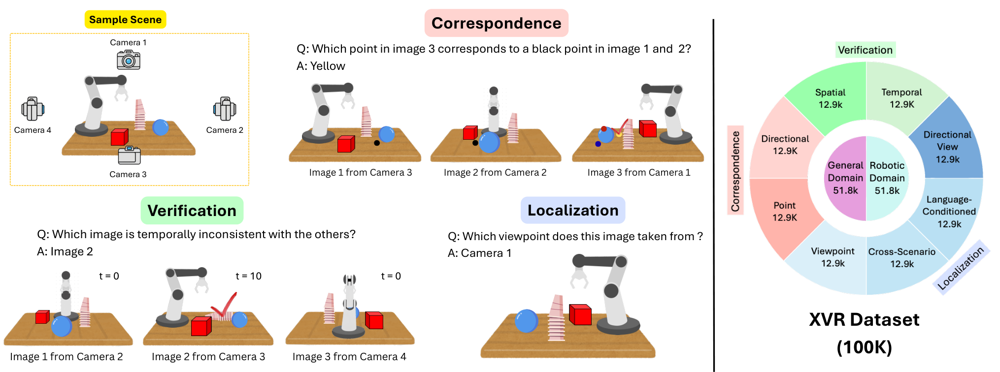
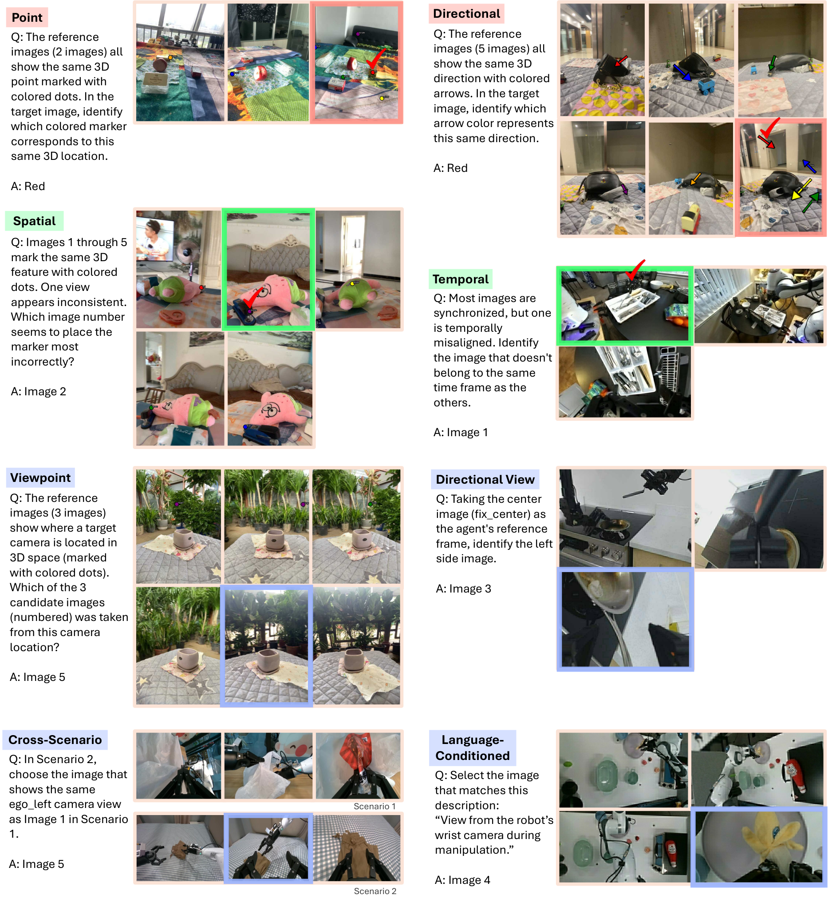

# XVR 原理总结

论文：**Learning Multi-View Spatial Reasoning from Cross-View Relations**，Suchae Jeong 等，CVPR 2026，pp. 2570–2581。本笔记依据 CVF 正式发表页与 arXiv:2603.27967v1（Accepted to CVPR 2026）。[CVF 页面](https://openaccess.thecvf.com/content/CVPR2026/html/Jeong_Learning_Multi-View_Spatial_Reasoning_from_Cross-View_Relations_CVPR_2026_paper.html) ｜ [arXiv](https://arxiv.org/abs/2603.27967)

## 原文方法图

原文图 1（CVF PDF 第 2 页）：XVR 从 18K 个 3D 场景与 70K 条机器人操作轨迹生成 100K 个 VQA 样本，覆盖 Correspondence / Verification / Localization 三类任务。其中 Correspondence 即跨视角 object matching——把同一物体在不同相机视图中的出现对应起来，是“跨视角对应”最直接的能力项。[图片来源：arXiv HTML 版 Figure1](https://arxiv.org/html/2603.27967v1)

原文图 2（CVF PDF 第 3 页）：从多视角渲染与机器人轨迹构造问答对的流程，明确把“同一物体跨视角匹配”作为监督信号之一。[图片来源：arXiv HTML 版 Figure2](https://arxiv.org/html/2603.27967v1)

## 做了什么

XVR 不是提出一个新的模型架构，而是构建一个大规模跨视角空间推理数据集，并用它微调 VLM，使模型获得跨多个视图理解 3D 空间关系的能力；再把训练后的 VLM 表征接到 Vision-Language-Action（VLA）模型，检验其能否改善机器人操作成功率。三类任务为：

- **Correspondence（对应）**：跨视角匹配同一物体，即判断不同视图里哪些物体是同一个；
- **Verification（验证）**：判断给定的空间关系（如“A 在 B 左边”）是否成立；
- **Localization（定位）**：识别物体在某一视图中的位置。

数据集共 **100K** 个 VQA 样本，来自 **18K** 个 3D 场景与 **70K** 条机器人操作轨迹。[原文摘要、第 1 节](https://arxiv.org/html/2603.27967v1)

## 方法要点：对应关系如何进入监督

训练目标是标准的 VQA 交叉熵，但数据构造显式要求模型建立“同一物体、同一事件在不同视角的外观对应”。这与本项目关心的“跨视角对应→训练监督”直接同构：对应不是隐式涌现，而是被做成可监督的问答对。

跨视角 object matching 的核心可写成（示意，非原文逐项损失）：

$$
\{\text{视角 }A\text{ 中物体 }o,\ \text{视角 }B\text{ 中物体 }o'\}
\xrightarrow{\mathrm{match}}
\mathbb{1}[o=o'].
$$

即监督把“看起来不同但属于同一物体”的跨视角观测绑定在一起。[原文第 3 节、XVR-Eval 任务定义](https://arxiv.org/html/2603.27967v1)

## 关键实验与对照

**对照一（跨视角关系本身是否必要，XVR-Eval，Table 2）**：无 XVR 监督的 `Qwen3-VL-2B-Instruct` 总体准确率 **45.02%**，经 XVR 微调的 `Qwen3-VL-2B-XVR` 达 **68.06%**，相对提升约 **1.8×**。任务级：Spatial Verification 48.11%→84.85%；Point Correspondence 57.95%→94.32%（超过人类 92.31%）。封闭的 `Gemini-Robotics-ER-1.5` 的 Viewpoint Localization 仅 **6.22%**，低于随机 **22.22%**——作者据此认为“没有显式监督，即使机器人专用训练也学不会视角关系推理”。这一对照支持“显式跨视角对应监督优于单纯扩大模型规模”，但它评的是推理准确率，不是控制或未来预测。

**对照二（迁移到 VLA 控制，RoboCasa，Figure 5 / 第 4.3 节）**：VLA 主干沿用 GR00T-N1.5 的扩散动作头架构，视觉-语言骨干对比 `Qwen3-VL-2B-Instruct`（基线）与 `Qwen3-VL-2B-XVR`，在 RoboCasa 模拟器中控制 Franka 机械臂，成功率基于 1,000 次 rollout，平均**绝对提升 13 个百分点**；三个任务中 TurnOffMicrowave（控制面板被手腕相机遮挡、需跨视角消歧）增益最大，CoffeePressButton、PnPCabToCounter 也均有提升。**原文未报告逐任务绝对成功率百分比，仅有 Figure 5 可视化与“平均 +13%”的结论**，因此不能从中读出每个任务的基线/实验值。

**外部基准（MindCube / RoboSpatial，Figure 3）**：原文仅披露部分绝对提升幅度——RoboSpatial-Home Compatibility **+7.6%**、MindCube-Tiny Among **+7.0%**，其余任务有提升但未给完整绝对值表。

这些对照能否支持因果结论：XVR-Eval 与 RoboCasa 都是“同数据、同骨干、仅加 XVR 监督”的对照，支持“跨视角关系监督带来收益”的因果推断；但 RoboCasa 只给了平均提升、无逐任务数与无严格消融（没有“打乱配对”或“单视角等价监督”的对照），不能排除部分收益来自数据量或任务分布。

## 与单车世界模型的关系及边界

**它支持**：本项目论证链中“跨视角对应→下游控制监督”这一环，XVR 提供了真实证据——显式训练跨视角 object matching / 空间关系，能迁移到 embodied VLA 的操作成功率（RoboCasa +13%）。这是“对应关系提升控制策略”的实例，与 [[CroCo总结|CroCo]] 的表征迁移、[[MV-MWM总结|MV-MWM]] 的单视角控制增益方向一致。

**它没有证明**：① XVR 训练的是 VLA 策略与空间推理，不是世界模型的未来预测 rollout，因此不直接证明“跨视角对应能改善单车的未来轨迹/占用预测”；② 其多视角来自同一机器人/同一场景的多个机位（腕部、左、右相机），是单 Agent 多相机，不是跨车（跨 Agent）时空对应；③ RoboCasa 仅报平均提升，缺逐任务数与配对正确性消融，无法确认收益严格来自“对应关系的正确性”而非数据或分布。把这些证据落到本项目，仍需补“跨车配对→本车动力学预测”的专门实验。

**一句话：XVR 用 100K 跨视角问答（含 object matching）证明“显式跨视角对应监督”能提升 VLA 在 RoboCasa 的操作成功率，但它是单 Agent 多相机、且只到控制策略而非单车世界模型未来预测。**

整体结论与拟议实验见 [[跨Agent视角对应的训练价值与单车推理结论]]。相关：[[MV-MWM总结]]、[[XVWM总结]]、[[CroCo总结]]。
