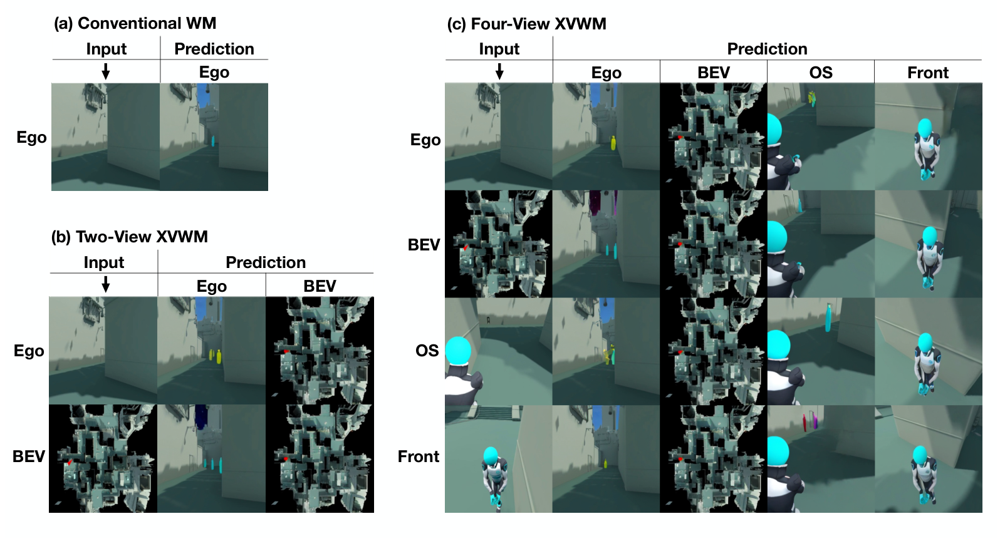

# XVWM 原理总结

论文：**Cross-View World Models**，2026 年；本笔记依据 arXiv:2602.07277v1，按预印本证据使用。[论文](https://arxiv.org/abs/2602.07277)

## 原文方法图

原文图 1：对比常规同视角未来预测与跨视角未来预测，展示两视角及四视角设置。这是原文的输入输出与任务机制概览，不是网络模块架构图；单个源视角的上下文可以用于预测目标视角的未来。[图片来源：论文 PDF 第 2 页](https://arxiv.org/pdf/2602.07277v1#page=2)

## 做了什么

给世界模型一个视角的历史和动作，让它预测相同或另一视角的未来。训练来自同一游戏过程的同步多相机记录，因此输入 A 与目标 B 描述的是同一次状态变化。[原文第 1、3 节](https://arxiv.org/html/2602.07277)

## 跨视角怎样进入动力学目标

用简化条件分布表示：

$$
p_\theta(o_{t+\Delta}^{B}\mid o_{t-k:t}^{A},a,\Delta,A,B).
$$

这里 $a$ 概括论文使用的移动和转向条件，$A,B$ 指视角身份；这不是所有动作序列细节的完整展开。

同一个模型同时学习 $A\to A$、$A\to B$、$B\to A$、$B\to B$。跨视角约束直接训练未来预测模型，不只是先做一个跨视角编码器。[第 2—3 节](https://arxiv.org/html/2602.07277#S3)

## 它试图减少什么歧义

第一人称的像素变化和鸟瞰图中的位置变化相差很大，但对应同一次移动。要完成跨视角预测，模型需要学习这些变化背后的空间联系。

作者将其解释为几何正则化；这不等于数学上保证 latent 唯一恢复真实三维状态，也不意味着能识别任何完全不可见的随机事件。

## 推理时单视角

模型用单个视角的上下文，加动作和目标视角条件，就能预测所选视角。目标视角是训练集合中的视角类型，不能直接理解为任意新相机位姿。

实验来自 Aimlabs 游戏，主要涉及移动与朝向变化；其鸟瞰图含 Agent 位置、朝向标记，不等同于一辆真实邻车的原始相机图像。[第 3 节](https://arxiv.org/html/2602.07277#S3)

## 对当前研究的意义

**强相关：它把证据从表征迁移推进到“跨视角训练对同视角未来预测的迁移”。**

但它没有验证真实跨车交互，也没有证明视角数量越多越好。当前研究需要进一步落到互补观测对具体动力学困难的帮助。

相关：[[MV-MWM总结]]；总笔记：[[跨Agent视角对应的训练价值与单车推理结论]]。
