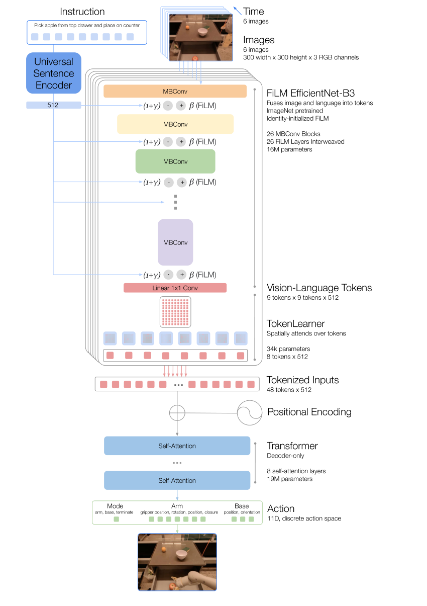
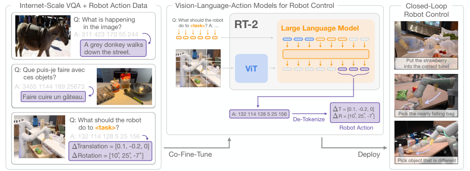
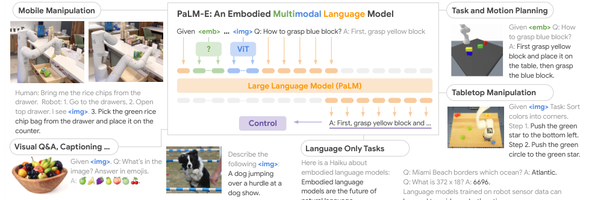

### 论文

#### RT-1: Robotics Transformer for Real-World Control at Scale

RT-1 是 Google Robotics 在 2022 年提出的机器人控制模型，全称是 Robotics Transformer 1。它的目标不是只在仿真里做任务规划，而是把自然语言指令、机器人第一视角图像和低层动作统一成 token 序列，让 Transformer 直接学习「看图 + 理解指令 -> 输出机器人动作」的端到端控制策略。

它可以看作早期 VLA（Vision-Language-Action）模型的代表：输入是视觉和语言，输出不是文字，而是可执行的机器人动作。

##### 核心思路

- 用大规模真实机器人数据训练一个多任务策略模型，而不是为每个任务单独训练策略。
- 用语言指令作为任务条件，让同一套模型支持不同物体、场景和操作目标。
- 把图像特征和动作都 token 化，使 Transformer 能像处理序列建模一样处理机器人控制。
- 通过 TokenLearner 压缩视觉 token，降低推理成本，让模型能以接近实时的频率控制机器人。

##### 架构图

上图来自 RT-1 论文 Figure 3，论文 PDF 已保存到 `论文/RT-1_Robotics_Transformer_for_Real-World_Control_at_Scale.pdf`。

##### 输入与输出

- 输入：
  - 一条自然语言任务指令，例如「把苹果从抽屉里拿出来放到台面上」。
  - 机器人相机的短历史图像序列，论文中使用 6 帧 300x300 RGB 图像。
- 输出：
  - 离散化后的机器人动作 token。
  - 动作空间包括机械臂末端位姿变化、夹爪开合、移动底盘控制，以及终止当前 episode 的模式选择。

RT-1 的动作不是连续回归出来的，而是把每个动作维度离散到固定 bin 中，再用分类方式预测。这让机器人控制问题更接近语言模型里的 token 预测，也方便用交叉熵训练。

##### 编码流程

1. 语言编码：使用 Universal Sentence Encoder 把自然语言指令转成语言向量。
2. 视觉编码：用 ImageNet 预训练的 EfficientNet-B3 提取图像特征。
3. 早期融合：通过 FiLM 层把语言条件注入视觉编码器，使视觉特征从一开始就关注与任务相关的区域。
4. Token 压缩：EfficientNet 输出的空间特征会被展平为视觉 token，再由 TokenLearner 选取和组合关键 token，减少后续 Transformer 的计算量。
5. 时序建模：压缩后的 token 加上位置编码，送入 decoder-only Transformer，建模图像历史和任务上下文。
6. 动作预测：Transformer 输出下一步动作 token，机器人据此执行低层控制。

##### 训练数据

RT-1 训练在大规模真实机器人示教数据上：

- 13 台 Everyday Robots 机器人。
- 约 17 个月采集。
- 约 13 万条 episode。
- 覆盖 700 多个真实操作任务。
- 每条轨迹包含图像、动作和对应的语言指令。

这些数据主要来自真实环境中的移动操作任务，例如抓取、放置、开关抽屉、取出物体、移动物体等。相比只在仿真中训练，RT-1 更强调真实机器人数据的多样性和规模化。

##### 为什么重要

- 把机器人策略学习从「单任务策略」推进到「多任务通用策略」。
- 证明 Transformer 可以直接用于真实机器人低层控制，而不仅仅是高层规划。
- 通过语言条件化，让同一个模型可以根据指令切换任务。
- 为后续 RT-2、Open X-Embodiment、VLA 模型等工作提供了结构基础。
- 在长程任务中可以和 SayCan 一类高层规划器结合：LLM 负责任务分解，RT-1 负责执行低层技能。

##### 局限

- 主要依赖模仿学习，能力边界受示教数据覆盖范围限制。
- 语言理解来自外部文本编码器，本身不是大语言模型级别的开放世界语义推理。
- 输出动作是离散化控制，虽然训练稳定，但精细控制能力受 bin 设计影响。
- 视觉输入主要是短历史帧，对长期记忆和复杂多阶段状态跟踪仍然有限。
- 泛化能力强于传统基线，但仍需要大量真实机器人数据支撑。

##### 一句话总结

RT-1 的关键贡献是：把真实机器人控制问题改写成视觉、语言和动作 token 的序列建模问题，用 Transformer 在大规模真实机器人数据上学习一个可实时执行的多任务策略模型。

参考：

- Google Research Blog: https://research.google/blog/rt-1-robotics-transformer-for-real-world-control-at-scale/
- Paper: https://arxiv.org/abs/2212.06817

#### RT-2: Vision-Language-Action Models Transfer Web Knowledge to Robotic Control

RT-2 是 Google DeepMind 在 2023 年提出的机器人控制模型，全称是 Robotics Transformer 2。它延续了 RT-1 的真实机器人控制路线，但核心变化是：不再只从机器人数据里训练一个相对小的控制 Transformer，而是把已经在互联网图文数据上预训练过的大型视觉语言模型改造成机器人策略模型。

RT-2 的关键想法是把机器人动作也当作一种「语言」：视觉语言模型原本输出自然语言 token，RT-2 把低层动作离散成文本 token，让同一个模型既能学习图文问答、图像描述等互联网任务，也能学习「看图 + 理解指令 -> 输出机器人动作」。

##### 核心思路

- 将机器人动作编码成文本 token，使机器人控制可以被纳入视觉语言模型的自回归输出空间。
- 在互联网规模视觉语言数据和机器人轨迹数据上 co-fine-tune，而不是只用机器人数据微调。
- 复用 PaLI-X、PaLM-E 这类大规模 VLM 的语义理解能力，让机器人获得更强的物体、场景和指令泛化能力。
- 推理时把模型输出的动作 token 反解码成连续机器人控制量，形成闭环控制。

##### 架构图

上图来自 RT-2 论文 Figure 1，论文 PDF 已保存到 `论文/RT-2_Vision-Language-Action_Models_Transfer_Web_Knowledge_to_Robotic_Control.pdf`。

##### 输入与输出

- 输入：
  - 机器人当前视觉观测，主要是相机图像。
  - 一条自然语言任务指令，通常会包装成类似 VQA 的 prompt，例如「机器人应该采取什么动作来完成这个任务」。
- 输出：
  - 一个文本形式的动作 token 序列。
  - 序列会被 de-tokenize 成机器人动作，包括末端执行器位置变化、旋转变化、夹爪伸缩，以及 episode 终止信号。

RT-2 沿用了 RT-1 的动作离散化思想：连续动作维度被离散到 256 个 bin 中，再作为 token 预测。区别在于，RT-2 把这些 action token 放进大型视觉语言模型的词表/输出空间里，让动作预测和自然语言生成使用同一种训练范式。

##### 训练流程

1. 选择预训练视觉语言模型作为骨干，论文中主要使用 RT-2-PaLI-X 和 RT-2-PaLM-E 两类实例。
2. 将机器人轨迹转写成视觉问答式样本：输入是图像和任务问题，答案不是自然语言，而是动作 token。
3. 将机器人动作数据和原始互联网视觉语言数据混合训练，避免模型只在机器人数据上微调后遗忘原有语义能力。
4. 训练完成后，模型在每个控制步根据当前图像和指令生成动作 token。
5. 系统把动作 token 反解码成机器人低层控制命令，并在真实机器人上闭环执行。

##### 训练数据

RT-2 的机器人数据来自 RT-1 同一系列真实机器人示教数据：

- 13 台 Everyday Robots 机器人。
- 约 17 个月采集。
- 覆盖办公室厨房环境中的抓取、移动、放置、开关抽屉、从容器中取物等操作。
- 每条示教包含视觉观测、自然语言指令和机器人动作。

除此之外，RT-2 还使用了骨干 VLM 原本的互联网规模图文数据，例如视觉问答、图像描述、图文交错样本等。论文强调的不是单纯扩大机器人数据，而是利用互联网图文预训练带来的语义知识迁移。

##### 为什么重要

- 把 RT-1 的「机器人动作 token 化」推进到「视觉语言动作模型」范式，也就是 VLA。
- 证明互联网图文预训练知识可以迁移到真实机器人低层控制，而不只用于高层规划。
- 相比 RT-1，RT-2 在未见过的物体、背景、环境和指令上有更强泛化能力。
- 模型能表现出一定的语义推理能力，例如根据物体功能、类别或抽象描述选择目标。
- 为后续 Open X-Embodiment、通用 VLA 和基于大模型的机器人策略提供了直接范式。

##### 局限

- 仍然需要真实机器人示教数据，不能只靠互联网图文数据直接获得稳定控制能力。
- 大模型闭环控制的推理成本很高，真实机器人实时部署需要额外的系统优化。
- 动作仍是离散 token，精细连续控制能力受离散化粒度影响。
- 评估环境主要集中在 Google 的移动操作机器人和厨房/桌面任务，开放世界泛化仍有限。
- 语义推理能力来自训练数据和 VLM 预训练，并不等价于可靠的物理因果推理。

##### 一句话总结

RT-2 的关键贡献是：把机器人动作表示成文本 token，把大型视觉语言模型直接训练成可闭环执行的视觉语言动作模型，让互联网图文知识能够迁移到真实机器人控制。

参考：

- Project: https://robotics-transformer2.github.io/
- Paper: https://arxiv.org/abs/2307.15818

#### PaLM-E: An Embodied Multimodal Language Model

PaLM-E 是 Google 在 2023 年提出的具身多模态语言模型，全称是 PaLM-E: An Embodied Multimodal Language Model。它和 RT-1、RT-2 的定位略有不同：RT-1/RT-2 更接近直接输出机器人动作的控制策略，而 PaLM-E 更像一个把视觉、状态、3D 场景表示接入大语言模型的具身推理与高层规划模型。

PaLM-E 的目标是让 LLM 不只处理文本，还能直接接收来自真实世界的连续观测，例如图像、机器人状态、物体状态和 3D 场景表示。模型把这些非文本输入映射到语言模型的 embedding 空间，和文本 token 交错组成 multimodal sentence，再由 PaLM 生成答案、计划或机器人可执行的高层指令。

##### 核心思路

- 将图像、状态向量、物体级表示、3D 场景表示等连续输入映射到 LLM 的 token embedding 空间。
- 用特殊 token 标记多模态输入位置，例如 `` 或 `<emb>`，再用对应编码器输出的向量替换这些 token。
- 保留 PaLM 的语言推理能力，同时通过端到端训练把语言和真实世界感知对齐。
- 在机器人规划、具身问答、视觉问答、图像描述和语言任务上联合训练，观察跨任务迁移能力。

##### 架构图

上图来自 PaLM-E 论文 Figure 1，论文 PDF 已保存到 `论文/PaLM-E_An_Embodied_Multimodal_Language_Model.pdf`。

##### 输入与输出

- 输入：
  - 文本 prompt，例如任务描述、问题或人类指令。
  - 图像输入，例如机器人相机图像或普通视觉问答图像。
  - 连续状态输入，例如机器人状态、物体位姿、场景状态。
  - 可选的 3D 或物体级表示，例如 OSRT 这类 object-centric scene representation。
- 输出：
  - 自然语言答案，例如视觉问答或图像描述。
  - 多步骤机器人计划，例如先找物体、再抓取、再放置。
  - 可交给低层策略执行的高层指令或决策。

PaLM-E 本身通常不直接输出关节力矩或末端执行器连续动作。它更像高层具身大脑，负责根据感知和语言生成计划；具体执行可以交给 RT-1 这类低层策略或其他机器人控制器。

##### 编码流程

1. 构造多模态句子：文本中包含特殊占位 token，用来表示图像、状态或其他连续观测。
2. 多模态编码：用 ViT、ViT + TokenLearner、状态 MLP 或 OSRT 等编码器处理不同模态输入。
3. 空间对齐：通过 projector 把这些编码结果映射到 PaLM 的词向量维度。
4. Token 替换：用连续观测 embedding 替换文本中的特殊 token，使图像和状态像词一样进入 Transformer。
5. 语言建模：decoder-only PaLM 根据多模态上下文自回归生成文本输出。
6. 机器人执行：当输出是计划或指令时，由低层策略/规划器把文本决策转换成具体机器人动作。

##### 训练数据

PaLM-E 的训练使用 full mixture 数据：

- 互联网规模视觉语言数据，例如 VQA、图像描述、COCO、WebLI 等。
- 常规语言建模数据，用来保持 PaLM 的通用语言能力。
- 多个机器人任务域的数据，包括 TAMP、Language-Table/tabletop manipulation、mobile manipulation。
- 论文中 full mixture 里只有 8.9% 是具身机器人数据，其余主要是语言和视觉语言数据。
- 机器人实验覆盖仿真环境和两个真实机器人平台。

这种数据设计的重点是验证迁移：即使机器人数据占比很小，模型仍然可以从大规模语言/视觉语言预训练中获得帮助，并在不同机器人任务之间互相提升。

##### 为什么重要

- 把大语言模型从纯文本推理推进到具身多模态推理，让传感器观测可以直接进入 LLM。
- 证明多任务、多模态、跨 embodiment 训练可以带来正迁移，而不是只训练单一机器人任务。
- PaLM-E-562B 展示了大规模模型在具身任务、视觉语言任务和语言任务之间同时保持能力的可能性。
- 它为后续 RT-2 这类 VLA 模型提供了重要基础：PaLM-E 可以作为具身 VLM 骨干，也可以作为高层规划器。
- 在机器人系统里，它更适合承担「理解场景、生成计划、调用技能」的角色。

##### 局限

- PaLM-E 主要输出文本计划或高层决策，不是完整的低层闭环控制策略。
- 机器人执行仍依赖外部低层策略，如果低层技能不可用或失败，PaLM-E 本身无法直接补足控制能力。
- 模型规模很大，训练和部署成本高。
- 多模态 grounding 依赖编码器和训练数据，面对分布外场景仍可能产生错误推理。
- 文本计划需要可靠地映射到机器人技能，解析、执行和错误恢复都会引入额外系统复杂度。

##### 一句话总结

PaLM-E 的关键贡献是：把图像、状态和 3D 场景等连续观测注入 PaLM 的语言 token 空间，让大语言模型可以在真实世界感知条件下进行具身问答、高层规划和跨任务机器人推理。

参考：

- Project: https://palm-e.github.io/
- Paper: https://arxiv.org/abs/2303.03378
