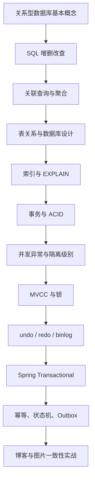
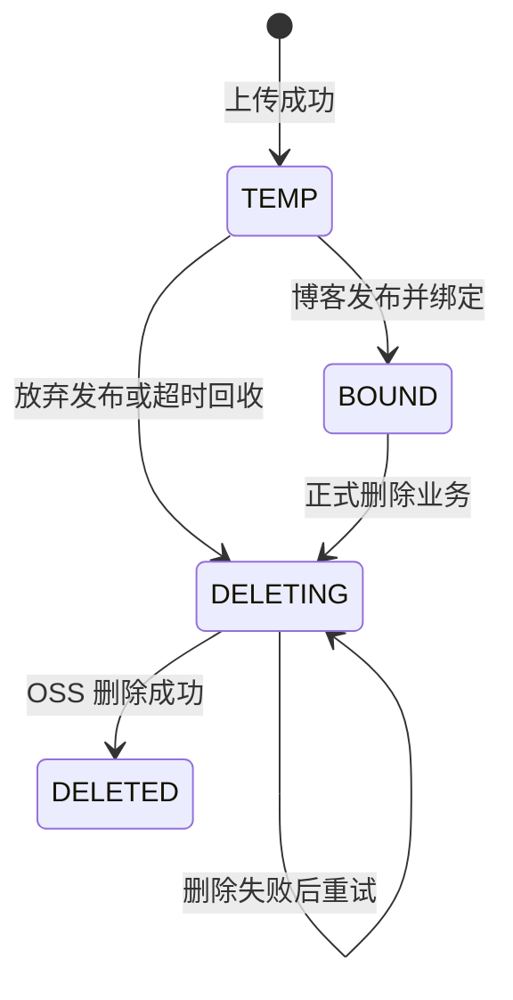

# 数据库基础补习路线：从 SQL 到事务与一致性

> [!abstract] 学习目标
> 从“能写简单 SQL”逐步走到“能设计表、分析索引、正确划分事务，并处理博客与图片的一致性问题”。  
> 不追求一次背完所有概念，而是做到：**能解释、能写 SQL、能复现实验、能应用到项目。**

> [!important] 学习原则
> 每学一个概念，至少完成一次实际操作。  
> 推荐每天学习 60～90 分钟，其中理论不超过一半，其余时间用于写 SQL、制造错误和观察结果。

## 目录

- [[#1. 数据库知识地图]]
- [[#2. 第一阶段：关系型数据库基础]]
- [[#3. 第二阶段：SQL 基础]]
- [[#4. 第三阶段：表设计与数据约束]]
- [[#5. 第四阶段：索引与查询优化]]
- [[#6. 第五阶段：事务基础]]
- [[#7. 第六阶段：并发问题与隔离级别]]
- [[#8. 第七阶段：MVCC、锁和日志]]
- [[#9. 第八阶段：Spring 事务]]
- [[#10. 第九阶段：跨系统一致性]]
- [[#11. 综合练习：博客与图片管理]]
- [[#12. 四周学习计划]]
- [[#13. 最终验收清单]]
- [[#14. 参考资料]]

---

## 1. 数据库知识地图



学习时严格从上往下。当前没必要先研究分库分表、TCC、Saga 或数据库源码。

---

## 2. 第一阶段：关系型数据库基础

### 2.1 数据库到底是什么

数据库管理系统（DBMS）是负责保存、查询、修改和保护数据的软件。MySQL 是一个关系型数据库管理系统。

基本层级：

```text
MySQL 服务
└── 数据库 / Schema
    ├── 表
    │   ├── 列：规定数据的含义和类型
    │   └── 行：一条具体数据
    ├── 索引
    ├── 约束
    └── 视图、存储过程等其他对象
```

例如博客系统中的一行数据：

| id | user_id | title | content |
|---:|---:|---|---|
| 1001 | 8 | MySQL 学习记录 | 今天学习了事务 |

- `id`、`user_id`、`title`、`content` 是列。
- 整行表示一篇博客。
- 表结构规定每一列允许保存什么数据。

### 2.2 必须掌握的基础词汇

| 概念 | 作用 |
|---|---|
| 主键 `PRIMARY KEY` | 唯一标识一行数据 |
| 外键 `FOREIGN KEY` | 表示两张表之间的引用关系 |
| 唯一约束 `UNIQUE` | 保证某列或某组列不重复 |
| 非空约束 `NOT NULL` | 不允许缺少该字段 |
| 默认值 `DEFAULT` | 插入时没有提供值则使用默认值 |
| `NULL` | 未知、缺失或不适用，不等于 `0` 或空字符串 |
| Schema | 表、索引、约束等数据库对象的集合 |
| SQL | 与关系型数据库交互的语言 |

### 2.3 SQL 类型分类

| 类型 | 常见命令 | 用途 |
|---|---|---|
| DDL | `CREATE`、`ALTER`、`DROP` | 定义数据库结构 |
| DML | `INSERT`、`UPDATE`、`DELETE` | 修改数据 |
| DQL | `SELECT` | 查询数据 |
| TCL | `COMMIT`、`ROLLBACK` | 控制事务 |
| DCL | `GRANT`、`REVOKE` | 控制权限 |

> [!warning]
> `DELETE` 是删除数据，`DROP` 是删除数据库对象，`TRUNCATE` 是快速清空表。三者不是一回事。

### 2.4 本阶段验收

- [ ] 能解释数据库、表、行、列的关系。
- [ ] 能解释主键、外键、唯一约束和非空约束。
- [ ] 知道 `NULL` 不等于空字符串。
- [ ] 能区分 DDL、DML、DQL 和 TCL。

---

## 3. 第二阶段：SQL 基础

### 3.1 建立练习数据库

以下示例以 MySQL 8.x 为主：

```sql
CREATE DATABASE IF NOT EXISTS db_blog_learn
    CHARACTER SET utf8mb4
    COLLATE utf8mb4_0900_ai_ci;

USE db_blog_learn;
```

如果当前 MySQL 版本不支持该排序规则，可以换成：

```sql
CREATE DATABASE IF NOT EXISTS db_blog_learn
    CHARACTER SET utf8mb4
    COLLATE utf8mb4_unicode_ci;
```

### 3.2 创建用户表

```sql
CREATE TABLE tb_user (
    id BIGINT UNSIGNED PRIMARY KEY AUTO_INCREMENT,
    username VARCHAR(64) NOT NULL,
    email VARCHAR(128) NOT NULL,
    status TINYINT NOT NULL DEFAULT 1,
    created_at DATETIME NOT NULL DEFAULT CURRENT_TIMESTAMP,
    UNIQUE KEY uk_user_email (email)
) ENGINE = InnoDB;
```

### 3.3 增删改查

插入：

```sql
INSERT INTO tb_user (username, email)
VALUES
    ('Alice', 'alice@example.com'),
    ('Bob', 'bob@example.com');
```

查询：

```sql
SELECT id, username, email
FROM tb_user
WHERE status = 1
ORDER BY id DESC
LIMIT 10;
```

修改：

```sql
UPDATE tb_user
SET username = 'Alice Chen'
WHERE id = 1;
```

删除：

```sql
DELETE FROM tb_user
WHERE id = 2;
```

> [!danger] 更新和删除前先检查条件
> 执行 `UPDATE` 或 `DELETE` 前，先把相同的 `WHERE` 放进 `SELECT`，确认命中的数据范围。  
> 没有 `WHERE` 的更新或删除可能影响整张表。

### 3.4 查询必须掌握的内容

#### 条件查询

```sql
SELECT *
FROM tb_user
WHERE status = 1
  AND username LIKE 'A%';
```

常见条件：

- `=`
- `<>` 或 `!=`
- `>`、`>=`、`<`、`<=`
- `IN`
- `BETWEEN`
- `LIKE`
- `IS NULL`
- `IS NOT NULL`
- `AND`、`OR`、`NOT`

注意：

```sql
-- 错误：NULL 不能用等号判断
WHERE email = NULL

-- 正确
WHERE email IS NULL
```

#### 排序和分页

```sql
SELECT id, username
FROM tb_user
ORDER BY created_at DESC, id DESC
LIMIT 20 OFFSET 0;
```

#### 聚合和分组

```sql
SELECT status, COUNT(*) AS user_count
FROM tb_user
GROUP BY status
HAVING COUNT(*) >= 1;
```

理解执行逻辑：

```text
FROM / JOIN
→ WHERE
→ GROUP BY
→ HAVING
→ SELECT
→ ORDER BY
→ LIMIT
```

这是逻辑顺序，不一定等于数据库内部真实的物理执行顺序。

### 3.5 JOIN

先建立博客表：

```sql
CREATE TABLE tb_blog (
    id BIGINT UNSIGNED PRIMARY KEY AUTO_INCREMENT,
    user_id BIGINT UNSIGNED NOT NULL,
    title VARCHAR(128) NOT NULL,
    content TEXT NOT NULL,
    status VARCHAR(16) NOT NULL DEFAULT 'DRAFT',
    created_at DATETIME NOT NULL DEFAULT CURRENT_TIMESTAMP,
    updated_at DATETIME NOT NULL DEFAULT CURRENT_TIMESTAMP
        ON UPDATE CURRENT_TIMESTAMP,
    CONSTRAINT fk_blog_user
        FOREIGN KEY (user_id) REFERENCES tb_user(id)
) ENGINE = InnoDB;
```

查询博客和作者：

```sql
SELECT
    b.id,
    b.title,
    b.status,
    u.username
FROM tb_blog AS b
INNER JOIN tb_user AS u
    ON u.id = b.user_id
ORDER BY b.id DESC;
```

`INNER JOIN` 和 `LEFT JOIN` 的区别：

- `INNER JOIN`：只保留两边能够匹配的数据。
- `LEFT JOIN`：左表的数据全部保留，右表匹配不到时返回 `NULL`。

### 3.6 SQL 练习

- [ ] 插入 5 个用户。
- [ ] 每个用户插入 0～3 篇博客。
- [ ] 查询所有已发布博客。
- [ ] 查询标题包含“MySQL”的博客。
- [ ] 查询每个用户的博客数量。
- [ ] 查询没有发布过博客的用户。
- [ ] 查询博客数量最多的 3 个用户。
- [ ] 分页查询博客，按创建时间倒序。

---

## 4. 第三阶段：表设计与数据约束

### 4.1 三种关系

#### 一对一

一个用户对应一份用户详情：

```text
tb_user 1 ─── 1 tb_user_profile
```

#### 一对多

一个用户可以发布多篇博客：

```text
tb_user 1 ─── N tb_blog
```

通常把“一”的主键放到“多”的一侧：

```text
tb_blog.user_id → tb_user.id
```

#### 多对多

一篇博客可以有多个标签，一个标签也可以属于多篇博客：

```text
tb_blog N ─── N tb_tag
```

使用中间表拆解：

```text
tb_blog 1 ─── N tb_blog_tag N ─── 1 tb_tag
```

### 4.2 主键与业务字段

主键最好具有以下特点：

- 唯一
- 稳定，不随业务修改
- 尽量短
- 不承载过多业务含义

手机号、邮箱、用户名可能发生变化，通常不适合作为主键，但可以建立唯一约束。

### 4.3 为什么需要约束

如果只在 Java 中检查邮箱不能重复，并发请求仍可能同时通过检查：

```text
请求 A：查询邮箱不存在
请求 B：查询邮箱不存在
请求 A：插入
请求 B：插入
```

数据库唯一约束才是最后一道防线：

```sql
UNIQUE KEY uk_user_email (email)
```

业务代码应该捕获重复键异常，并返回清晰的业务错误。

### 4.4 范式的直觉理解

不需要先背正式定义，先理解目标。

#### 第一范式

每个字段应保存一个不可再拆的业务值，而不是把多个标签塞进一个字符串：

```text
不推荐：tag_ids = "1,2,3"
推荐：使用 tb_blog_tag 中间表
```

#### 第二范式

非主键字段应该依赖整个主键，而不是只依赖联合主键的一部分。

#### 第三范式

非主键字段不应通过另一个非主键字段间接依赖主键。

例如博客表通常不应重复保存一整套用户资料：

```text
tb_blog(id, user_id, username, user_email, ...)
```

用户名修改后，所有博客行都需要同步修改，容易产生不一致。

### 4.5 反范式

为了查询性能，有时会主动保存少量冗余字段，例如博客点赞数、评论数。

反范式不是随便重复数据，而是：

1. 明确查询性能目标。
2. 明确哪个字段是权威来源。
3. 设计更新和修复机制。
4. 接受并监控可能出现的不一致。

### 4.6 外键的两个含义

外键首先是一个数据关系，其次才是数据库中的 `FOREIGN KEY` 约束。

有些互联网项目不创建物理外键，而由应用维护关系，原因可能包括迁移、性能和分库需求。但学习阶段必须理解外键约束，因为它能清晰展示数据完整性。

### 4.7 `ON DELETE CASCADE` 不是事务级联回滚

```sql
FOREIGN KEY (blog_id)
REFERENCES tb_blog(id)
ON DELETE CASCADE
```

它表示删除博客时自动删除相关子表记录。

它和“事务读取未提交数据后发生的级联回滚”是两个完全不同的概念。

### 4.8 本阶段验收

- [ ] 能识别一对一、一对多和多对多。
- [ ] 知道多对多为什么需要中间表。
- [ ] 能解释为什么邮箱应该使用唯一约束。
- [ ] 能解释范式解决了什么问题。
- [ ] 能区分外键级联删除和事务级联回滚。

---

## 5. 第四阶段：索引与查询优化

### 5.1 索引是什么

索引是帮助数据库快速定位数据的数据结构。InnoDB 常见索引主要使用 B+Tree。

直觉类比：

```text
没有索引：从书的第一页逐页查找
有索引：先查目录，再定位到对应页面
```

索引不是免费的：

- 占用磁盘空间。
- 插入、更新、删除时需要维护索引。
- 索引过多会降低写入性能。
- 错误索引可能根本不会被使用。

### 5.2 聚簇索引和二级索引

InnoDB 中：

- 主键索引通常是聚簇索引，叶子节点保存整行数据。
- 二级索引叶子节点通常保存索引列和主键值。
- 通过二级索引找到主键后，再查询聚簇索引取得其他列，通常称为“回表”。

### 5.3 联合索引

为博客列表建立索引：

```sql
CREATE INDEX idx_blog_user_status_created
ON tb_blog (user_id, status, created_at);
```

这个索引通常更适合：

```sql
WHERE user_id = ?
  AND status = ?
ORDER BY created_at DESC
```

理解最左前缀：

```text
(user_id, status, created_at)
```

通常可以从 `user_id` 开始使用，不能随意跳过最左列后还期待完整利用后续列。

> [!note]
> “最左前缀”是理解索引顺序的起点，不是判断执行计划的万能公式。最终以真实 SQL、数据分布和 `EXPLAIN` 为准。

### 5.4 覆盖索引

如果查询需要的列都可以从索引中取得，就可能不需要回表：

```sql
SELECT user_id, status, created_at
FROM tb_blog
WHERE user_id = ?
  AND status = ?;
```

### 5.5 使用 `EXPLAIN`

```sql
EXPLAIN
SELECT id, title, created_at
FROM tb_blog
WHERE user_id = 1
  AND status = 'PUBLISHED'
ORDER BY created_at DESC
LIMIT 20;
```

初学阶段重点观察：

| 字段 | 关注点 |
|---|---|
| `type` | 大致访问方式，避免无必要的全表扫描 |
| `possible_keys` | 可能使用的索引 |
| `key` | 实际使用的索引 |
| `key_len` | 实际使用的索引长度 |
| `rows` | 预计扫描行数 |
| `Extra` | 是否有额外排序、临时表、索引覆盖等信息 |

### 5.6 常见误区

- 在所有列上都建立索引。
- 联合索引顺序不考虑查询条件。
- 在索引列上随意使用函数。
- 对低选择性字段单独建很多索引。
- 使用 `%关键词%` 并期待普通 B+Tree 索引高效工作。
- 只看有没有索引，不看扫描行数和数据分布。
- 深分页时仍然使用很大的 `OFFSET`。

### 5.7 索引练习

- [ ] 给“用户的已发布博客列表”设计联合索引。
- [ ] 比较建索引前后的 `EXPLAIN`。
- [ ] 调换联合索引列顺序，观察执行计划。
- [ ] 尝试覆盖索引，观察 `Extra`。
- [ ] 解释为什么索引会提高查询但降低写入速度。

---

## 6. 第五阶段：事务基础

### 6.1 什么是事务

事务是数据库中的一个逻辑工作单元。一组操作要么全部成功，要么按照事务规则进行回滚。

转账示例：

```text
账户 A 减少 100 元
账户 B 增加 100 元
```

不能只完成其中一步。

### 6.2 基本语法

```sql
START TRANSACTION;

UPDATE tb_account
SET balance = balance - 100
WHERE id = 1;

UPDATE tb_account
SET balance = balance + 100
WHERE id = 2;

COMMIT;
```

发生错误：

```sql
ROLLBACK;
```

查看自动提交：

```sql
SELECT @@autocommit;
```

### 6.3 ACID

| 特性 | 含义 | 转账示例 |
|---|---|---|
| Atomicity 原子性 | 全部成功或整体回滚 | 不能只扣款不入账 |
| Consistency 一致性 | 事务前后满足业务约束 | 总金额应保持不变 |
| Isolation 隔离性 | 并发事务尽量互不干扰 | 不能看到不应看到的中间状态 |
| Durability 持久性 | 提交后即使宕机也应恢复 | 已提交转账不能因重启消失 |

一致性不是由数据库单独自动完成的。数据库提供原子性、隔离性、约束等能力，应用还需要写出正确的业务规则。

### 6.4 保存博客与绑定图片

这是一个事务：

```text
1. 插入博客
2. 图片 A：TEMP → BOUND
3. 图片 B：TEMP → BOUND
4. 图片 C：TEMP → BOUND
```

只要任意图片绑定失败：

```text
博客插入回滚
已绑定图片恢复为 TEMP
博客图片关联记录回滚
```

这叫“同一事务的整体回滚”，不是级联回滚。

### 6.5 事务边界

事务边界回答两个问题：

```text
事务从哪里开始？
事务在哪里提交或回滚？
```

好的事务边界通常对应一个完整的业务动作：

- 发布博客。
- 创建订单。
- 转账。
- 核销优惠券。

事务应该尽量短，不要在事务中等待用户输入、执行长时间计算或调用慢速远程接口。

### 6.6 本阶段验收

- [ ] 能解释事务边界。
- [ ] 能解释 ACID。
- [ ] 会使用 `START TRANSACTION`、`COMMIT`、`ROLLBACK`。
- [ ] 能解释博客与图片为什么应该在同一个 MySQL 事务中绑定。
- [ ] 知道数据库一致性也需要业务代码共同保证。

---

## 7. 第六阶段：并发问题与隔离级别

### 7.1 为什么单线程正确还不够

下面的逻辑在单线程中看似正确：

```text
查询图片状态为 TEMP
如果是 TEMP，则绑定为 BOUND
```

并发时可能发生：

```text
发布请求：读取 TEMP
删除请求：读取 TEMP
发布请求：改为 BOUND
删除请求：删除文件
```

最终数据库显示图片已发布，但真实文件已经被删除。

因此需要把“检查和修改”合并成带条件的原子更新：

```sql
UPDATE tb_blog_image
SET status = 'BOUND',
    blog_id = ?
WHERE id = ?
  AND owner_id = ?
  AND status = 'TEMP';
```

然后检查受影响行数是否为 `1`。

### 7.2 常见并发异常

| 异常 | 含义 |
|---|---|
| 脏读 | 读取了其他事务尚未提交的数据 |
| 不可重复读 | 同一事务两次读取同一行，结果发生变化 |
| 幻读 | 同一事务两次范围查询，结果集合中的行发生变化 |
| 脏写 | 覆盖了其他事务尚未提交的修改 |
| 丢失更新 | 后一次更新覆盖前一次更新结果 |
| 写偏差 | 各事务分别修改不同数据，但共同破坏业务约束 |
| 死锁 | 多个事务互相等待对方持有的锁 |

### 7.3 什么是级联回滚

```text
事务 T1 修改数据，但没有提交
事务 T2 读取了 T1 的未提交数据
事务 T1 回滚
```

T2 使用了无效数据，因此也需要回滚。如果 T3 又依赖了 T2，就可能继续回滚，这叫级联回滚。

它通常与读取未提交数据有关。不要和以下概念混淆：

- 同一个事务中多条 SQL 的整体回滚。
- 外键的 `ON DELETE CASCADE`。
- Spring 事务传播行为。

### 7.4 四种隔离级别

| 隔离级别 | 直觉理解 |
|---|---|
| `READ UNCOMMITTED` | 可能读取未提交修改，隔离能力最低 |
| `READ COMMITTED` | 每次语句只读取已经提交的数据 |
| `REPEATABLE READ` | 同一事务中的一致性读取通常基于稳定快照 |
| `SERIALIZABLE` | 尽量按照串行执行效果约束并发，隔离能力最高 |

设置当前会话隔离级别：

```sql
SET SESSION TRANSACTION ISOLATION LEVEL READ COMMITTED;
```

查看隔离级别：

```sql
SELECT @@transaction_isolation;
```

> [!warning] 不要只背隔离级别表
> SQL 标准描述和不同数据库的具体实现可能有差异。MySQL InnoDB 还需要结合快照读、当前读、MVCC、间隙锁和 Next-Key Lock 理解。

### 7.5 双会话实验：不可重复读

准备数据：

```sql
CREATE TABLE tb_account (
    id BIGINT UNSIGNED PRIMARY KEY,
    balance DECIMAL(12, 2) NOT NULL
) ENGINE = InnoDB;

INSERT INTO tb_account (id, balance)
VALUES (1, 1000.00);
```

会话 A：

```sql
SET SESSION TRANSACTION ISOLATION LEVEL READ COMMITTED;
START TRANSACTION;

SELECT balance
FROM tb_account
WHERE id = 1;
```

会话 B：

```sql
UPDATE tb_account
SET balance = 1200.00
WHERE id = 1;

COMMIT;
```

回到会话 A：

```sql
SELECT balance
FROM tb_account
WHERE id = 1;

COMMIT;
```

观察两次查询是否相同。然后把会话 A 改成 `REPEATABLE READ`，重新进行一次实验。

### 7.6 双会话实验：行锁

会话 A：

```sql
START TRANSACTION;

SELECT balance
FROM tb_account
WHERE id = 1
FOR UPDATE;
```

暂时不要提交。

会话 B：

```sql
UPDATE tb_account
SET balance = balance + 100
WHERE id = 1;
```

观察会话 B 是否等待。然后在会话 A 中执行：

```sql
COMMIT;
```

### 7.7 本阶段验收

- [ ] 能用自己的话解释脏读、不可重复读和幻读。
- [ ] 能解释丢失更新。
- [ ] 能区分级联回滚、整体回滚和级联删除。
- [ ] 能使用两个数据库会话复现并发行为。
- [ ] 知道不能把“先查询、再修改”天然当成原子操作。

---

## 8. 第七阶段：MVCC、锁和日志

### 8.1 快照读与当前读

普通查询通常属于一致性非锁定读：

```sql
SELECT *
FROM tb_account
WHERE id = 1;
```

它可能通过 MVCC 读取适合当前事务视图的版本。

锁定读读取需要参与当前修改判断的数据：

```sql
SELECT *
FROM tb_account
WHERE id = 1
FOR UPDATE;
```

它会对匹配记录加锁，其他事务的冲突修改需要等待。

### 8.2 MVCC 的直觉

MVCC 是多版本并发控制。

当一行被修改时，InnoDB 可以利用事务信息和 undo log 构造旧版本，使读取事务不一定需要等待写事务：

```text
当前版本：balance = 1200
旧版本：  balance = 1000
```

某个事务应该看到哪个版本，由事务隔离级别、Read View 和版本可见性规则共同决定。

初学阶段先掌握：

- 当前行带有事务版本信息。
- undo log 能帮助构造旧版本。
- Read View 决定哪些事务版本对当前读取可见。
- MVCC 主要改善读写并发，不代表完全不需要锁。

### 8.3 常见锁

| 锁 | 作用 |
|---|---|
| 共享锁 S | 允许多个事务读取，限制冲突写入 |
| 排他锁 X | 当前事务修改数据时阻止冲突操作 |
| 记录锁 Record Lock | 锁定索引记录 |
| 间隙锁 Gap Lock | 锁定索引记录之间的范围 |
| Next-Key Lock | 记录锁与间隙锁的组合 |

索引会影响锁定范围。如果查询条件没有合适索引，数据库可能扫描并锁定更多记录。

### 8.4 死锁

```text
事务 A 锁住第 1 行，等待第 2 行
事务 B 锁住第 2 行，等待第 1 行
```

降低死锁概率：

1. 保持事务短小。
2. 多个业务按照相同顺序访问表和行。
3. 给查询条件建立合适索引。
4. 不在事务中执行慢速远程调用。
5. 应用具备事务重试能力。

查看最近一次 InnoDB 死锁信息：

```sql
SHOW ENGINE INNODB STATUS;
```

### 8.5 undo、redo、binlog

| 日志 | 主要作用 | 所属层次 |
|---|---|---|
| undo log | 事务回滚、构造 MVCC 旧版本 | InnoDB |
| redo log | 崩溃恢复，保证已提交修改可恢复 | InnoDB |
| binlog | 复制、增量恢复、记录数据库逻辑变更 | MySQL Server |

记忆方式：

```text
undo：怎么撤销或找回旧版本
redo：宕机后怎么重做已记录修改
binlog：MySQL 对外记录发生了哪些变更
```

这些只是入门直觉，后续再学习刷盘时机、WAL、checkpoint、两阶段提交等实现细节。

### 8.6 本阶段验收

- [ ] 能区分快照读和 `SELECT ... FOR UPDATE`。
- [ ] 能解释 MVCC 为什么需要旧版本。
- [ ] 知道 MVCC 不等于完全没有锁。
- [ ] 能解释 undo、redo、binlog 的主要区别。
- [ ] 知道死锁发生后应用需要考虑重试。

---

## 9. 第八阶段：Spring 事务

### 9.1 `@Transactional` 做了什么

Spring 通常通过 AOP 代理在方法调用前后控制事务：

```text
调用代理对象
→ 开启或加入事务
→ 执行业务方法
→ 正常完成则提交
→ 符合回滚规则的异常则回滚
```

典型代码：

```java
@Transactional(rollbackFor = Exception.class)
public Long publishBlog(BlogPublishRequest request) {
    // 1. 保存博客
    // 2. 建立博客图片关系
    // 3. 把全部图片从 TEMP 更新为 BOUND
    // 4. 任意一步失败就抛出异常
    return blogId;
}
```

### 9.2 必须知道的坑

#### 异常被吞掉

```java
@Transactional
public void publish() {
    try {
        bindImages();
    } catch (Exception e) {
        log.error("绑定失败", e);
        // 没有继续抛出，事务可能正常提交
    }
}
```

如果业务必须整体失败，就应该让异常按事务规则传播，或者明确标记回滚。

#### 默认回滚规则

Spring 默认通常对 `RuntimeException` 和 `Error` 回滚。受检异常是否回滚需要结合配置确认，常见做法是：

```java
@Transactional(rollbackFor = Exception.class)
```

不要不加思考地在所有方法上使用它，应先明确业务异常类型和回滚语义。

#### 同类内部调用

```java
public void outer() {
    this.inner();
}

@Transactional
public void inner() {
    // 可能没有经过 Spring 代理
}
```

基于代理的事务管理中，同一个对象内部直接调用常常绕过事务代理。

#### 远程调用

普通 MySQL 本地事务不会自动覆盖：

- OSS、S3、MinIO
- HTTP 接口
- Redis 命令
- 消息队列
- 另一个数据库

### 9.3 传播行为先掌握两个

| 传播行为 | 简化理解 |
|---|---|
| `REQUIRED` | 有事务就加入，没有就新建，通常是默认值 |
| `REQUIRES_NEW` | 暂停当前事务，创建一个独立新事务 |

初学阶段不要急着背全部传播行为，先通过实际代码理解“是否与外层共同提交和回滚”。

### 9.4 图片绑定的关键 SQL

```sql
UPDATE tb_blog_image
SET status = 'BOUND',
    blog_id = ?
WHERE id = ?
  AND owner_id = ?
  AND status = 'TEMP';
```

Java 必须检查影响行数：

```java
int affected = imageMapper.bind(imageId, blogId, ownerId);
if (affected != 1) {
    throw new ImageBindException("图片不存在、无权操作或状态不允许绑定");
}
```

这样可以把状态检查和状态更新合并为一次原子数据库操作。

### 9.5 本阶段验收

- [ ] 能解释 Spring 事务通常依赖代理。
- [ ] 知道异常被捕获后可能不会回滚。
- [ ] 知道默认异常回滚规则需要确认。
- [ ] 知道同类内部调用可能导致 `@Transactional` 失效。
- [ ] 能解释 `REQUIRED` 和 `REQUIRES_NEW` 的区别。
- [ ] 会检查 `UPDATE` 的受影响行数。

---

## 10. 第九阶段：跨系统一致性

### 10.1 为什么 MySQL 不能回滚 OSS

MySQL 和对象存储是两个独立系统：

```text
MySQL：理解 BEGIN / COMMIT / ROLLBACK
OSS：理解上传、下载、删除对象的 API
```

MySQL 回滚不会自动通知 OSS 恢复已经删除的文件。

危险流程：

```text
1. 开启 MySQL 事务
2. 删除 OSS 文件
3. 更新数据库时失败
4. MySQL 回滚
```

结果：

```text
MySQL 图片记录仍然存在
OSS 文件已经不存在
```

### 10.2 图片状态机



状态含义：

| 状态 | 含义 | 允许的典型操作 |
|---|---|---|
| `TEMP` | 已上传但未发布 | 绑定、放弃、超时回收 |
| `BOUND` | 已被正式内容引用 | 正式删除，禁止临时删除接口操作 |
| `DELETING` | 已进入删除流程 | 后台重试删除，禁止重新绑定 |
| `DELETED` | 文件已删除 | 保留审计记录或后续清理元数据 |

### 10.3 Outbox / 任务表

在同一个 MySQL 事务中：

```text
1. 图片状态改为 DELETING
2. 写入一条待删除文件任务
3. 提交事务
```

事务提交后，后台任务：

```text
1. 读取待删除任务
2. 调用 OSS 删除文件
3. 成功后将图片改为 DELETED
4. 失败则记录次数并稍后重试
```

关键思想：

> MySQL 负责可靠记录“接下来必须做什么”，后台执行器负责不断重试，直到外部系统达到目标状态。

### 10.4 幂等

幂等表示同一个操作执行一次或多次，最终效果一致。

删除文件任务应当能够重复执行：

```text
第一次：文件删除成功，但服务在更新任务状态前宕机
第二次：再次删除时文件已经不存在
```

对删除业务而言，“对象不存在”通常也可以视为已达到删除目标。

### 10.5 本阶段验收

- [ ] 能解释 MySQL 为什么不能回滚 OSS 操作。
- [ ] 能解释为什么需要 `DELETING` 中间状态。
- [ ] 能解释任务表为什么要和状态更新放在同一事务。
- [ ] 能解释删除操作为什么需要幂等。
- [ ] 知道最终一致性不是“随便异步执行”。

---

## 11. 综合练习：博客与图片管理

### 11.1 建表

```sql
CREATE TABLE tb_blog_image (
    id BIGINT UNSIGNED PRIMARY KEY AUTO_INCREMENT,
    owner_id BIGINT UNSIGNED NOT NULL,
    blog_id BIGINT UNSIGNED NULL,
    object_key VARCHAR(512) NOT NULL,
    status VARCHAR(16) NOT NULL DEFAULT 'TEMP',
    created_at DATETIME NOT NULL DEFAULT CURRENT_TIMESTAMP,
    updated_at DATETIME NOT NULL DEFAULT CURRENT_TIMESTAMP
        ON UPDATE CURRENT_TIMESTAMP,
    UNIQUE KEY uk_image_object_key (object_key),
    KEY idx_image_owner_status_created (owner_id, status, created_at),
    KEY idx_image_blog_id (blog_id)
) ENGINE = InnoDB;
```

为了专门练习状态约束，可以在应用代码中定义合法迁移，并使用条件 SQL 保证并发安全。

### 11.2 发布流程

```text
客户端上传图片
→ 服务端保存 OSS 文件
→ 插入 TEMP 图片元数据
→ 客户端提交博客和图片 ID
→ MySQL 事务保存博客并绑定全部图片
→ 所有图片成功后提交
```

必须验证：

- 图片属于当前用户。
- 图片当前为 `TEMP`。
- 图片没有绑定其他博客。
- 请求中没有重复图片 ID。
- 每次状态更新的影响行数为 `1`。

### 11.3 临时图片删除流程

临时删除接口只允许：

```sql
UPDATE tb_blog_image
SET status = 'DELETING'
WHERE id = ?
  AND owner_id = ?
  AND status = 'TEMP';
```

它不能操作 `BOUND` 图片。

### 11.4 正式删除流程

正式删除已发布图片应该经过独立、权限更严格的业务入口：

```sql
UPDATE tb_blog_image
SET status = 'DELETING'
WHERE id = ?
  AND owner_id = ?
  AND status = 'BOUND';
```

不要复用“删除临时上传”接口绕过博客内容约束。

### 11.5 并发场景

同时发生：

```text
请求 A：TEMP → BOUND
请求 B：TEMP → DELETING
```

两个 SQL 都带原状态条件：

```sql
WHERE id = ? AND status = 'TEMP'
```

只有第一个成功修改状态的请求会影响一行，另一个请求影响零行并失败。

### 11.6 综合练习验收

- [ ] 博客和全部图片在同一个 MySQL 事务中绑定。
- [ ] 任意一张图片失败，博客和其他图片全部回滚。
- [ ] 临时删除接口不能删除 `BOUND` 图片。
- [ ] 发布和删除并发时只能有一个成功。
- [ ] OSS 删除失败不会让任务永久丢失。
- [ ] 重复执行删除任务不会产生错误结果。
- [ ] 存在定时任务回收超时 `TEMP` 图片。
- [ ] 能查询和修复长期停留在 `DELETING` 的任务。

---

## 12. 四周学习计划

### 每日固定流程

```text
20 分钟：学习一个概念
30 分钟：手写 SQL 或 Java 实验
10 分钟：不用资料解释今天的概念
10 分钟：记录错误、疑问和结论
```

### 第一周：数据库和 SQL

- [ ] Day 1：数据库、表、行、列、主键和数据类型
- [ ] Day 2：`CREATE`、`INSERT`、`UPDATE`、`DELETE`
- [ ] Day 3：`SELECT`、`WHERE`、排序、分页
- [ ] Day 4：聚合函数、`GROUP BY`、`HAVING`
- [ ] Day 5：`INNER JOIN`、`LEFT JOIN`
- [ ] Day 6：子查询、`EXISTS`、`NULL`
- [ ] Day 7：独立完成用户和博客查询练习

### 第二周：设计与索引

- [ ] Day 8：一对一、一对多、多对多
- [ ] Day 9：主键、外键、唯一约束
- [ ] Day 10：范式和数据冗余
- [ ] Day 11：B+Tree 与聚簇索引
- [ ] Day 12：联合索引与最左前缀
- [ ] Day 13：覆盖索引、回表和索引失效
- [ ] Day 14：使用 `EXPLAIN` 优化博客列表查询

### 第三周：事务与并发

- [ ] Day 15：事务边界、提交和回滚
- [ ] Day 16：ACID
- [ ] Day 17：脏读、不可重复读、幻读
- [ ] Day 18：四种隔离级别，完成双会话实验
- [ ] Day 19：MVCC、Read View、undo log
- [ ] Day 20：行锁、间隙锁、`SELECT ... FOR UPDATE`
- [ ] Day 21：死锁、redo log、binlog

### 第四周：Spring 与项目实战

- [ ] Day 22：Spring `@Transactional` 基本原理
- [ ] Day 23：回滚规则、异常处理、自调用问题
- [ ] Day 24：事务传播行为
- [ ] Day 25：条件更新、乐观并发控制、幂等
- [ ] Day 26：实现博客与图片原子绑定
- [ ] Day 27：实现状态机、删除任务和失败重试
- [ ] Day 28：并发测试、失败测试和知识复盘

> [!tip]
> 如果某天没有学懂，不需要强行进入下一天。计划是顺序提示，不是必须按日期完成的考试。

---

## 13. 最终验收清单

### SQL

- [ ] 能独立创建表和约束。
- [ ] 能熟练完成增删改查。
- [ ] 能写多表关联和分组统计。
- [ ] 知道 `NULL` 的判断方式。
- [ ] 更新和删除前会确认影响范围。

### 数据设计

- [ ] 能判断一对多和多对多关系。
- [ ] 能设计合理的主键和唯一约束。
- [ ] 能解释范式、冗余和反范式。
- [ ] 能说明哪些约束应该由数据库兜底。

### 索引

- [ ] 能解释 B+Tree 索引的大致作用。
- [ ] 能设计简单联合索引。
- [ ] 能解释最左前缀、覆盖索引和回表。
- [ ] 会使用 `EXPLAIN` 做基础分析。

### 事务与并发

- [ ] 能解释 ACID。
- [ ] 能解释事务边界。
- [ ] 能复现脏读、不可重复读或锁等待。
- [ ] 能区分四种隔离级别。
- [ ] 能解释 MVCC、undo log、redo log。
- [ ] 知道如何降低死锁概率并进行重试。

### Spring

- [ ] 知道 `@Transactional` 通常依赖 AOP 代理。
- [ ] 知道异常回滚规则。
- [ ] 知道自调用和异常吞掉问题。
- [ ] 能为一个完整业务动作划定事务边界。
- [ ] 不会把慢速远程调用随意放进长事务。

### 一致性设计

- [ ] 能解释本地事务为什么不能回滚 OSS。
- [ ] 能使用状态机约束操作。
- [ ] 能使用条件更新处理并发竞争。
- [ ] 能解释幂等、重试和 Outbox。
- [ ] 能完成博客与图片的一致性设计。

---

## 14. 参考资料

优先查官方文档，不要求从头通读：

- [MySQL 8.4 Reference Manual](https://dev.mysql.com/doc/refman/8.4/en/)
- [InnoDB Transaction Model](https://dev.mysql.com/doc/refman/8.4/en/innodb-transaction-model.html)
- [InnoDB Locking Reads](https://dev.mysql.com/doc/refman/8.4/en/innodb-locking-reads.html)
- [InnoDB Deadlocks](https://dev.mysql.com/doc/refman/8.4/en/innodb-deadlocks.html)
- [InnoDB Multi-Versioning](https://dev.mysql.com/doc/refman/8.0/en/innodb-multi-versioning.html)
- [Spring Transaction Management](https://docs.spring.io/spring-framework/reference/data-access/transaction.html)
- [Spring Declarative Transaction Rollback](https://docs.spring.io/spring-framework/reference/data-access/transaction/declarative/rolling-back.html)
- [CMU 15-445/645 Database Systems](https://15445.courses.cs.cmu.edu/)

### 推荐的提问方式

遇到不懂的地方，不要只问“这个是什么”，尽量带上具体场景：

```text
这两条 SQL 分别在哪个事务里？
在 READ COMMITTED 下两个会话会看到什么？
这里为什么使用 UPDATE ... WHERE status = 'TEMP'？
如果更新行数为 0，可能是哪几种原因？
MySQL 已提交但 OSS 删除失败时，系统如何恢复？
```

能清楚回答这些问题，说明知识已经从“记住名词”进入“能够解决问题”。

