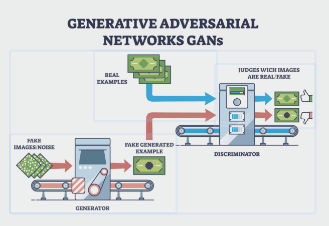

# 深度解读：同样是 Minimax 博弈，GAN 与对抗训练的本质分歧在哪里？

### 1. TL;DR

今天在推导损失函数时，解决了一个困扰我很久的思维误区。很多初学者（包括之前的我）在看到 Generative Adversarial Networks (GAN) 和 Adversarial Training（对抗训练）时，都会因为它们在数学形式上都表现为 `minimax` 博弈，而误以为它们在解决“同一种”问题。

但实际上，只要拆解它们的监督语义和对扰动的态度，就会发现两者背后的哲学南辕北辙。

用八个字总结：

- GAN 的核心是：**来源可分**（放大差异）
- 对抗训练的核心是：**语义鲁棒**（压平扰动）

### 2. 形式的迷惑性：Minimax 的外衣

从公式结构上看，两者确实长得很像，都是内层在“搞破坏”或者“造假”，外层在试图优化模型：

$$
\min_{\theta} \max_{\delta} \mathcal{L}(\theta, \delta)
$$

如果仅仅停留在“它们都在做二分类/多分类损失优化”这一层，就很容易陷入“本质差不多”的错觉。

但如果我们去看它们到底在对什么变量进行分类，差异就显现出来了。

### 3. GAN：对“来源”高度敏感，寻找判别边界

在 GAN 的框架下，判别器（Discriminator）最核心的监督信号是数据的来源标签：

- 这个样本来自真实世界，还是来自生成器伪造？

其目标可以概括为：

- 监督语义：**真 vs. 假**
- 对扰动的态度：**极度敏感**

如果一个真实猫图，被生成器加了一点点肉眼不可见的特征后变成生成样本，判别器的终极目标就是敏锐捕捉这种变化，并把它按在“假”的分类里。

它被鼓励去放大来源差异，强制划清真实分布与生成分布的界限。

### 4. 对抗训练：对“扰动”极度脱敏，坚守语义本质

在对抗训练中，虽然 inner maximization 也在找最恶劣的对抗扰动 $x' \in B(x, \epsilon)$ 来使分类损失最大化，但 outer minimization（外层分类器）的目标完全不同。

其目标可以概括为：

- 监督语义：**原始真实标签 $y$**（例如：它本来就是一只猫）
- 对扰动的态度：**极度迟钝（鲁棒）**

在对抗训练眼里，根本不在乎样本“有没有被加噪”或“是不是被攻击过”。只要扰动还在合理阈值内，这只猫就依然是猫。

它被鼓励去压平局部扰动带来的特征波动，维持对原始语义的忠诚。

### 5. 个人总结与思考

同样面对一张“加了微小扰动/生成的猫图”：

- 完美的 GAN 判别器会大喊：**警报！这是假的（来源不同）！**
- 完美的对抗训练鲁棒模型会淡定地说：**别闹，这依然是猫（语义不变）**

搞懂这一点，就等于真正掀开了 Minimax 的外衣，看到了机器学习在设定 target 时那种精妙的微观调控。

一个是锋利的矛（强制区分边界），一个是坚固的盾（包容局部变异）。
