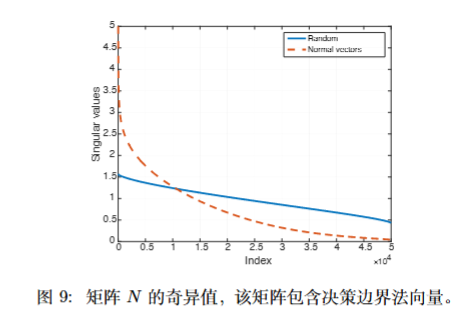

PGD实际上核心在于梯度更新 + 投影回约束集合
## 梯度更新

RMS的rms_inv的相关内容：
- 从量纲上看，它把梯度做了无量纲化，不再保留原始绝对尺度，而是保留符号和相对于历史尺度的**相对强度**
- 从方向来看，对每一个分量进行RMS_inv，确实也会造成他的方向发生改变
- `inv_rms` 相关项提供的是尺度标准化视角，帮助模型理解某一坐标当前梯度相对历史统计的强弱。

## 投影
投影这一步背后其实对应的是一个很标准的凸优化/凸分析知识点。对于欧氏空间中的闭凸集 $C$，点 $z$ 在集合上的投影 $\Pi_C(z)$ 就是离 $z$ 最近的那个可行点，也可以看成欧氏意义下的正交投影。这里的“正交”并不只是直观上的垂直，而是满足最优性条件：$$(z-\Pi_C(z))^\top (x-\Pi_C(z)) \le 0, \quad \forall x \in C.$$ 这个式子的含义是：从投影点指向外部点的向量 $z-\Pi_C(z)$，与从投影点指向集合内任意点的可行方向 $x-\Pi_C(z)$ 的夹角都是钝角或直角，因此你已经无法沿着集合内部方向继续靠近 $z$ 了。换句话说，投影残差本质上落在集合在该点的法方向上，这也是为什么 PGD 里的“投影回约束集”不是一个随手的修补操作，而是一个带有明确几何最优性意义的步骤。

## 论文
### Universal adversarial perturbations 

- 
	- 核心问题：是否存在一个**与输入无关**、但能让“大多数”自然图像都被误分类的统一扰动 $v$。
	- 论文结论：存在。作者把目标写成：在约束 $\|v\|_p \le \xi$ 下，让
	  $$
	  \mathbb{P}_{x\sim\mu}\big(\hat{k}(x+v)\neq \hat{k}(x)\big)\ge 1-\delta
	  $$
	  也就是扰动足够小，但 fooling rate 足够高。
	- 方法上不是“给每张图单独做攻击”，而是**在很多样本上累积一个共享方向**：
		- 初始化 $v=0$
		- 依次遍历样本 $x_i$
		- 如果当前 $x_i+v$ 还没有被成功攻击，就求一个最小增量扰动 $\Delta v_i$，把它推到决策边界外
		  这里的“求最小增量”在论文里实际不是空着的，而是把当前点 $z_i=x_i+v$ 当成普通样本，再对它跑一次**近似最小扰动攻击**，作者用的是 `DeepFool`。也就是求
		  $$
		  \Delta v_i \approx \arg\min_r \|r\|_2
		  \quad \text{s.t.}\quad
		  \hat{k}(z_i+r)\neq \hat{k}(x_i).
		  $$
		  做法是在 $z_i$ 附近把分类器局部线性化。若当前类别是 $\hat{k}$，对每个其他类别 $j$ 定义
		  $$
		  w_j=\nabla f_j(z_i)-\nabla f_{\hat{k}}(z_i),\qquad
		  b_j=f_j(z_i)-f_{\hat{k}}(z_i),
		  $$
		  那么线性化后，离当前点最近的决策边界就是
		  $$
		  \hat{j}=\arg\min_{j\neq \hat{k}} \frac{|b_j|}{\|w_j\|_2},
		  $$
		  而对应的最小增量近似为
		  $$
		  \Delta v_i \approx \frac{|b_{\hat{j}}|}{\|w_{\hat{j}}\|_2^2}\, w_{\hat{j}}.
		  $$
		  直觉上就是：在当前点附近把边界看成超平面，然后沿着**最近那张边界的法向**走到边界外；实现里通常还会乘一个很小的 overshoot，保证真的越界。
		- 然后更新 $v \leftarrow \Pi_{p,\xi}(v+\Delta v_i)$，也就是投影回 $\ell_p$ 约束球
		- 重复多轮，直到整体 fooling rate 达到目标
	- 模型脆弱性具有结构性，随机扰动与通用扰动之间这种显著差异，暗示了决策边界几何结构中存在冗余
	- 随机扰动要付出的代价大约是 $\Theta(\sqrt{d}\|r\|_2)$。直觉上，设某张图附近的决策边界局部像一个超平面，其法向量记作 $n_x$。想让 $x$ 被成功攻击，粗略上需要 $\langle v,n_x\rangle \gtrsim \|r(x)\|_2$；但如果 $v$ 是随机方向，即使总范数 $\|v\|_2=\rho$，它在固定单位向量 $n_x$ 上的投影典型量级也只有 $\rho/\sqrt{d}$，所以要达到同样的边界穿越效果，就必须把整体范数放大到大约 $\sqrt{d}\|r\|_2$ 这个量级。

	- 奇异值实验：
		- 作者对很多验证样本分别求最小对抗扰动 $r(x)$。由于最小扰动在到达边界点时与决策边界法向一致，所以 $r(x)$ 可以看成该样本附近决策边界的局部法向信息。
		- 然后把这些单位化后的方向堆成矩阵
		  $$
		  N=\left[\frac{r(x_1)}{\|r(x_1)\|_2},\dots,\frac{r(x_n)}{\|r(x_n)\|_2}\right]
		  $$
		  再去看 $N$ 的奇异值谱。
		- 如果不同样本附近的边界法向彼此独立、没有共享结构，那么这些列向量会更像随机方向，奇异值衰减会比较慢；但论文里真实法向构成的谱衰减得很快，明显快于随机向量基线。
		- 这说明：自然图像附近大量决策边界法向，其实集中在一个**低维子空间**里，而不是铺满整个高维空间。也就是说，模型在很多样本附近“朝哪些方向最脆弱”这件事，是有共享结构的。
		- 论文还进一步验证：从前 100 个奇异向量张成的子空间里随便采一个 $\|v\|_2=2000$ 的随机向量，在未参与 SVD 的新图像上都能 fool 接近 38% 的样本；而同范数的全空间随机扰动只能 fool 约 10%。这说明关键在有没有落在共享脆弱子空间中。
		- **奇异值快速衰减 = 决策边界法向高度相关 = 存在低维共享脆弱方向 = universal perturbation 有可能存在。**

### Adversarial Training is a Form of Data-dependent Operator Norm Regularization
- 核心问题：PGD 式 adversarial training 到底在“训练”什么？它为什么会提高鲁棒性，背后对应的到底是哪种几何量？
- 论文核心结论：对于分段线性的网络（如 ReLU 网络），如果在数据点附近局部线性化成立，那么 $\ell_p$ 约束的 PGD adversarial training，可以看成是在正则化该点 Jacobian 的**data-dependent $(p,q)$ operator norm**。
- 提出在局部线性近似下，最危险方向由 Jacobian 的主导方向决定，也就是jacobian矩阵的奇异值，而方向是最大奇异值的右奇异向量方向（输入空间）
- 这里的核心量是
  $$
  \|J_f(x)\|_{p,q}=\max_{\|v\|_p=1}\|J_f(x)v\|_q
  $$
  它表示：在样本 $x$ 附近，如果我给输入一个单位 $\ell_p$ 扰动，输出 logits 最多会被放大多少 $\ell_q$ 改变量。越大，说明模型在该点附近越敏感。
- 对应地，论文把 data-dependent operator norm regularization 写成
  $$
  \min_\theta \mathbb{E}_{(x,y)}\big[\ell(y,f(x))+\lambda \|J_f(x)\|_{p,q}\big]
  $$
  它不是去压一个“全局上界”，而是直接压**数据附近的局部最大增益方向**。
- 这篇论文最重要的 insight 是：PGD 攻击过程，本质上很像一个在输入空间里找 Jacobian 主导方向的 **power method / projected power iteration**。
	- 一步 PGD 可以理解成：先在 logit 空间选一个最能增大 adversarial loss 的方向 $u_k$
	- 再通过 $J_f(x)^\top$ 把这个方向反传回输入空间，得到最敏感输入方向
	- 然后投影回 $\ell_p$ 约束集合
	- 这和 operator norm 的迭代求最大化方向，在形式上是同一套 forward-backward 结构
- 精确一点说，论文证明的是：当 $\epsilon$ 足够小，使得扰动基本还待在同一个局部线性区域里，且 PGD 的更新权重取到 power-method-like 的极限时，**基于 logits 的 $\ell_q$ adversarial loss 的 PGD adversarial training**，等价于 Jacobian 的 data-dependent $(p,q)$ operator norm regularization。
- 所以这篇论文给了一个很清晰的统一视角：
	- 攻击时：PGD 在找局部 Jacobian 的最大增益方向
	- 防御时：adversarial training 在压低这些最大增益方向对应的奇异值 / operator norm
- 为什么强调 **data-dependent**：
	- 传统 global spectral norm regularization 更像压整个网络的全局上界，很多约束会浪费在远离数据流形的区域
	- 这篇论文关心的是 $J_f(x)$ 在真实样本附近的值，所以它更贴近真正决定 adversarial vulnerability 的局部几何
	- 论文实验里也确实发现：global spectral norm regularization 对奇异值谱和鲁棒性的改善都明显不如 data-dependent regularization
- 实验结论：
	- adversarial perturbations 和 Jacobian 的主导奇异向量强对齐
	- adversarial training 和 data-dependent spectral norm regularization 都会显著压低奇异值谱，尤其是最大的奇异值
	- 两者得到的 adversarial robustness 非常接近，而 global spectral norm regularization 效果明显差
	- AT 和 d.d. SNR 训练出来的模型，在数据附近更线性，ReLU activation pattern 也更稳定
- 还解释了一个常见现象：
	- 为什么 input gradient regularization 或一阶 FGM 往往不如 iterative PGD / AT
	- 因为单步梯度只是在做一个很粗的近似，它一般拿不到真正的 dominant singular direction；而 iterative PGD 更像在逐步逼近这个主导方向
- 和前面的 Universal adversarial perturbations 可以连起来看：
	- UAP 说的是：**跨很多样本**，存在共享脆弱方向，说明决策边界法向在数据分布层面有相关结构
	- 这篇论文说的是：**对单个样本局部**，最脆弱方向由 $J_f(x)$ 的主导奇异向量 / operator norm 决定
	- 合起来看就是：局部上，脆弱性来自 Jacobian 的高增益方向；全局上，如果这些局部高增益方向在很多样本之间相关，就会进一步形成 UAP 那样的共享脆弱子空间
	- 而 adversarial training 的作用，就是把这些数据附近的高增益方向压下去，从而同时缓解单样本攻击和共享脆弱方向问题
- 限制：
	- 论文的“等价”不是无条件全局成立，而是依赖局部线性化
	- 精确定理针对的是 logits 上的 $\ell_q$ adversarial loss，而不是任意损失
	- 结论覆盖的主要是 $p,q\in\{1,2,\infty\}$ 这些常见范数情形
### Origins of Low-Dimensional Adversarial Perturbations

这篇论文回答的核心问题是：**为什么对抗扰动被限制在远小于原始特征空间维度的低维子空间里，依然能高效欺骗分类器？** 也就是 LDAP（Low-Dimensional Adversarial Perturbations）的"低维"从哪来、有多强、与模型几何结构的关系是什么。

- 核心直觉：
	- 对抗扰动的有效性，本质上不取决于"扰动有多大"，而是取决于**扰动方向与模型输入梯度的对齐程度**
	- 如果模型在某些方向上的边界（margin）很小，那么只要扰动沿着这些脆弱方向走，即使维度很低、范数很小，也能把样本推出决策区域
	- 低维扰动之所以有效，是因为**模型决策边界的法向本身集中在低维子空间里**——这和 UAP 论文里的 SVD 实验结论是同一件事的不同视角
- fooling rate 下界：
	- 定义点态边界（pointwise margin）为 $m(x) = \frac{|f(x)|}{\|\nabla_x f(x)\|_2}$，即当前点到决策边界的局部距离
	- 欺骗率下界取决于 $\varepsilon$ 与 $m(x)$ 的比值，以及子空间 $V$ 与梯度 $\nabla_x f(x)$ 的投影长度 $\|V^\top \nabla_x f(x)\|_2$
	- 直觉上：**子空间捕获了多少梯度信息 × 扰动幅度是否足以跨越 margin = 能不能骗过**
	- $FR(V; \varepsilon)$ 定义：
		- $FR(V; \varepsilon)$ 表示：对于原本属于正类区域 $C'$ 的样本，有多大比例能通过某个属于子空间 $V$、且范数不超过 $\varepsilon$ 的扰动，被推进到负类区域 $C$
		- 形式化地：$FR(V; \varepsilon) = \mathbb{P}_{x \sim \mathcal{D}|_{C'}}\left(\exists v \in V, \|v\|_2 \leq \varepsilon \text{ s.t. } x + v \in C\right)$
		- 直观理解：**低维子空间 $V$ 里的"攻击能力"——在预算 $\varepsilon$ 内，能把多少正类样本跨界打到负类去**
- 与 UAP 的联系：
	- UAP 实验观察：$N = [\frac{r(x_1)}{\|r(x_1)\|}, \dots]$ 的奇异值衰减很快 → 结论：决策边界法向集中在低维子空间
	- LDAP 理论证明：fooling rate 下界依赖于子空间与梯度的对齐 → 结论：只要扰动子空间覆盖了梯度方向，低维就够
	- 一句话串联：UAP 说"存在低维共享脆弱方向"，LDAP 说"为什么低维方向有效 + 需要多低的维度"
- 与 PGD 的联系：
	- PGD 的梯度方向 $\nabla_x \mathcal{L}$ 本质上就是在局部近似决策边界的法向
	- 如果这些法向在不同样本/不同迭代步中**集中在某个低维子空间**，那么 PGD 的轨迹也天然被约束在这个低维流形附近
	- 这也解释了为什么**投影到 $\ell_p$ 球**就能工作：因为真正的脆弱方向本身维度就不高，投影只是为了保证扰动不跑出"合理的脆弱子空间范围"
- 关键公式：
	- margin 定义：$m(x) = \frac{|f(x)|}{\|\nabla_x f(x)\|_2}$
		- 分子 $|f(x)|$：当前输出离决策边界有多远
		- 分母 $\|\nabla_x f(x)\|_2$：梯度范数，理解为"函数在这个点附近变化有多敏感"
		- 直觉：梯度越大 → 局部越敏感 → 实际几何距离反而越近
	- fooling rate 下界（简化直觉）：$\mathbb{P}(\text{fool}) \gtrapprox \text{如何 } \varepsilon \text{ 与 } m(x) \text{ 比较，以及 } V \text{ 与 } \nabla_x f(x) \text{ 有多对齐}$
- 限制：
	- 精确定理针对二分类器在正则性假设下的推导，不是无条件全局成立
	- 依赖局部线性化和 Lipschitz 假设
- 一句话记忆：**低维对抗扰动有效 = 决策边界法向集中在低维子空间 + 扰动沿着梯度方向走 + 幅度足以跨越 margin**

