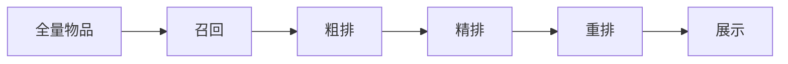
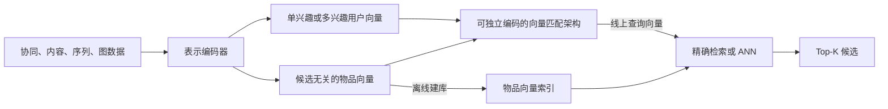

[[博客索引|返回博客索引]]

> [!abstract]
> 本文梳理推荐系统的标准全链路架构：
> - 各阶段的定位与目标（召回→粗排→精排→重排）
> - 每阶段的常见算法与选型考量
> - 冷启动、多样性、实时性等工程问题

推荐系统是现代互联网信息平台的核心系统，从用户请求到最终展示，通常经过 **召回 → 粗排 → 精排 → 重排** 四个阶段。每一阶段都在缩小候选集、提升精度。



![[Pasted image 20260517202341.png]]

## 零、推荐算法范式

推荐算法范式回答的是“用什么信息和假设来生成推荐”，推荐链路回答的是“一次请求如何从海量物品一步步缩小到最终展示”。两者不是同一层级：同一种推荐算法范式可以作为召回通道，也可以参与粗排、精排或过滤。

参考常见分类，推荐算法范式可以分为四类：

- **协同过滤推荐**：利用用户-物品交互关系，假设相似用户有相似偏好，或相似物品会被同一类用户喜欢。
- **基于内容推荐**：利用物品本身的属性和用户历史偏好，推荐与用户过去喜欢内容相似的物品。
- **基于知识推荐**：利用显式规则、约束、领域知识和用户明确需求做推荐。
- **混合推荐**：组合多种范式，弥补单一方法的冷启动、稀疏性或泛化问题。

### 0.1 协同过滤推荐  [传统]

协同过滤推荐的核心思想是：**用已有用户群体的历史行为，预测当前用户可能喜欢什么**。它不强依赖物品内容本身，而是依赖用户与物品之间的交互关系。

常见输入和输出：

- **输入**：用户-物品交互矩阵，如评分、点击、收藏、购买、播放、停留时长等。
- **输出**：用户对某个物品的偏好预测，或 TopN 推荐列表。

常见分类：

- **基于邻域的协同过滤**
	- **UserCF**：先找和目标用户兴趣相似的用户，再把相似用户喜欢、目标用户没看过的物品推荐给他。
	- **ItemCF**：先计算物品之间的相似度，再根据用户历史喜欢的物品，推荐相似物品。
- **基于模型的协同过滤**
	- 用机器学习模型从用户-物品交互中学习偏好模式，如关联规则、矩阵分解、隐语义模型、图模型、分类/回归模型、神经网络等。

优点：

- 不需要深入理解物品内容，模型通用性较强。
- 当交互数据充足时，效果通常不错。
- 能发现“内容上不相似但行为上相关”的兴趣关联。

缺点：

- **用户冷启动**：新用户没有行为，难以判断偏好。
- **物品冷启动**：新物品没有交互，难以被推荐出去。
- 数据稀疏时相似度不稳定。
- 解释性通常不如基于内容推荐。

### 0.2 基于内容推荐  [传统]

利用物品本身的属性（标签、分类、文本）计算相似度：
	
- 给出物品表示 - 基于向量空间模型的方法   TF-IDF / BM25 文本匹配 
	- TF(term-frequence)-IDF(inverse documents frequence)，词频-反文档频率
		- TF，词频。描述某个词在一篇文档中出现的频繁程度。考虑到文档长度，为了阻止更长的文档得到更高的相关度权值，必须进行文档长度的某种归一化。其中一种简单方法是将词出现的实际次数比上文档中其他关键词出现的最多次数，即 TF(i,j) = freq(i,j)/maxOthers(i,j)，其中 TF(i,j) 为文档 j 中关键词 i 的归一化词频值，freq(i,j) 为 i 在 j 中出现的绝对频率，maxOthers(i,j) 为 j 中其他关键词出现的最多次数。
		- IDF，反文档频率。组合了词频后的第二个衡量值，旨在降低所有文档中几乎都会出现的关键词的权重。其思想是，那些常见的词语对区分文档没有用，应该给那些仅出现在某些文档中的词更高的权值。IDF的计算方式为 IDF(i) = log(N/n(i))，其中 IDF(i) 为关键词 i 的反文档频率，N 为所有可推荐文档的数量，n(i) 为 N 中关键词 i 出现过文档的数量。 越常见分越低
		- **问题**：
			- 其一是维度随着词表增大而增大，且向量高度稀疏；
			- 其二是无法处理“一义多词”和“一词多义”问题。
				- 删除停用词并还原词干、通过特征选择选择可用词子集、通过矩阵分解对高维稀疏矩阵降维
- 学习用户偏好 - 基于**最近邻模型**的方法 
	- k近邻计算
- 生成推荐列表
- **问题**：
	- 物品的特征抽取一般很难
		- 如果系统中的物品是文档，那么我们现在可以比较容易地使用信息检索里的方法来“比较精确地”抽取出物品的特征。但很多情况下我们很难从物品中抽取出准确刻画物品的特征，比如电影推荐中物品是电影，社会化网络推荐中物品是人，这些物品属性都不好抽。其实，几乎在所有实际情况中我们抽取的物品特征都仅能代表物品的一些方面，不可能代表物品的所有方面。这样带来的一个问题就是可能从两个物品抽取出来的特征完全相同，这种情况下基于内容的方法就完全无法区分这两个物品了。
	- 无法挖掘出用户的潜在兴趣
		- 既然基于内容推荐只依赖于用户过去对某些物品的喜好，它产生的推荐也都会和用户过去喜欢的物品相似。如果一个人以前只看与推荐有关的文章，那基于内容推荐只会给他推荐更多与推荐相关的文章，它不会知道用户可能还喜欢数码。
	- 无法为新用户产生推荐
		- 新用户没有喜好历史，自然无法获得他的用户偏好，所以也就无法为他产生推荐了。当然，这个问题协同过滤推荐也有。

基于内容推荐的过程一般包括以下三步：
> 1、给出物品表示：为每个物品抽取出一些特征来表示此物品；  
> 2、学习用户偏好：利用一个用户过去喜欢（及不喜欢）的物品的特征数据，来学习出此用户偏好；  
> 3、生成推荐列表：根据候选物品表示和用户偏好，为该用户生成其最可能感兴趣的 n 个物品。

### 0.3 基于知识推荐  [传统]

基于知识推荐不是主要依赖“别人怎么点”或“内容像不像”，而是依赖**用户明确需求、物品属性、业务规则和领域知识**来推荐。

适合场景：

- 用户不会频繁产生重复购买行为，协同过滤数据不足，如房产、汽车、高价数码、企业软件。
- 用户需求可以明确表达，如预算、品牌、性能、尺寸、位置、用途等。
- 推荐结果需要较强解释性，如“为什么这个方案满足你的约束”。

常见分类：

- **基于约束的推荐**：用户给出条件，系统根据规则和约束筛选物品。例如预算小于 5000、屏幕大于 15 寸、重量小于 1.5kg。
- **基于实例的推荐**：用户给出一个当前物品或偏好方向，系统根据相似度找更接近需求的物品。例如“类似这款，但更便宜/更轻/像素更高”。

基本流程：

1. 收集用户的显式需求或偏好。
2. 用规则、约束或相似度检索匹配物品。
3. 如果没有满足条件的结果，放宽约束或引导用户修改需求。
4. 给出推荐解释，说明推荐项满足了哪些需求。

优点：

- 对冷启动更友好，不完全依赖历史行为。
- 可解释性强，适合决策成本高的推荐场景。
- 可以把业务规则、领域知识和用户显式需求纳入系统。

缺点：

- 需要维护领域知识、规则和物品结构化属性。
- 用户需要表达需求，交互成本比“刷信息流”更高。
- 规则过硬时容易结果过少，规则过松时又可能不够精准。

### 0.4 混合推荐  [工程常用]

混合推荐是把协同过滤、基于内容、基于知识等方法组合起来，利用不同范式的优势互补。

混合的目标：

- 用基于内容推荐缓解协同过滤的物品冷启动。
- 用协同过滤补足基于内容推荐难以发现潜在兴趣的问题。
- 用基于知识推荐处理强约束、强解释性的业务场景。
- 用多路结果融合提升覆盖率、准确率、多样性和稳定性。

常见设计方式：

- **整体式混合**：把多种信息源放进一个模型或一个统一策略里，例如用户行为特征 + 内容特征 + 上下文特征一起训练。
- **并行式混合**：多个推荐器分别产出结果，再加权、投票、切换或融合。例如热门、ItemCF、内容召回、向量召回分别出候选。
- **流水线式混合**：一个推荐器的输出作为下一个阶段的输入。例如先用内容规则过滤候选，再用协同过滤或排序模型打分。

在工业推荐系统里，混合推荐通常会落到“多路召回 + 排序模型 + 规则重排”的链路中：算法范式负责提供不同来源的候选和特征，工程链路负责把它们组织成稳定的在线服务。

## 〇、召回方法分类框架（学术分类）

> 本节给出召回方法的严格分类体系。现有 §1 按工程/技术类型组织，本节从方法论层面重新划分。召回研究的核心问题可解耦为三个独立维度：**相似度如何学习→学完后如何快速检索→训练时如何优化**。此外，召回策略层（非个性化 vs 个性化）和工业系统层（多路拼接）分别作为问题的 Background 与应用层，不纳入方法论主分类。

### 0.1 召回策略层（Background / Retrieval Strategy）

召回策略回答"从什么路径找候选"，是指导方法设计的高层概念。

- **非个性化召回**：热门、趋势、新品、小众、运营活动。不依赖具体用户兴趣，适合冷启动、补量、探索。
- **个性化召回**：
  - **U2I（User-to-Item）**：从用户直接找物品。如 MF、双塔。
  - **I2I（Item-to-Item）**：从用户交互过的 item 找相似 item。如 ItemCF、Swing、Graph Embedding I2I。
  - **U2U2I（User-to-User-to-Item）**：找相似用户，再推荐其喜欢的物品。如 UserCF。

### 0.2 相似度学习层（Similarity Learning）

召回模型的核心：如何建模用户与物品的相关性。

**浅层结构（Shallow Structures）：**

| 子类              | 方法                | 本质                 | 对应策略      |
| --------------- | ----------------- | ------------------ | --------- |
| Neighborhood CF | UserCF            | 找相似用户              | U2U2I     |
|                 | ItemCF            | 找相似物品              | I2I       |
|                 | Swing             | 抑制热门导致的虚假 Item 相似  | I2I       |
| MF              | MF / BPR-MF       | 用户-物品隐向量点积建模交互    | U2I       |
|                 | SVD++ / TimeSVD++ | 隐式反馈 + 时间动态扩展       | U2I       |
|                 | FM                | 泛化 MF，建模任意特征二阶交互   | U2I / I2I |
| SLIM            | SLIM              | 学稀疏 Item-Item 线性权重矩阵 | I2I       |

- **UserCF（User-based Collaborative Filtering）**：基于用户的协同过滤。核心假设是「相似用户有相似偏好」。给定目标用户 $u$，先找出与 $u$ 行为最相似的 $k$ 个用户（邻居集 $N(u)$），再聚合邻居喜欢的、$u$ 未交互过的物品作为推荐候选。用户间相似度通常用 Jaccard 或余弦相似度计算交互向量。优点是不依赖物品内容，缺点是用户数远大于物品数时计算开销大，且新用户无行为时冷启动严重。
- **ItemCF（Item-based Collaborative Filtering）**：基于物品的协同过滤。核心假设是「被同一用户喜欢的物品之间相似」。根据用户 $u$ 历史交互过的物品集合 $I_u$，从每个 $i \in I_u$ 找最相似的 Top-K 物品，聚合后推荐。物品相似度常用余弦相似度：$sim(i,j) = \frac{|U_i \cap U_j|}{\sqrt{|U_i| |U_j|}}$。ItemCF 性能通常优于 UserCF，因为物品数量相对稳定、相似度可离线预计算。典型应用是 Amazon 的「购买此商品的用户也购买了」。
- **Swing**：阿里巴巴提出的 ItemCF 改进。ItemCF 的问题在于：若两个物品 $i, j$ 的大量共同交互用户中包含很多「泛用户」（什么都点、什么都买），会导致虚假的高相似度。Swing 定义一条「边」为 $(i,j)$ 与用户 $u$ 的关系，若 $i$ 和 $j$ 的共同交互用户集合 $U_i \cap U_j$ 中，任意两个用户 $u,v$ 的行为模式越窄（仅共同交互少数物品），则 $i,j$ 的相似度越可信。形式化：$Swing(i,j) = \sum_{u \in U_i \cap U_j} \sum_{v \in U_i \cap U_j} \frac{1}{\alpha + |I_u \cap I_v|}$，其中 $|I_u \cap I_v|$ 为用户 $u,v$ 的共同交互数。该值越小，$u,v$ 越「不泛」，$i,j$ 的相似度越可靠。
- **MF（Matrix Factorization / BPR-MF）**：矩阵分解。将 $|U| \times |I|$ 的稀疏交互矩阵分解为 $U \times K$ 和 $I \times K$ 两个低秩稠密矩阵的乘积。用户 $u$ 对物品 $i$ 的偏好预估为 $\hat{y}_{ui} = \mathbf{p}_u^\top \mathbf{q}_i$。BPR-MF（Bayesian Personalized Ranking）是 MF 在隐式反馈场景下的标准形式，优化目标是让交互过的 $(u,i)$ 得分高于未交互过的 $(u,j)$，即 $L = \sum_{(u,i,j)} -\ln \sigma(\hat{y}_{ui} - \hat{y}_{uj})$。本质是学习用户和物品在 $K$ 维隐空间中的嵌入表示，不依赖手动特征工程。
- **SVD++ / TimeSVD++**：SVD++ 在标准 MF 基础上引入隐式反馈项：用户 $u$ 的偏置不仅由显式特征 $\mathbf{p}_u$ 决定，还受其历史行为集合 $N(u)$ 的隐向量之和影响：$\hat{y}_{ui} = \mu + b_u + b_i + (\mathbf{p}_u + |N(u)|^{-1/2}\sum_{j \in N(u)} \mathbf{y}_j)^\top \mathbf{q}_i$。TimeSVD++ 进一步为每个参数引入时间分段建模（如按天划分），捕捉用户兴趣漂移和物品流行度变化。本质是对 MF 的细粒度扩展。
- **FM（Factorization Machine）**：因子分解机。泛化了 MF——MF 只能建模「用户 × 物品」的交互，FM 可建模任意特征字段之间的二阶交互：$\hat{y} = w_0 + \sum_{i} w_i x_i + \sum_{i<j} \langle \mathbf{v}_i, \mathbf{v}_j \rangle x_i x_j$。用户 ID、物品 ID、性别、类目、时间、位置均可作为特征字段，且无需预定义交互结构。召回场景下常用于特征交叉丰富的 U2I 或 I2I 通道。
- **SLIM（Sparse Linear Methods）**：稀疏线性模型。目标是从交互矩阵 $R$ 学习一个稀疏的 Item-Item 相似矩阵 $S$，使得 $R \approx R \cdot S$，即用用户历史交互物品的加权组合预测新物品。优化目标为 $L = \frac{1}{2}\|\mathbf{R} - \mathbf{R}\mathbf{S}\|_F^2 + \beta\|\mathbf{S}\|_1 + \lambda\|\mathbf{S}\|_F^2$，其中 $\ell_1$ 正则控制稀疏性。与 ItemCF 的关键区别：ItemCF 用预定义的启发式相似度（如余弦），SLIM 通过优化学习相似权重，理论上更精准但计算更昂贵。

**深层结构（Deep Structures）：**

| 子类                | 方法代表                              | 本质                 | 对应策略              |
| ----------------- | --------------------------------- | ------------------ | ----------------- |
| Two-Tower         | DSSM、YouTubeDNN、DAT、IntTower、MVKE | 用户塔 + 物品塔分别编码      | U2I，也可做 I2I       |
| AutoEncoder / VAE | CDAE、Mult-VAE、RecVAE              | 从历史重构/生成可能喜欢的 item | U2I               |
| Graph Embedding   | Item2Vec、DeepWalk、Node2Vec、EGES   | 从序列/图结构学嵌入         | I2I / U2I / U2U2I |
| GNN               | NGCF、LightGCN、PinSage、SGL         | 在用户-物品图上传播邻居信息     | U2I / I2I         |
| MLP-CF            | NCF、DMF                           | 用 MLP 学非线性交互       | U2I               |
| Multi-Interest    | MIND、ComiRec、SINE、PinnerSage、UMI  | 用户多兴趣向量分别召回        | U2I               |

- **Two-Tower（DSSM / YouTubeDNN / DAT / IntTower / MVKE）**：双塔模型，工业界最主流的向量召回结构。用户侧特征输入用户塔得到用户向量 $\mathbf{u}$，物品侧特征输入物品塔得到物品向量 $\mathbf{v}$，通过内积或余弦计算相似度 $\text{sim}(\mathbf{u},\mathbf{v})$。两塔独立计算，线上只预存物品向量，用户请求时实时推算用户向量后用 ANN 检索 Top-K。本质是将召回转化为向量空间中的最近邻搜索。变体包括多视图（MVKE）、对抗训练（DAT）等。
- **AutoEncoder / VAE（CDAE / Mult-VAE / RecVAE）**：从用户的历史交互中学习一个低维隐表示，再通过解码器重构用户对所有物品的偏好。Mult-VAE 是多选型变分自编码器，将用户交互建模为多项分布（Softmax），优化 ELBO 目标。RecVAE 在此基础上改进先验和后验的设计。本质上是将用户偏好压缩到低维隐空间再全库解码，适合 User-CF 启发式聚合的替代。
- **Graph Embedding（Item2Vec / DeepWalk / Node2Vec / EGES）**：将用户行为序列或用户-物品二部图转化为节点嵌入。Item2Vec 在 item 共现序列上用 Skip-Gram 学嵌入；DeepWalk / Node2Vec 在用户-物品图上随机游走生成序列，再用 Word2Vec 训练节点嵌入，使图中结构相近的节点向量相近。EGES 是阿里巴巴提出的增强版，融合多个 Side Information 的嵌入。本质是将图结构信息转化为稠密向量，常用于 I2I 和 U2I 召回，也兼容 ANN 加速。
- **GNN（NGCF / LightGCN / PinSage / SGL）**：图神经网络在召回中的应用。在用户-物品二部图上逐层传播邻居信息，使节点嵌入融合高阶邻域信号。NGCF 是早期工作，在传播时使用特征变换和非线性激活；LightGCN 简化了传播——去掉变换矩阵和非线性，只做邻居均值聚合，在推荐场景效果反超 NGCF。PinSage 是 Pinterest 在大规模图上设计的采样式 GNN（随机游走采样邻居 + 重要性池化），用于 Pin（图钉）和 Board（画板）的召回。SGL 引入图数据增强（节点丢弃、边丢弃、随机游走）提升 GNN 的鲁棒性。
- **MLP-CF（NCF / DMF）**：用多层感知机替代内积来建模用户-物品交互。NCF（Neural Collaborative Filtering）将用户向量和物品向量拼接后输入 MLP，学习非线性交互函数 $f(\mathbf{p}_u, \mathbf{q}_i)$，而非固定使用内积。DMF（Deep Matrix Factorization）将用户和物品分别过 MLP 得到隐表示，再计算交互得分。本质是浅层 MF 的深层化：MF 假设交互是线性的（点积），MLP-CF 放松这一假设，理论上表达能力更强，但同时也更容易过拟合。
- **Multi-Interest（MIND / ComiRec / SINE / PinnerSage / UMI / HimiRec）**：传统双塔为每个用户只生成一个向量，但用户兴趣往往是多峰的（如既爱数码又爱二次元），单一向量会压平这些兴趣。Multi-Interest 方法为每个用户生成多个兴趣向量 $\{\mathbf{u}_1, \mathbf{u}_2, \dots, \mathbf{u}_K\}$，每个捕捉一个潜在兴趣维度。MIND 使用动态路由机制将用户行为序列分配到多个兴趣胶囊；ComiRec 和 PinnerSage 分别用注意力机制和聚类聚合。线上检索时，每个兴趣向量独立走 ANN 取得 Top-N，合并后去重，多路兴趣独立召回。

### 0.3 索引检索层（Indexing Mechanisms）

不负责学相似度，负责在千万级物品中快速找 Top-K。

| 子类 | 本质 | 适用场景 |
|------|------|----------|
| Whole Vault Calculation | 全库暴力计算 | 小规模、离线、候选少 |
| ANN（近似最近邻） | Faiss、Milvus、ScaNN、HNSW、IVFPQ | 大规模向量召回主流 |
| Tree-based Indexing | TDM、JTM、OTM、Deep Retrieval | 模型与索引联合优化 |

### 0.4 训练优化层（Optimization Methods）

召回模型的训练技术，非召回策略，而是方法层面的训练手段。

| 子类 | 方法 | 作用 |
|------|------|------|
| 负采样 | Random / Static | 从未交互 item 中均匀抽样 |
| | Popularity-biased | 按流行度加权抽样 |
| | Hard Negative | 挑模型易误判的样本 |
| | Adversarial | GAN 生成困难负样本 |
| | Graph-based | PinSage negative、MixGCF |
| 全数据训练 | WMF、EALS、ExpoMF、ENMF | 所有未交互 item 当低权重负样本 |
| Loss 函数 | Sampled Softmax、NCE、Hinge、BPR | 决定优化目标 |

### 0.5 工业多路召回层（Industrial Multi-Channel Retrieval）

系统拼装：多个独立召回通道并行产出候选子集，再聚合、去重、配额、融合。每一通道由「策略层 × 方法层」组合定义。以 CMB 通道为例：

| 通道 | 策略层 | 方法层 |
|------|--------|--------|
| Popular | 非个性化 | 统计召回 |
| New and Niche Item | 非个性化 | 统计/运营 |
| Word2Vec I2I | I2I | 图/序列 Embedding |
| Node2Vec I2I | I2I | 图嵌入 |
| DSSM I2I | I2I | 双塔语义匹配 |
| Node2Vec U2I | U2I | 图嵌入 |

### 0.6 小结

完整分类层次：

```text
推荐系统召回
├── 策略层（Background）：非个性化 / U2I / I2I / U2U2I
├── 方法层
│   ├── 相似度学习（Similarity Learning）
│   │   ├── 浅层：UserCF、ItemCF、Swing、MF、FM、SLIM
│   │   └── 深层：双塔、VAE、Graph Embedding、GNN、MLP-CF、多兴趣
│   ├── 索引检索（Indexing）：全库暴力 / ANN / 树索引
│   └── 训练优化（Optimization）：负采样 / 全数据 / Loss
└── 系统层（Industrial）：多路召回 → 融合 → 补量 → 去重
```

## 一、召回

**定位**：从千万/亿级物品中快速筛选出几百到几千的候选集。

目标是 **高召回率 + 低延迟**，允许一定程度的精度损失。

### 1.1 基于内容的召回  [传统]

基于内容召回是把“基于内容推荐”的思想落到召回阶段：不直接产出最终推荐列表，而是利用物品属性和用户历史兴趣，快速取出一批内容相似、主题相关的候选物品。

常见做法：

- **标签/类目召回**：根据用户高频点击、收藏、购买的标签或类目，从倒排索引中取候选。
- **文本检索召回**：把用户兴趣、搜索词或最近浏览内容转成查询，用 TF-IDF / BM25 / Elasticsearch 从标题、正文、描述中检索候选。
- **内容相似召回**：根据用户最近交互过的物品，查离线计算好的相似物品 TopK。
- **内容向量召回**：把文本、图片、店铺描述等内容编码成 embedding，再用 ANN 检索相近物品。

离线侧通常要准备：

- 物品内容特征：标签、类目、关键词、文本向量、图片向量等。
- 检索索引：倒排索引、相似物品表、向量索引。
- 用户兴趣画像：长期偏好标签、短期兴趣类目、最近行为聚合向量。

在线侧一般流程：

1. 根据用户历史行为得到兴趣表示。
2. 从一个或多个内容索引中召回候选。
3. 对不同来源候选做截断、去重、过滤，再交给后续粗排。

适合场景：新物品冷启动、内容属性强的业务（文章、视频、商品、本地生活店铺等）。

局限：容易只推荐和历史内容相似的物品，探索性弱；内容特征质量差时，召回质量也会直接下降。

### 1.2 协同过滤召回  [传统]

利用用户-物品交互矩阵：

- **UserCF**：找相似用户喜欢的物品
- **ItemCF**：找用户历史喜欢物品的相似物品
- **矩阵分解（MF, SVD）**：将交互矩阵分解为用户/物品隐向量

### 1.3 向量召回（Embedding-based）

向量召回先把查询侧（用户、请求或上下文）和候选物品编码到同一向量空间，再用近似最近邻（Approximate Nearest Neighbor，ANN）查找 Top-K。对一次请求逐个计算全库物品得分需要 $O(|I|d)$；当物品达到百万、亿级时，通常要用 ANN 以少量精度损失换取低延迟。

其相关性通常写成：

$$
s(u,i)=\operatorname{sim}\left(q_\theta(x_u), d_\phi(x_i)\right)
$$

其中 $q_\theta$ 产生查询向量，$d_\phi$ 产生物品向量，`sim` 常用内积、余弦相似度或负欧氏距离。

> [!important] 用四个正交维度理解向量召回
> 1. **信息来源与编码方式**：向量依据什么信息生成？可利用协同交互、内容语义、行为序列或用户-物品图。
> 2. **用户表示形态**：一个用户最终生成一个向量，还是多个兴趣向量？
> 3. **向量匹配架构**：用户侧和物品侧能否独立编码？双塔解决的是这个问题，它不是某一种表示方法。
> 4. **检索索引**：得到向量后，怎样快速取 Top-K？这是精确检索或 ANN 索引负责的事情。



#### 1.3.1 第一维：信息来源与编码方式

这一维回答“向量依据什么信息、通过什么编码器生成”。下面几类信息可以单独使用，也可以组合，例如“内容 + 序列”或“图 embedding + 商品属性”。
- 同一种编码方式可以装进双塔，也可以脱离双塔单独用于 I2I。


##### 1. 浅层协同表示
- **矩阵分解（MF / BPR-MF）**：将交互矩阵分解为用户和物品隐向量，直接用内积表达偏好，是向量召回的早期典型形式。
- **平均池化（Average Pooling）**：把用户历史 item embedding 做平均或加权平均，得到一个固定维度的用户向量。实现简单，是常见基线。
- **Item2Vec**：把用户行为序列当作“句子”、item 当作“词”，用 Skip-Gram 学物品共现向量，通常直接用于 I2I ANN 召回。

> [!note] Swing 不属于 Embedding 方法
> Swing 和关联规则会直接产生 Item-Item 相似度或关联分数，通常查离线相似表完成 I2I 召回。它们可以与向量通道并行，但严格说不是“先学稠密向量，再做 ANN”的向量召回。

##### 2. 内容与语义表示

用标题、正文、图片、类目、品牌等内容特征编码物品，也可把用户兴趣或搜索词编码成同空间向量。这类方法不完全依赖交互数据，因此能缓解物品冷启动。

- **DSSM（Microsoft, CIKM 2013）**：query 与 document 分别经过 DNN 编码，再用余弦相似度匹配，是双编码器语义匹配的代表性早期工作。
- **内容编码器**：文本可用 CNN、RNN 或 Transformer，图片可用视觉模型；多个模态还可拼接、加权或经统一网络融合。

##### 3. 序列表示

把点击、加购、收藏、观看等行为按时间排列，再将整段历史压缩为一个或多个用户兴趣向量。

- **RNN / LSTM / GRU**：顺序读取行为，以隐藏状态表示当前兴趣。擅长捕捉顺序信息，但长序列建模和并行效率有限。
- **Transformer / Self-Attention**：把行为当作 token，加上位置编码后建模远距离依赖，适合同时捕捉长期与短期兴趣。
- **GRU4Rec**：用 session 内的点击序列训练 GRU 预测下一个 item，是早期序列推荐代表。
- **SDM**：短期 session 用多头自注意力、长期行为用 attention，门控融合后形成一个可用于向量匹配的用户表示。

例如，历史序列 `[手机 → 手机壳 → 充电宝]` 比简单平均更能表达“数码配件”这一连续意图；如果最近行为切换为婴儿车，序列编码器还可以提高新兴趣的权重。

序列模型能否直接用于 ANN，关键不在于它用了 GRU 还是 Transformer，而在于它最终能否生成**与当前候选物品无关的固定用户向量**。DIN、DIEN、BST 的标准形式通常会引入候选物品参与 attention 或后续交互，更适合作为排序模型；若要用于标准双塔 ANN，需要去掉候选依赖或改造成独立用户编码器。

##### 4. 图表示

图建模先从用户行为图中学习节点 embedding，再把结果用于 I2I 或 U2I 检索。

- **Node2Vec**
  - 在用户-物品二部图或 Item-Item 图上做有偏随机游走，将节点序列当作语料，用 Skip-Gram 预测上下文节点。
  - **返回参数 $p$** 控制回到上一节点的倾向：$p$ 越小越容易立即回退。
  - **进出参数 $q$** 控制向外探索的倾向：$q$ 较大时更偏局部的 BFS，$q$ 较小时更偏向外扩展的 DFS。
  - 训练目标可抽象为最大化邻居共现对数似然：$\sum_{u\in V}\sum_{v\in N(u)} \log P(v\mid f(u))$。
  - 产出的同维稠密向量可直接建立 ANN 索引。例如用户 A 连续交互手机、手机壳和充电宝后，这些物品在图上形成相近上下文，手机可以召回相关配件。
- **EGES**
  - 纯图 embedding 对长尾物品不稳定：交互越少，随机游走样本越少；全新物品甚至没有可用的图边。
  - EGES 为 item、类目、店铺、品牌、价格档等字段分别学习 embedding，再用可学习权重融合：$H_v=\frac{\sum_{s\in S_v}a_s\mathbf e_s}{\sum_{s\in S_v}a_s}$。
  - 新手机壳即使交互稀少，也能借助“手机配件、数码店、品牌”等 side information 得到较合理的初始表示，从而缓解冷启动。

#### 1.3.2 第二维：用户表示形态

这一维回答“一个用户最终产生几个查询向量”，与上一维使用序列、图还是内容编码没有冲突。

##### 1. 单兴趣表示

把用户当前兴趣压缩成一个查询向量，线上只需发起一次近邻检索。MF、YouTube DNN、EBR、SDM 等通常属于这种形式。它实现简单、延迟较低，但容易把用户的多个兴趣平均成一个模糊方向。

##### 2. 多兴趣表示

为一个用户生成 $K$ 个兴趣向量，每个向量表达一个潜在兴趣方向并独立执行 ANN，最后合并、去重和控制配额。这样可以避免把“数码、运动、电影”等不同兴趣压缩到同一个向量中。

- **MIND（Alibaba/Tmall, CIKM 2019）**：用胶囊网络的动态路由把行为序列聚合成多个兴趣向量，是电商多兴趣召回的代表。
- **ComiRec（KDD 2020）**：通过自注意力或动态路由提取多个兴趣表示，并在召回结果中进一步考虑兴趣覆盖与多样性。

多兴趣是一种**用户向量的输出形态**，不是与内容、序列、图平级的信息来源。例如 MIND 同时属于“行为序列编码 + 多兴趣表示 + 双塔匹配 + ANN 检索”。

#### 1.3.3 第三维：向量匹配架构——两侧能否独立编码

这一维回答“用户和物品能否分别编码后再计算相似度”。它直接决定物品向量能否提前计算，也决定系统能否使用 ANN。

##### 1. 可独立编码：双塔

双塔（Two-Tower / Dual Encoder）是**可独立编码的向量匹配架构**：

- 用户塔 $q_\theta(x_u)$：输入用户特征、行为序列和上下文，输出一个或多个用户向量。
- 物品塔 $d_\phi(x_i)$：输入物品 ID、内容和统计特征，输出物品向量。
- 两塔只在末端通过内积或余弦相似度交互，训练时可使用 sampled softmax、对比学习、triplet loss 或 BPR 等目标。

它最重要的约束是：**物品向量不能依赖当前用户，用户向量也不能依赖某个待打分候选物品**。因此全部物品向量可以离线计算并建索引，线上只需计算一次用户向量。

双塔的典型服务流程：

1. 离线批量计算全库物品向量，并构建 ANN 索引。
2. 在线请求到来后，用户塔实时生成查询向量。
3. ANN 返回最相近的 Top-K 物品。
4. 对候选做过滤、去重，再送入粗排和精排。

代价是两侧缺少早期细粒度交叉，表达能力通常弱于 cross encoder 或候选感知 attention；收益则是物品侧可预计算，能够支撑大规模低延迟召回。

下面这些模型不是与“序列、图、多兴趣”平级的新类别，而是多个维度的具体组合：

| 模型 | 信息来源与编码方式 | 用户表示形态 | 匹配与检索方式 |
|------|--------------------|--------------|----------------|
| DSSM | Query / Document 文本语义编码 | 单向量 | 双编码器 + 相似度检索 |
| YouTube DNN | 历史视频池化 + 搜索、地理、人口统计等特征 | 单兴趣向量 | 用户向量与视频 embedding 匹配并生成候选 |
| EBR | Query / user / context 与 Document / entity 语义编码 | 单向量 | 双编码器 + Faiss ANN |
| SDM | 长期行为 attention + 短期序列 self-attention + 门控融合 | 单兴趣向量 | 双塔 + KNN / ANN |
| MIND | 行为序列 + 胶囊动态路由 | 多兴趣向量 | 双塔；每个兴趣向量分别 ANN 后合并 |

同理，Node2Vec、EGES 学出的 item embedding 可以直接做 I2I ANN，也可以作为物品塔的初始化或输入；MF 则直接产出用户、物品两张向量表。它们都不必先被归类为“双塔模型”。

##### 2. 不可独立编码：候选感知交互

DIN、DIEN、BST 等模型的标准形式会让用户历史与当前候选物品发生 attention 或深层特征交叉。此时面对候选 $i_1$ 和 $i_2$，模型可能生成不同的用户表示，无法只计算一次用户向量后检索全库。

这类结构能捕捉更细的用户-物品交互，但通常需要逐候选计算，更适合粗排或精排。若要进入标准向量召回链路，需要移除候选依赖，改造成能够独立生成用户向量和物品向量的双编码器。

判断一个模型能否直接用于双塔 ANN，可以检查其得分是否满足：

$$
s(u,i)=\operatorname{sim}(q(u),d(i)),\qquad q(u)\text{ 不依赖 }i,\quad d(i)\text{ 不依赖 }u
$$

#### 1.3.4 第四维：检索索引——有了向量以后怎么查

检索层不负责学习兴趣，只负责在大规模向量库中查找近邻：小规模数据可以精确遍历，大规模数据通常使用 ANN。索引选择要与训练时的相似度一致；例如使用余弦相似度时，常先对向量做 L2 归一化，再转成内积检索。

| 工具或索引 | 类型 | 主要特点 |
|------------|------|----------|
| **Faiss** | 向量检索库 | 提供 Flat、IVF、PQ、HNSW 等多种索引，可利用 CPU / GPU |
| **HNSW** | 图索引算法 | 召回率和延迟表现好，但图结构通常占用较多内存 |
| **IVF + PQ** | 倒排分桶 + 向量量化 | 显著压缩存储并减少搜索范围，适合超大规模物品库 |
| **ScaNN** | 向量检索库/方案 | 结合分区、量化和重排序，适合大规模内积或距离搜索 |

工程上需要共同调节召回率、P99 延迟、内存占用、索引构建时间和增量更新能力，而不是只比较单一查询速度。

#### 1.3.5 容易混淆的边界

| 方法 | 是否属于经典“Embedding + ANN” | 原因 |
|------|-------------------------------|------|
| MF、DSSM、YouTube DNN、EBR、SDM | 是 | 能得到候选无关的查询向量和可离线索引的物品向量 |
| MIND、ComiRec | 是 | 每个用户产生多个查询向量，分别走 ANN |
| Node2Vec、EGES | 是，常用于 I2I | 直接学习节点或物品向量，可建立近邻索引 |
| Swing、关联规则 | 通常不是 | 直接计算并存储 Item-Item 关联分数，不依赖稠密向量索引 |
| DIN、DIEN、BST 标准形式 | 通常不是召回双塔 | 用户表示或交互结果依赖当前候选，更适合粗排/精排 |
| TIGER | 不属于经典 ANN 路线 | 将 item 表示为语义 ID token，由生成模型直接生成候选 ID |

> [!summary] 四维分类小结
> 一个具体的向量召回方案，不应只被塞进某个互斥的“模型大类”，而应描述成四个维度的组合：
>
> ```text
> 向量召回方案
> ├── 信息来源与编码：协同 / 内容 / 序列 / 图（可组合）
> ├── 用户表示形态：单兴趣向量 / 多兴趣向量
> ├── 向量匹配架构：独立双编码器 / 候选感知交互
> └── 检索方式：精确检索 / ANN（HNSW、IVF-PQ、ScaNN 等）
> ```

因此，理解一个模型时应依次追问：**用了什么信息编向量 → 一个用户输出几个向量 → 两侧能否独立编码 → 用什么方式检索 Top-K**。

### 1.4 多路召回融合

实际系统会同时启用多路召回（如：热门召回、ItemCF 召回、向量召回、标签召回），最终合并去重，通常用 **MMR** 或简单的加权融合。

## 二、粗排

**定位**：召回输出几百~几千条，粗排进一步压缩到几百条，交给精排。

粗排是"轻量级精排"——用简单模型快速预估，筛掉明显不相关的候选。

常见方案：双塔模型（与召回类似但特征更丰富）、小型 LR/FM/DeepFM、或直接用精排模型的蒸馏版本。

## 三、精排

**定位**：对粗排输出的几百条做精确排序，输出最合适的几十条。

目标是 **高精度预估**，CTR/CVR 等核心指标在此阶段决定。

### 3.1 常见模型演进

| 阶段 | 模型 | 特点 |
|------|------|------|
| 线性 | LR + 特征交叉 | 可解释性强，但表达能力有限 |
| 特征交叉 | FM / FFM | 自动学习二阶特征交叉 |
| 深度 | DeepFM / DCN / DCN-V2 | 显式 + 隐式特征交叉 |
| 序列 | DIN / DIEN / SIM | 建模用户行为序列，捕捉兴趣演化 |
| 多目标 | MMOE / PLE / ESMM | 同时优化 CTR + CVR 等多个目标 |
| 大模型 | 推荐大模型（如 P5, Recformer） | 用统一模型框架处理多任务 |

### 3.2 特征体系

- **用户特征**：uid、年龄、性别、城市、长期/短期行为统计
- **物品特征**：id、分类、标签、价格、发布时间、统计指标
- **上下文特征**：时间、位置、设备、网络环境
- **交叉特征**：用户×物品交互统计、用户对类目偏好等

### 3.3 多目标优化

实际业务中往往需要同时优化多个目标（如点击率、转化率、时长、互动率）：

- **Shared-Bottom**：底层共享，上层分塔
- **MMOE**：多个 Expert + 门控机制
- **PLE（渐进式分层提取）**：腾讯提出，显式区分共享和任务独有 Expert

### 3.4 模型训练要点

- **负采样**：曝光未点击作负例，需注意采样偏差
- **样本权重**：时长、转化等可加权
- **实时更新**：在线学习 / 增量训练应对数据分布漂移

## 四、重排

**定位**：精排给出打分后，重排对最终列表做 **业务规则调整 + 多样性保证 + 用户体验优化**。

### 4.1 多样性——MMR 算法

最大边际相关性（Maximal Marginal Relevance）：

$$MMR = \arg\max_{i \in R\setminus S} \left[ \lambda \cdot score(i) - (1-\lambda) \cdot \max_{j \in S} sim(i, j) \right]$$

- $S$：已选物品，$R$：候选物品
- $\lambda$ 控制相关性与多样性的权衡

### 4.2 常见重排策略

- **打散**：同类型/同商家物品间隔展示
- **去重**：相同内容只展示一次
- **插入**：广告、运营位、新物品穿插
- **频控**：同一用户不过度推荐同类内容
- **上下文感知**：考虑相邻物品之间的相互影响（list-wise 重排模型如 PRM）

## 五、冷启动

### 5.1 用户冷启动

新用户没有行为历史：

- 用人口统计特征做粗粒度推荐
- 引导式兴趣选择（注册时选标签）
- 热门物品兜底
- 探索策略（EE——Exploration & Exploitation）

### 5.2 物品冷启动

新物品没有交互数据：

- 基于内容属性匹配
- 利用物品图文信息做向量召回
- 随机展示给部分用户收集反馈
- Bandit 算法（如 Thompson Sampling）

## 六、评估指标

### 6.1 离线指标

| 指标 | 含义 | 适用阶段 |
|------|------|----------|
| AUC | 模型排序能力 | 精排 |
| GAUC | 按用户分组的 AUC 平均 | 精排 |
| Recall@K | 召回覆盖率 | 召回 |
| HitRate@K | 命中率 | 召回 |
| NDCG@K | 排序质量 | 精排/重排 |
| ILD | 列表多样性 | 重排 |

### 6.2 在线指标

- CTR（点击率）
- CVR（转化率）
- 用户停留时长
- 留存率
- 业务指标（GMV、播放量等）

## 七、工程要点

- **特征存储**：Redis 存实时特征，HDFS/Table Store 存离线特征
- **实时特征**：Flink/Kafka 流式计算用户实时行为
- **模型更新**：天级全量训练 + 小时级增量更新
- **AB 测试**：分层实验平台，支持多组并行实验
- **降级策略**：高并发时走缓存或热门兜底

## 待补充

- 推荐系统中的 Bias（位置偏差、流行度偏差）与矫正方法
- 强化学习在推荐中的应用（RL-based 长期价值优化）
- 大模型 + 推荐的结合方向（LLM4Rec）
- Graph Neural Network 在推荐中的应用（NGCF, LightGCN）
- 精排 vs 重排的 List-wise 模型（PRM、SetRank 等）

## 工程落地案例

- [[hmdp/docs/hmdp-项目架构分析|hmdp 项目架构分析]] — hmdp 全功能分区架构，其中 二-帖子推荐 包含 Feed 流召回→排序→缓存的完整链路
