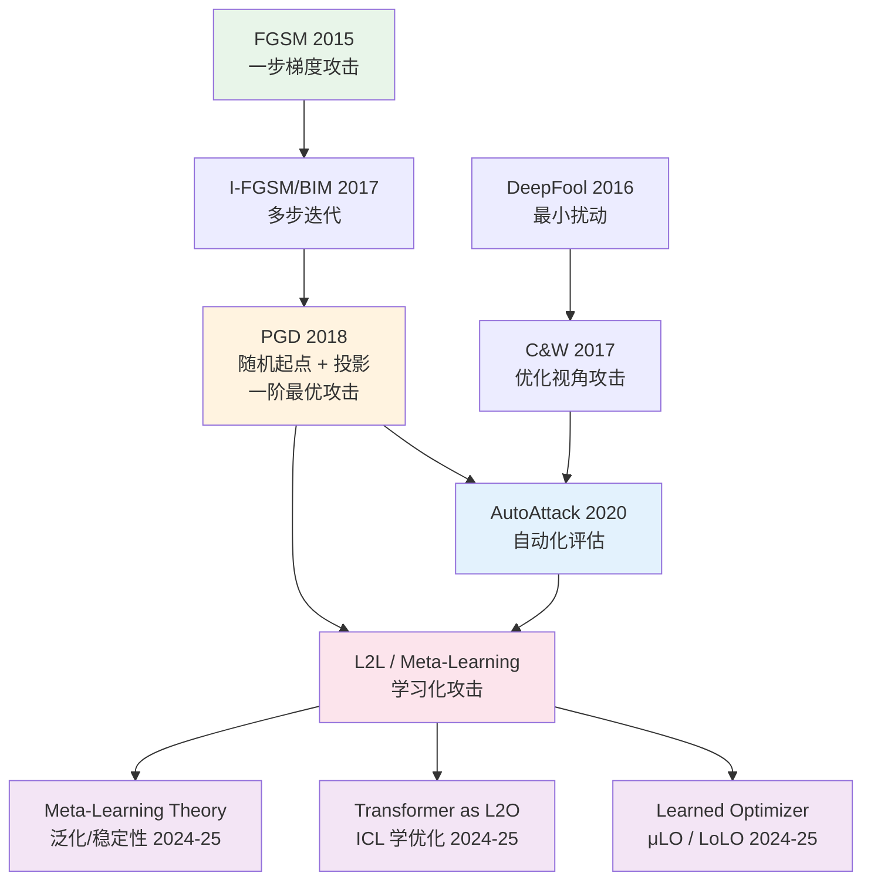

# 对抗性攻击发展脉络与 L2L

## 一句话

对抗性攻击的发展，本质上是一个**"攻击策略从人工设计走向自动学习"**的过程：从最早手写梯度公式（FGSM），到精心设计优化目标（C\&W），到自动组合评估（AutoAttack），最终走向**让神经网络自己学怎么攻击**（L2L / Meta-Learning）。每一步都是在回答同一个问题——怎么用最小的扰动把模型骗过去。

---

## 第一阶段：手工梯度攻击（2014–2017）

这个阶段的核心思想很朴素：**模型是可微的，那就对输入求梯度，沿着梯度方向加扰动。**

### FGSM（Fast Gradient Sign Method）

> Goodfellow et al., "Explaining and Harnessing Adversarial Examples", ICLR 2015

$$
x_{\text{adv}} = x + \epsilon \cdot \text{sign}(\nabla_x \mathcal{L}(\theta, x, y))
$$

**做了什么**：算一次梯度，取符号（每个维度 $\pm\epsilon$），一步到位。

**优点**：
- 极快——只需要一次前向 + 一次反向传播
- 概念清晰，容易实现和理解
- 开创了"基于梯度的对抗攻击"整条研究线

**缺点**：
- ==只走一步==，攻击强度弱，很多稍微鲁棒的模型就能防住
- `sign` 操作丢掉了梯度的幅度信息，所有维度被同等对待
- 只在 $L_\infty$ 范数下自然，不好直接推广到 $L_2$ 等其他范数

---

### I-FGSM / BIM（Basic Iterative Method）

> Kurakin et al., "Adversarial Examples in the Physical World", ICLR 2017 Workshop

$$
x^{t+1} = \text{Clip}_{x, \epsilon}\left(x^t + \alpha \cdot \text{sign}(\nabla_{x^t} \mathcal{L}(\theta, x^t, y))\right)
$$

**做了什么**：把 FGSM 的一大步拆成多个小步，每步走 $\alpha$，走完之后裁剪回 $\epsilon$-球。

**优点**：
- 多步迭代，攻击成功率大幅提升
- 仍然概念简单，实现容易

**缺点**：
- 容易陷入**局部最优**——因为每步只看当前梯度方向，没有全局视野
- 没有随机性，攻击路径完全确定，容易被针对性防御
- 计算成本线性增长（步数 $\times$ 单步成本）

---

### PGD（Projected Gradient Descent）

> Madry et al., "Towards Deep Learning Models Resistant to Adversarial Attacks", ICLR 2018

$$
x^{t+1} = \Pi_{B_\epsilon(x)}\left(x^t + \alpha \cdot \text{sign}(\nabla_{x^t} \mathcal{L}(\theta, x^t, y))\right)
$$

**做了什么**：和 BIM 几乎一样，但加了一个关键改动——==随机初始化起点==。从 $\epsilon$-球内随机采一个起点开始迭代，而不是从原始样本出发。

**优点**：
- 随机起点避免了 BIM 的确定性陷阱，多次重启可以逼近**最强一阶攻击**
- Madry 等人在理论上论证了 PGD 是 $L_\infty$ 约束下的"一阶最优攻击"
- 成为对抗训练（Adversarial Training）的**标准内层攻击**，至今仍是基线

**缺点**：
- 计算成本高——需要多步迭代 $\times$ 多次重启
- 仍然是一阶方法，==对梯度遮蔽（gradient masking/obfuscation）类防御容易失效==
- 步长 $\alpha$、步数、重启次数都需要手动调参，没有自适应机制
- $L_\infty$ 范数的 `sign` 操作不适用于其他范数约束

> [!important] PGD 的历史地位
> PGD 是对抗攻击领域的**分水岭**。在它之前，攻击方法五花八门但缺乏理论支撑。PGD 第一次把对抗攻击和对抗训练放进了一个**min-max 优化框架**里严格讨论，奠定了后续所有工作的理论基础。

---

## 第二阶段：优化视角攻击（2016–2019）

第一阶段的方法本质上都是"沿梯度走"，区别只在走几步、怎么裁剪。第二阶段开始**认真设计优化目标**，用更精细的优化手段找更小的扰动。

### DeepFool

> Moosavi-Dezfooli et al., "DeepFool: a Simple and Accurate Method to Fool Deep Neural Networks", CVPR 2016

**做了什么**：不再固定 $\epsilon$-球大小，而是找到**最小扰动**使样本跨越决策边界。迭代地将样本投影到最近的分类超平面上。

**优点**：
- 生成的扰动**真正最小**（在 $L_2$ 意义下），不浪费扰动预算
- 可以用来**衡量模型的鲁棒性**——每个样本的 DeepFool 扰动大小反映了模型在该点的鲁棒半径

**缺点**：
- 基于线性近似，对高度非线性的决策边界可能不准
- 计算成本较高（需要多类别的梯度）
- 主要用于评估，不太适合直接用于对抗训练（因为扰动大小不固定）

---

### C\&W Attack（Carlini \& Wagner）

> Carlini \& Wagner, "Towards Evaluating the Robustness of Neural Networks", IEEE S\&P 2017

$$
\min_\delta \|\delta\|_p + c \cdot f(x + \delta)
$$

其中 $f$ 是精心设计的攻击目标函数（基于 logit 差值）。

**做了什么**：把"找对抗样本"严格建模为一个**带约束的优化问题**，用 Adam 等现代优化器求解，并通过二分搜索调节权衡系数 $c$。

**优点**：
- 当时**最强的攻击**，击破了大量此前声称有效的防御（defensive distillation 等）
- 支持 $L_0, L_2, L_\infty$ 三种范数
- 攻击目标函数设计精巧，避免了交叉熵损失在高置信区域梯度消失的问题

**缺点**：
- ==极慢==——需要上千步优化 + 二分搜索，单张图片可能要几分钟
- 不适合用在对抗训练的内层（太慢了，训练时间会爆炸）
- 超参数（$c$ 的搜索范围、优化步数、学习率）需要精心调节

---

## 第三阶段：自动化与标准化评估（2020–2022）

前两个阶段暴露了一个严重问题：**很多防御方法其实只是对特定攻击有效，换一种攻击就崩了。** 这个阶段的核心诉求是——怎么做到**攻击评估标准化、不被梯度遮蔽骗**。

### AutoAttack

> Croce \& Hein, "Reliable Evaluation of Adversarial Robustness with an Ensemble of Attacks", ICML 2020

**做了什么**：把四种互补的攻击组合在一起（APGD-CE、APGD-DLR、FAB、Square Attack），自动依次尝试，任何一种攻破就算攻破。其中 APGD 是带自适应步长的 PGD，Square Attack 是无梯度的黑盒攻击。

**优点**：
- ==无参数==——不需要手动调步长、步数等超参，拿来就用
- 混合了白盒 + 黑盒攻击，能有效检测**梯度遮蔽**类的虚假防御
- 成为对抗鲁棒性评估的**事实标准**（RobustBench 排行榜用的就是 AutoAttack）

**缺点**：
- 计算成本极高——四种攻击都要跑一遍，评估一个模型可能要几个小时
- 攻击组合是**手动设计**的，不一定对所有防御都最优
- 本质上还是"把现有攻击拼起来"，没有学到新的攻击策略

> [!warning] 梯度遮蔽问题
> 很多防御方法（如输入变换、随机化、非可微组件）会导致梯度信号消失或误导——模型看起来"鲁棒"了，但其实只是让基于梯度的攻击"看不见路"。AutoAttack 通过混入无梯度攻击（Square Attack）来检测这种"虚假鲁棒"。这个问题在后续 L2L 方法中同样存在，且更加隐蔽。

---

### 其他代表性工作

| 方法 | 核心思路 | 优缺点速览 |
|------|----------|------------|
| FAB Attack | 沿决策边界的投影攻击 | 扰动更小，但更慢 |
| Square Attack | 无梯度黑盒攻击，随机搜索 | 不依赖梯度，能检测梯度遮蔽；但效率低 |
| Adaptive Attack | 针对特定防御定制攻击策略 | 每个防御都要单独设计，不可扩展 |

---

## 第四阶段：学习化攻击——L2L / Meta-Learning（2019–至今）

### 为什么要"学习怎么攻击"

前三个阶段的攻击方法，不管多精巧，都有一个共同特点：**攻击策略是人手写的**。步长怎么调、方向怎么选、什么时候停，全靠人的经验和直觉。

问题是：
1. **手写的策略不一定最优**——人的直觉在高维空间中并不可靠
2. **没有跨任务的知识迁移**——PGD 在 CIFAR-10 上调好的超参，换到 ImageNet 上可能完全不行
3. **对抗训练的内层攻击太慢**——PGD 需要多步迭代，每个训练 batch 都要跑一遍，训练成本 $\times10$

L2L 的核心想法：**让一个神经网络（"元学习器"）自己学习怎么生成对抗扰动。** 不是人去设计攻击公式，而是让网络从大量攻击经验中学出一个攻击策略。

### L2L 在对抗攻击中的基本范式

典型的做法是用一个 RNN（或其他序列模型）充当**"学习到的优化器"（learned optimizer）**：

```
传统 PGD:
  for t in range(T):
      grad = ∇_x L(θ, x_t, y)
      x_{t+1} = x_t + α · sign(grad)     ← 更新规则是人写死的

L2L 攻击:
  for t in range(T):
      grad = ∇_x L(θ, x_t, y)
      update = RNN(grad, hidden_state)     ← 更新规则是网络学出来的
      x_{t+1} = x_t + update
```

RNN 接收当前梯度（以及历史信息），输出更新方向和步长。这个 RNN 通过**元训练（meta-training）**——在大量攻击任务上训练——来学习一个通用的攻击策略。

**优点**：
- 可以学到**自适应的步长和方向**，不需要手动调参
- 能利用**历史梯度信息**，不像 PGD 只看当前梯度
- 理论上可以学到比人工设计更好的攻击策略
- 用于对抗训练时，==少步（如 1-3 步）就能达到 PGD 多步（如 20 步）的攻击效果==，大幅加速训练

**缺点**：
- ==Meta-generalization 难==——在训练分布上学到的攻击策略，换到新模型/新任务上可能失效
- ==Unroll 稳定性差==——元训练时通常只 unroll 几步（比如 5 步），但实际使用时可能需要更多步，步数一长就容易发散
- **梯度遮蔽风险**——learned optimizer 生成的扰动是否真的在"攻击"，还是只是在"走捷径"？这个问题比传统攻击更难诊断
- 元训练本身计算成本高（二层优化）

---

## L2L 最新进展（2024–2025）

这两年 L2L / 元学习的发展可以沿着四条主线来看。

### 主线 1：Learned Optimizer——从"能跑"到"能泛化、能长时 unroll"

这条线和上面的"RNN 学更新规则"是同一个大方向，但 2024-2025 的重点变成：**怎么让 learned optimizer 在没见过的任务 / 更长训练步数上也不崩**。

#### μLO：Compute-Efficient Meta-Generalization of Learned Optimizers

> 2024，[arXiv:2406.00153](https://arxiv.org/abs/2406.00153)

**核心问题**：learned optimizer 在训练时见过的网络宽度/任务上表现好，但换到更宽的网络或新任务上就崩了（meta-generalize 不了）。

**怎么解决**：引入 μP（maximal update parameterization）的思想，让 learned optimizer 的更新规则对网络宽度不敏感。同时改进训练 recipe，降低元训练的计算成本。

**优点**：
- 解决了 learned optimizer 最致命的问题之一——宽度泛化
- 计算效率显著提升（用小网络训练的优化器可以迁移到大网络）

**缺点**：
- μP 本身有适用范围限制，不是所有架构都能直接套用
- 对任务分布的泛化仍然有限（宽度泛化 ≠ 任务泛化）

---

#### LoLO / ELO：Towards Robust Unroll Generalization in Learned Optimizers

> 2025，[OPT-ML Workshop](https://opt-ml.org/papers/2025/paper139.pdf)

**核心问题**：元训练时 unroll $K$ 步，但实际使用时跑 $K' \gg K$ 步，误差累积导致发散。

**怎么解决**：用 replay buffer + imitation learning / 稳定化手段，让 learned optimizer 在长时轨迹上也能保持稳定。

**优点**：
- 直接解决 unroll 泛化这个实际部署中最大的痛点
- 可以用较短的 unroll 训练，然后在长时使用时不崩

**缺点**：
- 引入了额外的训练复杂度（replay buffer、imitation 的目标设计）
- 理论保证仍然不充分，更多是经验性的稳定化技巧

---

### 主线 2：Transformer 作为"Learn-to-Optimize / 算法执行器"

近两年很热的一条线：**Transformer 不仅能做 ICL（in-context learning），它可能本身就在"执行/逼近梯度下降类算法"**。这和 L2L 在概念上合流了。

#### On the Learn-to-Optimize Capabilities of Transformers in ICL

> 2024 arXiv / 2025 ICLR，[arXiv:2410.13981](https://arxiv.org/pdf/2410.13981)

**核心问题**：Transformer 在做 ICL 的时候，内部到底在执行什么算法？是在做某种隐式的梯度下降吗？能力边界在哪里？

**看点**：分析 Transformer 在 ICL 中"学优化"的能力边界与机制——和之前"Transformer 像在做梯度下降"那批理论工作（Akyürek et al. 2023, Von Oswald et al. 2023）是同一脉络，但推进到了更一般的优化问题。

**优点**：
- 把 L2L 和大模型范式（ICL）打通了，概念上非常优雅
- 理论分析给出了明确的能力边界

**缺点**：
- 目前主要是理论/小规模实验，离实际的对抗攻击应用还有距离
- Transformer 作为优化器的计算成本远高于简单的 RNN learned optimizer

> [!note] 和对抗攻击的关系
> 如果 Transformer 确实能"学会优化"，那理论上可以用一个预训练好的 Transformer 来做对抗攻击的内层优化——给它 support set（当前模型的梯度信息），让它直接输出最优扰动。这比 RNN 优化器有更强的表达能力，但计算成本也更高。

---

### 主线 3：把元学习改写成 In-Context Learning

#### Unsupervised Meta-Learning via In-Context Learning

> 2024 arXiv / 2025 ICLR，[arXiv:2405.16124](https://arxiv.org/abs/2405.16124)

**核心问题**：传统元学习需要人工构造 task distribution（support/query 的划分），能不能让模型用 ICL 的方式自动构造和解决元学习任务？

**怎么做**：把元学习任务构造成序列建模问题，让模型用 ICL 的方式"读 support、解 query"，并且是在无监督/弱监督条件下构造任务。

**优点**：
- 不需要人工设计 task distribution，更贴近大模型的使用范式
- 可以利用大规模预训练模型的表征能力

**缺点**：
- 对序列长度敏感，support set 太大放不进 context window
- 无监督构造的任务质量不可控

---

### 主线 4：元学习理论——泛化 / 稳定性（2024-2025 明显在补课）

做 L2L 相关方法（尤其 learned optimizer / bi-level optimization），最大的理论缺口一直是：**为什么能泛化？什么时候会过拟合/不稳定？** 这两年终于有人在认真补这个课。

#### On the Stability and Generalization of Meta-Learning（Uniform Meta-Stability）

> 2024，NeurIPS，[论文链接](https://proceedings.neurips.cc/paper_files/paper/2024/file/984fa4634385c48ab3722d825c57ede0-Paper-Conference.pdf)

**核心贡献**：提出 meta-learning 的**稳定性概念**（uniform meta-stability），并基于此给出泛化界。把元学习当成统计学习问题认真分析，而不是只做实验看效果。

**优点**：
- 第一次给出了元学习框架下严格的泛化界
- 稳定性条件可以指导算法设计（什么样的内层优化器更"稳定"）

**缺点**：
- 界比较 loose，对实际算法设计的指导有限
- 分析假设较强（Lipschitz 连续性等）

---

#### On the Stability and Generalization of Meta-Learning（GDF/PDF 框架）

> 2025，NeurIPS / [OpenReview](https://openreview.net/forum?id=l1L0Yhh6x6)

**核心贡献**：围绕"内层更新过程如何影响泛化"给出框架化分析——区分了 GDF（梯度下降框架）和 PDF（proximal 框架），分别给出泛化界。

**优点**：
- 框架化的分析更系统，可以统一分析不同类型的内层优化器
- 对 bi-level optimization 的泛化问题有直接指导意义

**缺点**：
- 仍然偏理论，和实际的 learned optimizer 实现之间有 gap

---

### 近期综述（快速补全知识地图）

| 综述 | 发表 | 看点 |
|------|------|------|
| [Advances and Challenges in Meta-Learning: A Technical Review](https://dl.acm.org/doi/abs/10.1109/TPAMI.2024.3357847) | 2024，IEEE TPAMI | 覆盖面最全的技术综述，适合当"元学习百科 + 参考文献入口" |
| [Domain Generalization through Meta-Learning: A Survey](https://link.springer.com/article/10.1007/s10462-024-10922-z) | 2024，Springer | 把元学习和 domain generalization 系统整理，聚焦"泛化到不同分布"这个问题 |

---

## 当前面临的核心问题

> [!danger] 开放问题
> 以下是 L2L / 学习化攻击当前面临的关键瓶颈，也是潜在的研究方向。

### 问题 1：Meta-Generalization Gap

Learned optimizer 在元训练分布上表现好，但换到新模型/新任务/新数据分布上就退化。这是 L2L 最根本的问题——**如果"学到的攻击策略"不能泛化，那还不如用不需要学的 PGD。**

- μLO 解决了宽度泛化，但任务泛化仍然 open
- 理论上的泛化界（2024-2025 NeurIPS）还太 loose，不能直接指导实践
- 评估标准不统一——不同论文在不同的 meta-test 设定下报结果，不可比

### 问题 2：Unroll 稳定性

元训练时 unroll $K$ 步，使用时跑 $K' \gg K$ 步就容易发散。这个问题在对抗训练中尤其致命——对抗训练跑上千个 epoch，每个 epoch 的内层攻击都需要稳定。

- LoLO/ELO 提出了经验性的稳定化手段，但没有理论保证
- 长时 unroll 的训练本身就有梯度爆炸/消失问题（truncated BPTT 的老问题）
- 和 learned optimizer 的"遗忘"问题交织——跑太长会忘记元训练时学到的策略

### 问题 3：梯度遮蔽 / 评估可靠性

这是对抗攻击领域的"原罪"：**怎么确认你的攻击是真的在攻击，而不是被梯度遮蔽骗了？**

对 L2L 方法来说，这个问题更加隐蔽：
- Learned optimizer 的更新规则是黑盒的，你不知道它是在"聪明地找扰动"还是在"走捷径"
- 如果元训练的内层损失下降了，到底是因为攻击变强了，还是因为 learned optimizer 学会了"利用目标模型的梯度遮蔽"？
- AutoAttack 式的混合评估可以部分缓解，但不能完全解决

> [!warning] 这个问题的严重性
> 如果一个 L2L 攻击方法声称"1 步就达到 PGD-20 的效果"，你必须追问：这个效果是在什么模型上测的？有没有用无梯度攻击交叉验证？目标模型的梯度是否干净？否则很可能只是"看起来很强的梯度遮蔽假象"。

### 问题 4：计算成本的 Trade-off

L2L 方法的核心承诺是"用元训练的一次性成本，换来后续攻击的加速"。但实际上：
- 元训练本身是 bi-level 优化，计算成本很高
- 如果 meta-generalization 不好，换个任务就要重新元训练，那一次性成本变成了反复成本
- Transformer-based 的 L2O 方法虽然表达能力强，但推理成本远高于简单的 RNN

### 问题 5：理论与实践的 Gap

- 理论上的泛化界（2024-2025 NeurIPS）基于强假设（Lipschitz、凸性等），实际的神经网络不满足
- Learned optimizer 的收敛性没有保证——传统优化器（SGD、Adam）有收敛性证明，learned optimizer 没有
- 对抗鲁棒性本身的理论（min-max 优化的收敛性）还有很多 open 问题，L2L 又加了一层复杂度

---

## 发展脉络总览



---

## 关系

- **相关**: [[对抗训练]]（Adversarial Training）—— L2L 攻击的主要应用场景
- **相关**: [[元学习]]（Meta-Learning）—— L2L 的理论基础
- **相关**: [[Transformer]] → [[In-Context Learning]] —— L2O 的新范式
- **上级**: [[深度学习]] → [[鲁棒性]]
