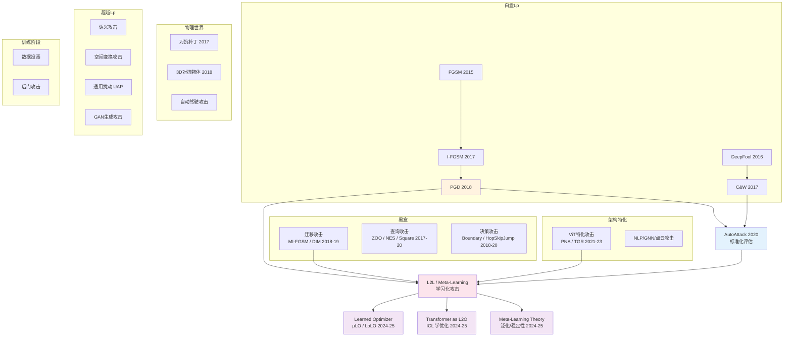

# 对抗性攻击发展脉络与 L2L

## 一句话

对抗性攻击不是一条线发展的，而是**多条线并行推进**：白盒梯度攻击、黑盒迁移/查询攻击、物理世界攻击、架构特化攻击、语义/空间攻击、训练阶段攻击……它们各自解决不同的问题，但最终都在汇向同一个方向——**从人工设计攻击策略，走向让网络自己学怎么攻击**（L2L / Meta-Learning）。

---

## 全景地图

> [!abstract] 怎么读这篇笔记
> 先看这张地图，搞清楚有哪些线、每条线解决什么问题。然后按需深入各条线的细节。

对抗性攻击可以按**攻击发生的阶段**和**攻击者的能力**分成以下主线：

| 主线                  | 核心问题                | 代表方法                      |
| ------------------- | ------------------- | ------------------------- |
| [[#主线 A：白盒 Lp 攻击]]  | 知道模型一切，怎么找最优扰动      | FGSM → PGD → C&W          |
| [[#主线 B：黑盒攻击]]      | 不知道模型内部，怎么攻击        | 迁移攻击、查询攻击、决策攻击            |
| [[#主线 C：物理世界攻击]]    | 扰动怎么在真实场景中生效        | 对抗补丁、3D 对抗物体              |
| [[#主线 D：架构特化攻击]]    | 针对特定结构（ViT等）怎么攻击更有效 | PNA、PatchOut、TGR、token 攻击 |
| [[#主线 E：超越 Lp 的攻击]] | 不限于像素噪声，还能怎么骗模型     | 语义攻击、空间变换、通用扰动、GAN 生成     |
| [[#主线 F：训练阶段攻击]]    | 不攻击推理，攻击训练过程        | 数据投毒、后门攻击                 |
| [[#主线 G：自动化评估]]     | 怎么判断防御是真的还是假的       | AutoAttack                |
| [[#主线 H：学习化攻击 L2L]] | 让网络自己学怎么攻击          | Learned Optimizer、L2O     |

下面先看统一框架，再逐条展开。

---

## 统一框架：所有对抗攻击在解同一个问题

所有对抗攻击，不管看起来多不一样，本质上都在解同一个优化问题：

$$
\delta^* = \underset{\delta \in \mathcal{C}}{\arg\max} \; \mathcal{A}(f_\theta, x, y, \delta)
$$

找一个满足约束 $\mathcal{C}$ 的扰动 $\delta$，让攻击目标 $\mathcal{A}$ 最大化。

不同方法的区别不在于问题本身，而在于**怎么实例化和求解**这个问题。可以沿 6 个轴来拆解：

```
┌──────────────────────────────────────────────────────┐
│              对抗攻击统一框架                          │
│                                                       │
│  ① 扰动空间 ──→  在什么空间里改（像素/语义/离散token） │
│  ② 约束集   ──→  改多少算合法（Lp球/语义合理性）      │
│  ③ 信息来源 ──→  能看到什么（梯度/查询响应/什么都没有）│
│  ④ 搜索策略 ──→  谁决定怎么搜（人写的/学的/直接生成） │
│  ⑤ 计算时机 ──→  什么时候算（在线逐样本/离线一次性）  │
│  ⑥ 任务与目标 ─→  攻击什么任务/什么输出（分类/检测/分割）│
└──────────────────────────────────────────────────────┘
```

### 6 个轴分别是什么

**① 扰动空间**：改的"东西"是什么。大多数方法在像素空间加噪声，但也可以在颜色参数空间、仿射变换参数空间、GAN 的潜空间、甚至离散的词表空间里做扰动。扰动空间决定了梯度对谁求导。

**② 约束集**：扰动不能无限大，总要有个"合法范围"。经典的是 $L_p$ 球（$\|\delta\|_p \leq \epsilon$），但也可以是 patch 区域约束、语义合理性（改完之后人看起来还正常）、图结构约束（加边不能太多）等。

**③ 信息来源**：攻击者能看到目标模型的什么信息。白盒能拿到梯度，score-based 黑盒能拿到输出概率，decision-based 黑盒只能拿到最终标签，迁移攻击甚至完全不查询目标模型。信息越少，搜索越难。

**④ 搜索策略**：**这是最核心的区分维度。** 给定扰动空间、约束、信息来源，你怎么从中找到好的 $\delta$？这里有本质不同的几种范式：

| 搜索策略        | 谁决定怎么走                        | 代表                                  |
| ----------- | ----------------------------- | ----------------------------------- |
| 人写的梯度优化     | 人写死的更新公式（`sign(grad)`、Adam 等） | FGSM, PGD, C&W, ViT 特化, 语义攻击……      |
| 无梯度搜索       | 人写的随机搜索 / 有限差分估计              | Square Attack, Boundary Attack, ZOO |
| 学习到的优化（L2L） | 网络离线学到更新规则，在线按步迭代执行           | Learned Optimizer (RNN/Transformer) |
| 摊销生成        | 网络直接一次前向输出扰动，不迭代              | AdvGAN, UAP                         |
| 离散组合搜索      | 贪心替换 / beam search            | TextFooler (NLP), 图攻击 (GNN)         |
| 训练阶段操纵      | 操纵数据/过程，不优化扰动                 | 数据投毒、后门攻击                           |
|             |                               |                                     |

> [!warning] 训练阶段攻击和上面五种本质不同
> 上面五种搜索策略（梯度优化、无梯度、L2L、摊销生成、离散组合）都在做同一件事：**模型已经训练好了，边界固定了，我要找一个输入跨过这条边界。** 边界不动，输入动。
>
> 训练阶段攻击完全是另一回事：**模型还没训练好，攻击者通过操纵训练数据，让训练出来的模型的边界本身就长歪了。** 输入不动，边界动。
>
> 硬要统一的话，投毒可以写成 bi-level 优化（外层优化训练数据，内层是模型训练过程），形式上能塞进 $\arg\max$ 框架，但本质上和"找已有模型的边界点"是两码事。把它放在这张表里，是为了全景展示，不是说它和其他方法属于同一类问题。

> [!important] "前向攻击 vs 反向攻击"的本质
> 所谓"前向攻击"（AdvGAN 推理时一次前向）和"反向攻击"（PGD 反传梯度迭代），区别不在于用不用梯度——AdvGAN 训练阶段照样反传梯度，只是**把反传挪到了训练阶段**。攻击时的"一次前向"是在享受训练时积累的知识。
>
> 所以真正的区分维度是 **⑤ 计算时机**（在线 vs 离线），不是"用不用反传"。

**⑤ 计算时机**：搜索过程发生在什么时候。

| 计算时机          | 含义                   | 代表                      |
| ------------- | -------------------- | ----------------------- |
| 在线逐样本（无离线训练）  | 每来一个新样本，当场做优化/搜索     | PGD, Square Attack      |
| 离线元训练 + 在线多步  | 先离线训练攻击优化器，在线按步生成扰动  | L2L / Learned Optimizer |
| 离线训练 + 在线一次前向 | 提前训练生成器/算固定扰动，攻击时直接用 | AdvGAN, UAP             |
| 离线（攻击训练集）     | 攻击发生在目标模型训练之前        | 数据投毒、后门攻击               |
|               |                      |                         |

**⑥ 任务与目标**：攻击针对的下游任务、输出空间和成功判据是什么。

| 任务类型 | 典型输出 | 常见攻击目标 |
|------|------|------|
| 图像分类 | 单标签类别 | untargeted（让原类别错）/ targeted（指定错到某类） |
| 目标检测 | 边界框 + 类别 | 漏检、误检、框偏移、类别误导 |
| 语义分割 | 像素级标签图 | 指定区域错分、整体 mIoU 降低 |
| OCR/文本识别 | 字符序列 | 识别内容偏移到指定字符串 |
| 语音识别 | token/文本序列 | 转写错误或指定关键词注入 |
| VLP/检索 | 图文相似度 | 排名翻转、检索错配 |

> [!note] 为什么要加第 ⑥ 轴
> 同样是 "$L_p$ + 白盒梯度 + 在线多步"，分类、检测、分割的损失定义和评估指标差异很大。把"任务与目标"单独列成一轴，才能解释为什么两个方法看起来优化流程类似，但论文贡献点完全不同。

### 用这个框架装所有方法

| 方法              | ①扰动空间          | ②约束          | ③信息来源                  | ④搜索策略                         | ⑤计算时机                              |
| --------------- | -------------- | ------------ | ---------------------- | ----------------------------- | ---------------------------------- |
| FGSM            | 像素             | $L_\infty$ 球 | 梯度（白盒）                 | 人写的：`sign(grad)`              | 在线 1 步                             |
| PGD             | 像素             | $L_\infty$ 球 | 梯度（白盒）                 | 人写的：迭代 `sign(grad)` + 投影      | 在线多步                               |
| C&W             | 像素             | $L_2$ 球      | 梯度（白盒）                 | 人写的：Adam                      | 在线多步                               |
| ViT 特化（PNA）     | 像素             | $L_\infty$ 球 | 梯度（白盒，attention-aware） | 人写的：改梯度流的迭代优化                 | 在线多步                               |
| 语义攻击            | 颜色/纹理参数        | 语义合理性        | 梯度（白盒）                 | 人写的：对语义参数梯度优化                 | 在线多步                               |
| 空间变换            | 仿射/光流参数        | 变换幅度         | 梯度（白盒）                 | 人写的：对变换参数梯度优化                 | 在线多步                               |
| 迁移攻击            | 像素             | $L_p$ 球      | 替代模型梯度                 | 人写的：MI-FGSM/DIM 等             | 在线多步                               |
| Square Attack   | 像素             | $L_p$ 球      | 查询响应（黑盒）               | 人写的：随机搜索                      | 在线多次查询                             |
| Boundary Attack | 像素             | $L_2$ 球      | 决策标签（黑盒）               | 人写的：沿边界游走                     | 在线多次查询                             |
| **L2L**         | 像素             | $L_p$ 球      | 梯度（白盒）                 | **网络学的**：RNN/Transformer 决定更新 | **离线元训练 + 在线多步**（每步目标模型梯度 + 优化器前向） |
| **AdvGAN**      | 像素             | $L_p$ 球      | **无**（攻击时）             | **网络学的**：生成器直接输出              | **离线训练 + 在线前向**                    |
| **UAP**         | 像素             | $L_p$ 球      | 梯度（白盒）                 | 人写的：跨样本聚合梯度                   | **离线计算 + 在线直接加**                   |
| TextFooler      | 离散 token       | 语义相似性        | 梯度做重要性排序               | 人写的：贪心替换                      | 在线逐词贪心                             |
| 数据投毒            | 训练样本           | 修改量/干净标签     | 梯度（bi-level）           | 人写的：bi-level 优化               | **离线（攻击训练集）**                      |
| 后门攻击            | 训练样本 + trigger | trigger 隐蔽性  | 无                      | 人写的：注入 trigger 样本             | **离线（攻击训练集）**                      |

### 从这张表能看出什么

**大多数方法在④搜索策略上是一样的**——人写的梯度迭代优化。它们的差异主要在①扰动空间和②约束上（像素空间加 $L_p$ 噪声 vs 语义参数空间 vs 离散 token 空间），但求解的"引擎"是同一套。

**真正在④搜索策略上有本质区别的是四种：**

1. **无梯度搜索**——不用梯度，随机搜索/有限差分（解决黑盒场景梯度不可用的问题）
2. **L2L / Learned Optimizer**——用梯度做输入，但怎么用由网络自己学（解决人写策略不一定最优的问题）
3. **摊销生成（AdvGAN/UAP）**——把搜索提前做完，攻击时直接出结果（解决在线计算太慢的问题）
4. **离散组合搜索**——贪心/beam search，桥接连续梯度和离散操作空间（解决离散空间不可微的问题）

> [!tip] 各主线之间的关系
> 所谓"不同主线"，大多数时候只是在这张表的不同"列"上做了不同的选择，**底层优化引擎往往是同一个**（梯度反传 + 迭代优化）。比如 ViT 特化攻击和白盒 $L_p$ 攻击的区别只在③信息来源（怎么算梯度）上，扰动空间和搜索策略完全一样。理解了这张表，就能把看似繁杂的方法放到一个统一的坐标系里。

---

## 主线 A：白盒 $L_p$ 攻击

**前提**：攻击者完全知道模型的结构、参数、梯度（白盒），目标是在 $L_p$ 范数约束内找到最优扰动。

这是对抗攻击领域**最早也最成熟**的一条线。

### FGSM（Fast Gradient Sign Method）

> Goodfellow et al., "Explaining and Harnessing Adversarial Examples", ICLR 2015

$$
x_{\text{adv}} = x + \epsilon \cdot \text{sign}(\nabla_x \mathcal{L}(\theta, x, y))
$$

**做了什么**：算一次梯度，取符号，一步到位。

**优点**：
- 极快——一次前向 + 一次反向
- 开创了"基于梯度的对抗攻击"整条线

**缺点**：
- ==只走一步==，攻击强度弱
- `sign` 丢掉梯度幅度信息，所有维度被同等对待
- 只在 $L_\infty$ 下自然

---

### I-FGSM / BIM（Basic Iterative Method）

> Kurakin et al., "Adversarial Examples in the Physical World", ICLR 2017 Workshop

$$
x^{t+1} = \text{Clip}_{x, \epsilon}\left(x^t + \alpha \cdot \text{sign}(\nabla_{x^t} \mathcal{L}(\theta, x^t, y))\right)
$$

**做了什么**：把 FGSM 的一大步拆成多个小步。

**优点**：多步迭代，成功率大幅提升。
**缺点**：确定性路径，容易陷入局部最优，容易被针对性防御。

---

### PGD（Projected Gradient Descent）

> Madry et al., "Towards Deep Learning Models Resistant to Adversarial Attacks", ICLR 2018

$$
x^{t+1} = \Pi_{B_\epsilon(x)}\left(x^t + \alpha \cdot \text{sign}(\nabla_{x^t} \mathcal{L}(\theta, x^t, y))\right)
$$

**做了什么**：和 BIM 几乎一样，但关键改动——==随机初始化起点==。

**优点**：
- 多次重启可以逼近**一阶最优攻击**
- 成为对抗训练的**标准内层攻击**，至今仍是基线

**缺点**：
- 计算成本高（多步 $\times$ 多次重启）
- 对梯度遮蔽类防御容易失效
- 步长、步数需要手动调

> [!important] PGD 的历史地位
> PGD 第一次把对抗攻击和对抗训练放进了一个 **min-max 优化框架**里严格讨论，奠定了后续所有工作的理论基础。

---

### DeepFool

> Moosavi-Dezfooli et al., CVPR 2016

**做了什么**：不固定 $\epsilon$，找到**最小扰动**使样本跨越决策边界。

**优点**：生成的扰动真正最小（$L_2$ 意义），可衡量模型鲁棒半径。
**缺点**：基于线性近似，计算成本高，主要用于评估。

---

### C&W Attack（Carlini & Wagner）

> Carlini & Wagner, IEEE S&P 2017

$$
\min_\delta \|\delta\|_p + c \cdot f(x + \delta)
$$

**做了什么**：把对抗攻击严格建模为**带约束的优化问题**，用 Adam 求解。

**优点**：
- 当时最强攻击，击破了 Defensive Distillation 等大量"假防御"
- 支持 $L_0, L_2, L_\infty$ 三种范数

**缺点**：
- ==极慢==——上千步优化 + 二分搜索
- 不适合做对抗训练的内层攻击

---

## 主线 B：黑盒攻击

**前提**：攻击者**不知道**模型的内部结构和参数。这比白盒更贴近真实场景——你通常没法拿到别人部署的模型的权重。

黑盒攻击按信息量从多到少，分成三个层次：

### B1：迁移攻击（Transfer Attack）

**思路**：在一个你有白盒访问权限的**替代模型（surrogate）**上生成对抗样本，然后直接拿去攻击目标模型。之所以能work，是因为不同模型的决策边界有**共性**——在替代模型上有效的对抗样本，在目标模型上也可能有效。

**代表工作**：

| 方法 | 核心思路 | 优缺点 |
|------|----------|--------|
| MI-FGSM（Dong et al., CVPR 2018） | 给 I-FGSM 加动量，稳定梯度方向 | 迁移率显著提升；但仍是像素级 Lp 攻击 |
| DIM（Xie et al., CVPR 2019） | 每步对输入做随机变换（resize + pad），增加多样性 | 简单有效；变换类型有限 |
| TIM（Dong et al., CVPR 2019） | 用高斯核平滑梯度，减少对局部特征的依赖 | 和 DIM 互补；核大小需要调 |
| SGM（Wu et al., 2020） | 利用跳跃连接的梯度（skip gradient），梯度更"全局" | 对 ResNet 系效果好；对无跳跃连接的架构不适用 |
| TAP（Transferable Adversarial Perturbations） | 在优化分类损失之外，额外约束中间层表征偏移，提升跨模型迁移 | 迁移性常提升；需要选层和权重，超参更敏感 |

> [!important] TAP 放在什么位置更合理
> TAP 的核心是**迁移增强**，不是"架构特化"。它通常不依赖某个单一架构（不像 ViT 专用 token/attention 机制），而是通过"中间层特征破坏"提高跨模型可迁移性。
>
> 因此在这篇笔记中，TAP 更适合归入 **B1 迁移攻击**（黑盒场景下的白盒替代模型优化），并作为"**目标函数工程**"的一类代表：不仅优化输出层误分类损失，还优化中间层表征偏移损失。

**优点**：
- 不需要查询目标模型，**零查询**
- 可以离线生成，攻击成本低

**缺点**：
- 迁移率不稳定——替代模型和目标模型差异越大，成功率越低
- 跨架构迁移（CNN → ViT）尤其困难

---

### B2：基于查询的攻击（Query-based Attack）

**思路**：可以向目标模型发送输入、拿到输出（分数/概率），通过反复查询来**估计梯度**或**搜索对抗样本**。

按返回信息量又分两种：

**Score-based（返回概率/logit）**：

| 方法 | 核心思路 |
|------|----------|
| ZOO（Chen et al., 2017） | 坐标级有限差分估计梯度 |
| NES（Ilyas et al., 2018） | 自然进化策略，随机方向估计梯度 |
| Bandits（Ilyas et al., ICML 2019） | 利用先验（时间/数据相关性）减少查询次数 |
| Square Attack（Andriushchenko et al., ECCV 2020） | 不估计梯度，直接随机搜索正方形扰动区域 |

**Decision-based（只返回最终类别标签）**：

| 方法 | 核心思路 |
|------|----------|
| Boundary Attack（Brendel et al., 2018） | 从一个已经对抗的点出发，沿决策边界游走，逐步缩小扰动 |
| HopSkipJump（Chen et al., 2020） | 改进 Boundary Attack，用二分搜索更高效地逼近边界 |
| Sign-OPT（Cheng et al., ICLR 2020） | 把决策攻击转化为符号优化问题 |

**优点**：
- 不需要替代模型，直接和目标模型交互
- Decision-based 是**最弱假设**下的攻击（只需要最终标签）

**缺点**：
- 查询次数多（几百到几万次），被检测/限频的风险大
- 每次查询都有延迟，攻击速度慢

---

## 主线 C：物理世界攻击

**前提**：对抗扰动不是数字世界里直接加像素，而是要在**真实物理环境**中生效——扰动需要在不同角度、光照、距离下都有效。

### 对抗补丁（Adversarial Patch）

> Brown et al., "Adversarial Patch", NeurIPS Workshop 2017

**做了什么**：不是在整张图上加微小扰动，而是生成一个**可以打印出来贴在物体上**的小贴片，让模型误分类。

**优点**：
- 物理可实现——打印贴上去就能用
- 扰动集中在一小块区域，不需要控制整张图

**缺点**：
- 补丁通常很显眼（不隐蔽）
- 对角度/距离敏感，需要 Expectation over Transformation (EoT) 来增强鲁棒性

---

### 3D 对抗物体

**代表工作**：
- Athalye et al., "Synthesizing Robust Adversarial Examples", ICML 2018 —— 生成 3D 打印的对抗龟（被分类为步枪）
- 对抗 T 恤、对抗眼镜等后续工作

**核心挑战**：物理世界的变换（视角、光照、遮挡、相机噪声）是连续且不可微的，需要用 EoT 在这些变换的分布上做优化。

---

### 自动驾驶场景

对交通标志、车道线、行人检测器的物理攻击。这条线特别关注**安全隐患**——一个被误判的停车标志可能导致事故。

> [!warning] 物理攻击的评估困难
> 物理攻击的效果很难在论文中严格验证——真实环境变量太多。很多工作只在模拟环境中测试，真实世界的成功率往往大幅下降。

---

## 主线 D：架构特化攻击

**前提**：不同的神经网络架构有不同的"弱点"，通用攻击方法（直接套 PGD）不一定是最优的。这条线专门针对特定架构设计攻击策略。

### 对 ViT/Transformer 的攻击（最活跃的方向）

ViT 和 CNN 的结构差异很大——patch tokenization + self-attention vs. 卷积 + 池化。直接把 CNN 时代的攻击套到 ViT 上，效果往往不理想，特别是黑盒迁移时。

> [!note] 和 TAP 的边界
> TAP 属于"迁移攻击中的目标函数增强"，核心是中间层特征偏移；这里的 ViT 特化攻击属于"针对特定架构机制（token/attention/patch 流）改造梯度与采样"。两者可以组合，但不应混为同一子类。

#### 阶段 1：用经典攻击做"体检"（~2021）

先用 FGSM/PGD/C&W 测 ViT 的鲁棒性，回答"ViT 到底脆不脆？和 CNN 有啥不同？"。这里经典攻击是**评估工具**，不是创新点本身。

> 代表：*On the Robustness of Vision Transformers to Adversarial Examples*（2021）

---

#### 阶段 2：ViT 特化的迁移攻击（2021–2022）

发现直接套 CNN 攻击做黑盒迁移效果差，开始利用 ViT 的结构特点改造攻击。

> [!info] `Towards Transferable Adversarial Attacks on Vision Transformers` 在讲什么
> 这篇（arXiv:2109.04176 / AAAI 2022）主要研究**图像分类场景**下的迁移攻击，不是语义分割或语音任务。
>
> 核心是 dual attack：
> - **PNA（Pay No Attention）**：反传时跳过 attention 分支梯度，减少源模型特有梯度模式对扰动的束缚
> - **PatchOut**：每步只优化随机采样的一部分 patch，降低对源模型和局部模式的过拟合
>
> 目标是提升 **ViT->ViT** 与 **ViT->CNN** 的黑盒迁移成功率，并可与 MI-FGSM/DIM 等迁移方法叠加。

| 方法                                                    | 核心思路                                              | 对比纯 PGD 改了什么         |
| ----------------------------------------------------- | ------------------------------------------------- | -------------------- |
| Self-Ensemble + Token Refinement（Naseer et al., 2021） | 利用各层 class token 信息做集成                            | 攻击目标从最后一层扩展到多层 token |
| PNA + PatchOut（Wei et al., AAAI 2022）                 | PNA：在反传时特殊处理 attention 梯度；PatchOut：每步只优化一部分 patch | 改了梯度计算方式和扰动采样策略      |

> [!note] 这些方法的本质
> **底层仍然是迭代梯度优化（PGD 家族），但"优化什么、怎么算梯度、怎么采样"已经完全围绕 ViT 的 token/attention 结构重写了。** 不是只换了个名字的 PGD，而是"PGD-like optimization + ViT-specific mechanism"。

---

#### 阶段 3：Token / Patch / Attention 级别攻击（2021–2023）

开始直接在 ViT 的结构层面做文章，不再限于像素空间的统一噪声。

| 方法 | 核心思路 |
|------|----------|
| Adversarial Token Attacks（2021） | 在 token/patch 级别做 block-sparse 攻击 |
| Attention-based Patch Attack（CVPR 2022） | 针对 dot-product attention 构造 patch attack |
| TGR: Token Gradient Regularization（CVPR 2023） | token-wise 梯度正则化，提升迁移效果 |

---

#### 阶段 4：查询高效黑盒 + 频域/语义增强（2022–2025）

| 方法 | 核心思路 |
|------|----------|
| PAR（NeurIPS 2022） | Decision-based 黑盒，patch-wise removal + coarse-to-fine 查询 |
| AdvViT（2024） | 硬标签黑盒 + query-efficient + patch-level |
| TESSER（2025） | Spectral + semantic regularization 增强 ViT 迁移攻击 |

---

### 对其他架构的特化攻击

| 目标架构 | 攻击特点 |
|----------|----------|
| RNN/LSTM（NLP） | 在离散 token 空间做扰动，需要处理不可微性（HotFlip, TextFooler 等） |
| GNN（图神经网络） | 扰动图结构（加/删边）或节点特征，离散优化问题 |
| 点云模型（3D） | 在 3D 点云上加/删/移动点，稀疏且不可微 |
| 扩散模型（Diffusion） | 攻击去噪过程或条件输入，新兴方向 |

---

## 主线 E：超越 $L_p$ 的攻击

**前提**：前面所有方法基本都在 $L_p$ 球内加噪声。但人类视觉对扰动的感知不是按 $L_p$ 范数来的——$L_\infty = 8/255$ 的噪声人眼可能看得到，但一个微妙的颜色变化或空间扭曲人眼可能根本注意不到。这条线探索**非 $L_p$ 约束**下的攻击。

### 语义攻击（Semantic Attack）

**思路**：不加像素噪声，而是改变图像的**语义属性**（颜色、纹理、风格）。

| 方法 | 做了什么 |
|------|----------|
| ColorFool（Shamsabadi et al., 2020） | 只改变颜色分布，不动纹理 |
| Semantic Adversarial Examples（Hosseini & Poovendran, 2018） | 改变色调/饱和度/亮度 |
| Style-based Attack | 用风格迁移生成对抗样本 |

**优点**：人眼几乎看不出来，更加隐蔽。
**缺点**：语义变化难以精确控制，攻击成功率通常低于 $L_p$ 攻击。

---

### 空间变换攻击（Spatial Transform Attack）

> Xiao et al., "Spatially Transformed Adversarial Examples", ICLR 2018

**思路**：不加像素噪声，而是对图像做微小的**空间变换**（旋转、平移、仿射、光流场扭曲）。

**优点**：变换后的图像看起来完全自然。
**缺点**：空间变换和分类器的关系不如像素噪声直接，优化更难。

---

### 通用对抗扰动（Universal Adversarial Perturbation, UAP）

> Moosavi-Dezfooli et al., CVPR 2017

**思路**：找一个**与输入无关的固定扰动**，加到任意图片上都能让模型误分类。

**优点**：一次计算，到处使用，攻击效率极高。
**缺点**：成功率通常低于样本特定攻击；跨模型迁移性不稳定。

---

### GAN 生成攻击

| 方法 | 核心思路 |
|------|----------|
| AdvGAN（Xiao et al., 2018） | 训练一个 GAN 直接生成对抗扰动，推理时一次前向即可 |
| Natural GAN（2019–2020） | 在 GAN 的潜空间中搜索，生成看起来完全自然的"对抗图片" |

**优点**：推理时极快（生成器一次前向），适合大规模攻击。
**缺点**：GAN 训练本身不稳定；生成的扰动可能不够强。

---

## 主线 F：训练阶段攻击

**前提**：不攻击推理阶段，而是**攻击训练过程**——在训练数据中下毒，或者在模型中植入后门。这和推理阶段的对抗攻击是完全不同的威胁模型。

### 数据投毒（Data Poisoning）

**思路**：在训练集中混入少量精心构造的"毒样本"，使模型在特定测试样本上犯错。

| 类型 | 目标 |
|------|------|
| 靶向投毒 | 让模型在特定测试样本上误分类 |
| 非靶向投毒 | 整体降低模型精度 |
| 干净标签投毒 | 毒样本的标签是正确的（更隐蔽），但特征分布被操纵 |

---

### 后门攻击（Backdoor Attack）

> Gu et al., "BadNets: Identifying Vulnerabilities in the Machine Learning Model Supply Chain", 2017

**思路**：在训练时植入一个**触发器（trigger）**——训练一个看起来正常的模型，但当输入中出现特定 pattern（如小方块、特定纹理）时，模型会输出攻击者指定的类别。

**优点**：模型在干净数据上表现正常，极难检测。
**缺点**：需要控制训练过程（或训练数据），威胁模型较强。

> [!note] 和推理阶段攻击的关系
> 数据投毒/后门攻击和 FGSM/PGD 这类推理阶段攻击是**完全不同的威胁模型**。前者假设攻击者能动训练数据，后者假设攻击者能动测试输入。两条线各自有各自的防御方法，不能混为一谈。

---

## 主线 G：自动化评估

### 这条线要解决什么问题

前面这些攻击方法发展起来之后，暴露了一个比"防御不够强"更严重的问题：**很多防御根本就是假的，只是当时没人能证明它是假的。**

典型剧情：

```
1. 有人提出一个防御方法
2. 用 FGSM / PGD 攻击，攻击成功率从 90% 降到 5%
3. 论文发表，宣称"我们的防御很鲁棒"
4. 半年后有人换了一种更强的攻击（比如 C&W），成功率又回到 85%
5. 原来那个防御根本没用，只是 FGSM/PGD 碰巧打不动它
```

最典型的例子是 **Defensive Distillation**（Papernot et al., 2016）——PGD 打不动，C&W 一出来直接打穿。

所以核心诉求是：**在改进防御之前，得先解决"怎么判断一个防御是真的有效"这个前置问题。**

### 什么是梯度遮蔽（Gradient Masking / Obfuscation）

很多"假防御"之所以能骗过基于梯度的攻击，靠的就是这个机制：

```
正常鲁棒模型:
  PGD 沿梯度走 → 找不到对抗样本 → 因为真的没有 ✅

梯度遮蔽模型:
  PGD 沿梯度走 → 找不到对抗样本 → 因为梯度是瞎指的 ❌
  换一个不依赖梯度的攻击 → 轻松找到对抗样本 → 暴露了
```

常见手法：输入加随机噪声（让每次反传的梯度方向不一致）、不可微的预处理（JPEG 压缩、量化）、网络中插入不可微组件。这些操作让基于梯度的攻击"看不见路"，但对抗样本本身并没有消失。

### AutoAttack

> Croce & Hein, "Reliable Evaluation of Adversarial Robustness with an Ensemble of Attacks", ICML 2020

**做了什么**：四种互补攻击组合（APGD-CE、APGD-DLR、FAB、Square Attack），任何一种攻破就算攻破。
- APGD：带**自适应步长**的 PGD
- Square Attack：**不依赖梯度**的黑盒攻击，专门检测梯度遮蔽

**优点**：
- ==无参数==——拿来就用
- 白盒 + 黑盒混合，有效检测梯度遮蔽
- 成为对抗鲁棒性评估的**事实标准**（RobustBench 排行榜）

**缺点**：
- 计算成本极高
- 攻击组合是手动设计的，不一定对所有防御最优
- 本质上是"把现有攻击拼起来"，没有学到新的攻击策略

---

## 主线 H：学习化攻击——L2L / Meta-Learning

### 为什么要"学习怎么攻击"

前面所有主线的攻击方法，不管多精巧，都有一个共同特点：**攻击策略是人手写的**。步长怎么调、方向怎么选、什么时候停，全靠人的经验和直觉。

问题是：
1. **手写的策略不一定最优**——人的直觉在高维空间中并不可靠
2. **没有跨任务的知识迁移**——PGD 在 CIFAR-10 上调好的超参，换到 ImageNet 上可能完全不行
3. **对抗训练的内层攻击太慢**——PGD 需要多步迭代，每个训练 batch 都要跑一遍，训练成本 $\times10$

L2L 的核心想法：**让一个神经网络（"元学习器"）自己学习怎么生成对抗扰动。**

### L2L 在对抗攻击中的基本范式

典型的做法是用一个 RNN（或其他序列模型）充当**"学习到的优化器"（learned optimizer）**：

```
传统 PGD:
  for t in range(T):
      grad = ∇_x L(θ, x_t, y)
      x_{t+1} = x_t + α · sign(grad)     ← 更新规则是人写死的

L2L 攻击:
  for t in range(T):
      grad = ∇_x L(θ, x_t, y)
      update = RNN(grad, hidden_state)     ← 更新规则是网络学出来的
      x_{t+1} = x_t + update
```

**优点**：
- 可以学到**自适应的步长和方向**，不需要手动调参
- 能利用**历史梯度信息**
- 用于对抗训练时，==少步（如 1-3 步）就能达到 PGD 多步（如 20 步）的攻击效果==

**缺点**：
- ==Meta-generalization 难==——换到新模型/新任务上可能失效
- ==Unroll 稳定性差==——步数一长就容易发散
- **梯度遮蔽风险**——learned optimizer 是黑盒，难以诊断它是"真的在攻击"还是"在走捷径"
- 元训练本身计算成本高（二层优化）

---

## L2L 最新进展（2024–2025）

上面列的三个缺点——==meta-generalization 难、unroll 稳定性差、梯度遮蔽风险==——不是小问题，它们直接决定了 L2L 能不能从"论文里好看"变成"实际能用"。2024-2025 这两年的进展，本质上就是在从不同角度攻克这些瓶颈。

可以分成三类动作来看：**修补现有范式**、**换一个范式**、**补理论基础**。

---

### 修补现有范式：让 Learned Optimizer 真正能部署

第一类工作最直接——不改 L2L 的基本框架（RNN/MLP 当优化器，双层优化训练），而是针对具体的部署痛点打补丁。

**痛点 A：宽度泛化。** Learned optimizer 在小网络上训练好了，换到更宽的网络上就崩。说白了就是更新规则对网络维度敏感——小网络学到的"每个参数该怎么更新"的策略，到大网络上比例就不对了。

**μLO**（2024，[arXiv:2406.00153](https://arxiv.org/abs/2406.00153)）的解法是引入 μP（maximal update parameterization）——这个技巧最早是用来让超参数跨宽度迁移的，μLO 把它用到 learned optimizer 上，==让更新规则对网络宽度不敏感==。效果是：在窄网络上元训练的优化器，可以直接迁移到宽网络，不需要重新训练。

> [!tip] 对对抗攻击的意义
> 如果你想用 L2L 加速对抗训练，目标模型的宽度经常变（调架构、做 scaling experiment）。μLO 意味着你不需要每换一个宽度就重新元训练一遍攻击器。

不过 μP 有适用范围——它主要解决宽度维度的泛化，==任务泛化（换数据集、换任务类型）仍然是 open 的==。

**痛点 B：Unroll 泛化。** 元训练时 unroll $K$ 步计算 meta-loss，但部署时可能需要跑 $K' \gg K$ 步。步数一超出训练范围，learned optimizer 就容易发散——因为它从来没"见过"第 $K+1$ 步之后的状态。

**LoLO / ELO**（2025，[OPT-ML Workshop](https://opt-ml.org/papers/2025/paper139.pdf)）用 replay buffer + imitation learning 来解决：把训练过程中见到的长轨迹存起来，让 learned optimizer 学习模仿"如果继续跑下去应该怎么做"。==直接解决了"训练 $K$ 步、部署 $K'$ 步"的稳定性问题==。

代价是额外的训练复杂度，而且理论保证还不充分——你知道它经验上稳定了，但不知道在什么条件下一定稳定。

%% 痛点 C：任务泛化。目前还没有一个干净的解法。μLO 只解决了宽度维度，任务维度的泛化可能需要更根本的架构变化（见下面的"换范式"部分）。如果后续出现相关工作，在这里补充。 %%

---

### 换一个范式：从 RNN 到 Transformer，从双层优化到 ICL

第二类工作更激进——既然现有范式（RNN + 双层优化）的瓶颈这么多，干脆换一个。2024-2025 出现了两个方向性的转变。

#### Transformer 作为 Learned Optimizer

传统 L2L 用 RNN 当优化器，因为优化过程天然是序列（一步一步迭代）。但 RNN 的表达能力有限，而且长序列上有梯度消失问题——这可能是 unroll 泛化差的根本原因之一。

**On the Learn-to-Optimize Capabilities of Transformers in ICL**（2024 arXiv / 2025 ICLR，[arXiv:2410.13981](https://arxiv.org/pdf/2410.13981)）从理论上分析了 Transformer 在 in-context learning 中"执行优化算法"的能力。核心发现是：==Transformer 的 attention 机制可以隐式地逼近梯度下降类算法==——你把优化轨迹喂给它，它能学会"下一步该怎么更新"。

> [!note] 这对对抗攻击意味着什么
> 如果用 Transformer 替换 RNN 做 learned optimizer：
> - **表达能力更强**——attention 可以直接看到所有历史梯度，不需要压缩成隐状态
> - **unroll 泛化可能更好**——Transformer 对序列长度的泛化比 RNN 好（这正是 LoLO 试图用 imitation learning 解决的问题）
> - **代价**——计算成本更高，而且目前主要是理论分析 + 小规模实验，离对抗攻击的实际应用还有距离

#### 把元学习重新表述为 In-Context Learning

更彻底的一步：干脆不要双层优化了。

**Unsupervised Meta-Learning via In-Context Learning**（2024 arXiv / 2025 ICLR，[arXiv:2405.16124](https://arxiv.org/abs/2405.16124)）把元学习任务直接构造成序列建模问题——support set 是 context，query 是要预测的 token。模型用 ICL 的方式"读 support、解 query"，==不需要人工设计 task distribution，也不需要显式的双层优化==。

这个方向如果成熟，对 L2L 攻击的影响是根本性的：

- **不需要 unroll**——没有内层优化循环，自然没有 unroll 稳定性问题
- **不需要人工设计元训练任务分布**——这一直是 L2L 攻击的痛点（你的攻击器只能在见过的任务分布上泛化）
- **受限于 context window**——你能放多少 support example 取决于上下文长度，目前还不能处理大规模任务

%% 这两个方向（Transformer L2O 和 Meta-Learning as ICL）可能最终会合流：用 Transformer 既作为优化器架构，又用 ICL 范式训练，彻底取代 RNN + 双层优化。但目前还没有看到这样的工作。留意后续发展。 %%

---

### 补理论基础：泛化界与稳定性分析

第三类工作是理论层面的。前面说的所有工程改进都是"经验上有效"，但缺乏理论保证。2024-2025 终于开始有人系统地研究元学习的泛化和稳定性。

两篇有代表性的工作：

**Uniform Meta-Stability**（2024，NeurIPS，[论文](https://proceedings.neurips.cc/paper_files/paper/2024/file/984fa4634385c48ab3722d825c57ede0-Paper-Conference.pdf)）提出了 **meta-stability** 的概念——不是问"学到的模型在新数据上能不能泛化"（这是普通泛化），而是问"学到的==学习算法==在新任务上能不能泛化"。给出了基于 uniform stability 的 meta-generalization bound。

**GDF/PDF 框架**（2025，[OpenReview](https://openreview.net/forum?id=l1L0Yhh6x6)）更细致地区分了两类元学习算法：基于梯度下降的（GDF）和基于 proximal 算子的（PDF），分别推导了泛化界。==这意味着不同架构的 learned optimizer 可能需要不同的理论工具来分析==。

> [!warning] 理论与实践的差距
> 这些泛化界都依赖强假设（Lipschitz 连续、凸性等），实际的神经网络基本不满足。所以目前的理论更多是"方向性的指引"（告诉你哪些因素影响泛化），而不是"定量的保证"（告诉你泛化误差具体是多少）。

%% 理论方面还有一个重要的 open 问题：learned optimizer 的收敛性。目前没有任何工作证明"用 learned optimizer 做优化一定收敛"。对于对抗攻击来说，这意味着你不知道 L2L 攻击跑完之后是不是真的找到了（近似）最优的扰动。如果后续有收敛性相关的理论工作，在这里补充。 %%

---

### 近期综述

如果想系统了解元学习的全貌，这两篇综述值得一读：

| 综述 | 发表 | 看点 |
|------|------|------|
| [Advances and Challenges in Meta-Learning: A Technical Review](https://dl.acm.org/doi/abs/10.1109/TPAMI.2024.3357847) | 2024，IEEE TPAMI | 截至 2024 最全的元学习技术综述，覆盖 metric-based、optimization-based、model-based 三大范式 |
| [Domain Generalization through Meta-Learning: A Survey](https://link.springer.com/article/10.1007/s10462-024-10922-z) | 2024，Springer | 专注于元学习在领域泛化中的应用——这和 L2L 攻击的 meta-generalization 问题直接相关 |

%% 如果后续出现专门针对 L2L / learned optimizer 的综述，在表格中补充。 %%

---

## 当前面临的核心问题

> [!danger] 开放问题
> 以下是 L2L / 学习化攻击当前面临的关键瓶颈，也是潜在的研究方向。

### 问题 1：Meta-Generalization Gap

- 跨模型迁移 Towards Transferable Adversarial Attac

Learned optimizer 在元训练分布上表现好，但换到新模型/新任务/新数据分布上就退化。**如果"学到的攻击策略"不能泛化，那还不如用不需要学的 PGD。**

- μLO 解决了宽度泛化，但任务泛化仍然 open
- 理论上的泛化界还太 loose，不能直接指导实践
- 评估标准不统一

### 问题 2：Unroll 稳定性

元训练时 unroll $K$ 步，使用时跑 $K' \gg K$ 步就容易发散。对抗训练跑上千个 epoch，每个 epoch 的内层攻击都需要稳定。

### 问题 3：梯度遮蔽 / 评估可靠性

**怎么确认你的攻击是真的在攻击，而不是被梯度遮蔽骗了？**

对 L2L 方法来说更隐蔽：
- Learned optimizer 是黑盒，你不知道它是在"聪明地找扰动"还是在"走捷径"
- 如果内层损失下降了，是攻击变强了，还是 learned optimizer 学会了利用梯度遮蔽？

> [!warning] 这个问题的严重性
> 如果一个 L2L 方法声称"1 步就达到 PGD-20 的效果"，必须追问：在什么模型上测的？有没有用无梯度攻击交叉验证？目标模型的梯度是否干净？

### 问题 4：计算成本的 Trade-off

L2L 的承诺是"用元训练的一次性成本，换来后续攻击的加速"。但如果 meta-generalization 不好，换个任务就要重新元训练，一次性成本变成反复成本。

### 问题 5：理论与实践的 Gap

- 泛化界基于强假设（Lipschitz、凸性），实际神经网络不满足
- Learned optimizer 没有收敛性保证
- 对抗鲁棒性本身的 min-max 理论还有很多 open 问题

---

## 发展脉络总览



---

## 各主线的交叉关系

> [!tip] 回顾
> 各主线之间的底层关系已经在前面的 [[#统一框架：所有对抗攻击在解同一个问题|统一框架]] 中用 5 轴表格系统说明了。这里补充几个具体的交叉点：

| 交叉点 | 说明 |
|--------|------|
| 迁移攻击 = 白盒 + 黑盒 | 在替代模型上用白盒方法（③信息来源=梯度）生成扰动，在目标模型上用（③=无） |
| AutoAttack 混合了白盒 + 黑盒 | APGD 是白盒梯度攻击，Square Attack 是黑盒无梯度搜索，组合起来检测梯度遮蔽 |
| 物理攻击 ≈ 超越 $L_p$ | 对抗补丁的约束是空间区域而不是 $L_p$ 球，在统一框架中体现为②约束集不同 |
| AdvGAN → L2L 的演化 | 两者都是"让网络学攻击"，但④搜索策略不同：AdvGAN 是摊销生成（一次前向），L2L 是学习到的迭代优化（多步） |

---

## 关系

- **相关**: [[对抗训练]]（Adversarial Training）—— L2L 攻击的主要应用场景
- **相关**: [[元学习]]（Meta-Learning）—— L2L 的理论基础
- **相关**: [[Transformer]] → [[In-Context Learning]] —— L2O 的新范式
- **上级**: [[深度学习]] → [[鲁棒性]]
