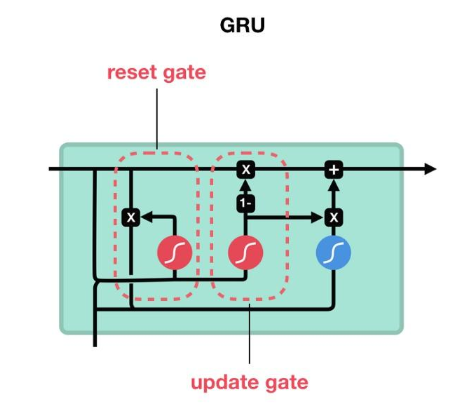

# GRU（Gated Recurrent Unit）

## 1. 一句话
- LSTM 的轻量化门控 RNN：用 **update/reset 两个门**控制“保留旧记忆 vs 写入新信息”，通常更省参数与计算。

## 2. 目标（解决什么问题）
- 和 LSTM 类似：缓解 Vanilla RNN 的长程依赖问题，但结构更简洁、训练更快。

## 3. 核心结构（模块图/数据流）

- 只有一个状态 `h_t`（没有显式 `c_t`）
- 门：
  - `z_t`（update gate）：保留旧 `h_{t-1}` 的比例（也可理解为写入强度）
  - `r_t`（reset gate）：在生成候选状态时“看不看”旧状态

## 4. 损失 / 训练目标
- 同 LSTM：作为序列建模单元，本身不定义特定损失。

## 5. 训练流程（关键公式）
- 常用写法：
  - $$z_t=\sigma(W_z[h_{t-1},x_t]+b_z),\ r_t=\sigma(W_r[h_{t-1},x_t]+b_r)$$
  - $$\tilde{h}_t=\tanh(W_h[r_t\odot h_{t-1},x_t]+b_h)$$
  - $$h_t=(1-z_t)\odot h_{t-1}+z_t\odot\tilde{h}_t$$
- 训练：BPTT；同样注意变长序列的 `mask/padding` 与梯度裁剪。

## 6. 推理
- many-to-one / many-to-many 与 LSTM 同理（取 `h_T`、pool、或逐步输出）。

## 7. 常见坑 & Debug 清单
- **门的写法差异**：不同资料可能把 `(1-z_t)` 与 `z_t` 的角色对调（本质一样）
- **过拟合**：参数少不代表不会过拟合；需要 dropout / 正则化 / 早停
- **padding 没 mask**：同 LSTM

## 8. 扩展与对比（相关模型）
- 对比：`LSTM`（更重但常更稳）、Vanilla RNN（更简单但长依赖差）
- 变体：Minimal GRU、LayerNorm GRU、BiGRU（见 [BiRNN.md](BiRNN.md)）

## 9. 参考
- Cho et al., 2014

