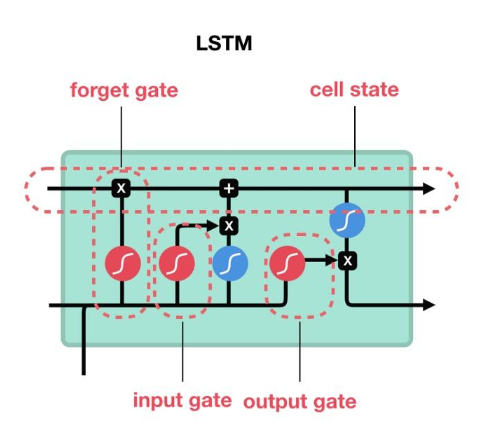

# LSTM（Long Short-Term Memory）

## 1. 一句话
- 用 **cell state `c_t`** + **门控**（忘记/写入/输出）让梯度更容易穿过长时间跨度，从而更稳地建模长期依赖。

## 2. 目标（解决什么问题）
- 缓解 Vanilla RNN 在长序列上的梯度消失/爆炸，使“该记的能记住、该忘的能忘掉”。

## 3. 核心结构（模块图/数据流）

- 状态：隐藏状态 `h_t` + 记忆状态（cell）`c_t`
- 门：
  - 忘记门 `f_t`：保留多少旧记忆 `c_{t-1}`
  - 输入门 `i_t` + 候选记忆 `g_t`：写入多少新信息
  - 输出门 `o_t`：把多少 cell 信息暴露为 `h_t`

## 4. 损失 / 训练目标
- LSTM 本身是编码器/状态更新单元；损失由任务决定（分类/回归/序列标注/语言模型等）。

## 5. 训练流程（关键公式）
- 常用写法（把 `h_{t-1}` 与 `x_t` 拼接为 `[h_{t-1}, x_t]`）：
  - $$f_t=\sigma(W_f[h_{t-1},x_t]+b_f),\ i_t=\sigma(W_i[h_{t-1},x_t]+b_i),\ o_t=\sigma(W_o[h_{t-1},x_t]+b_o)$$
  - $$g_t=\tanh(W_g[h_{t-1},x_t]+b_g)$$
  - $$c_t=f_t\odot c_{t-1}+i_t\odot g_t,\quad h_t=o_t\odot\tanh(c_t)$$
- 训练：BPTT（长序列常配 `gradient clipping`）；变长序列注意 `padding/mask`。

## 6. 推理
- many-to-one：用 `h_T`（或 pool）做序列 embedding
- many-to-many：每步输出 `y_t`（例如逐步预测/标注）

## 7. 常见坑 & Debug 清单
- **mask/padding**：没处理 padding 会把无效步也学进去（尤其是 batch 内变长）
- **初始状态**：`h_0/c_0` 用 0、可学习参数或由输入映射初始化；不同选择会影响收敛
- **长序列不稳定**：学习率过大/没做裁剪容易爆；过长可用截断 BPTT
- **输入表征**：某些任务（如轨迹）直接喂绝对坐标易学到坐标系偏置，常改用位移/速度等相对量

## 8. 扩展与对比（相关模型）
- 对比：`GRU`（更轻量，少一个显式 `c_t`）
- 变体：Peephole LSTM、Coupled gates、LayerNorm LSTM、ConvLSTM、BiLSTM（见 [BiRNN.md](BiRNN.md)）

## 9. 参考
- Hochreiter & Schmidhuber, 1997

