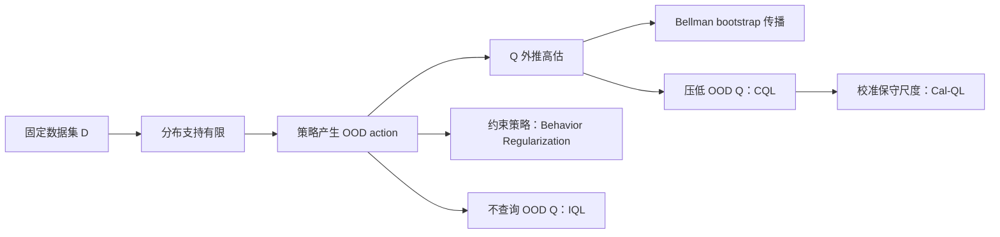

# 离线强化学习（Offline RL）

## 1. 一句话

离线强化学习只使用固定数据集

$$
\mathcal D=\{(s,a,r,s')\}
$$

训练期间不能再与环境交互，因此既要提升策略，又要避免策略和 Q-function 跑出数据支持域。

## 2. 它在现有 RL 结构中的位置

Offline RL 不是“策略优化 / 值优化”之外的第三种优化对象，而是一个**数据获取范式**：

| 维度 | 选项 | 回答的问题 |
|---|---|---|
| 优化对象 | 策略优化 / 值优化 | 学 $\pi$，还是学 $Q$ |
| 价值估计 | MC / TD / GAE | 如何估计回报、价值或优势 |
| 策略关系 | On-policy / Off-policy | 行为策略与目标策略是否相同 |
| 数据范式 | Online / Offline | 训练时能否继续向环境采集数据 |

> [!important] Off-policy 不等于 Offline
> Q-learning、DQN、SAC 都是 off-policy，但把它们直接放到固定数据集上训练，并不会自动成为可靠的 offline RL 算法。标准 off-policy 方法仍可能查询数据集未覆盖的动作并产生外推误差。

## 3. Offline 不等于只有一种 OOD

| OOD 维度 | 数学位置 | 对 Offline RL 的影响 |
|---|---|---|
| [[ObservationOOD|Observation OOD]] | $o_{\text{test}}\not\sim p_{\text{train}}(o)$ | policy 与 Q 在模型输入空间外泛化 |
| [[StateVisitationOOD|State-visitation OOD]] | $d^\pi(s)\neq d^\mu(s)$ | 部署策略进入离线轨迹未覆盖的完整世界状态 |
| [[ActionOODAndExtrapolationError|Action OOD]] | $a\notin\operatorname{support}\mathcal D(a\mid o,l)$ | Q 对数据外动作外推，策略利用虚假高值 |
| [[LanguageGoalTaskOOD|Language / Goal / Task OOD]] | $l$ 或任务语义超出训练条件分布 | 条件策略或 evaluator 误解目标 |
| [[TransitionRewardOOD|Transition / Reward OOD]] | $P_{\text{test}}\neq P_{\text{train}}$ 或 $R_{\text{test}}\neq R_{\text{train}}$ | 训练价值对应的后果或评价标准失效 |

CQL、IQL、Cal-QL 这一组经典 Offline RL 方法主要针对 **Action OOD**；其余位置需要单独诊断。[[EnvironmentShift|Environment Shift]] 与 [[EmbodimentShift|Embodiment Shift]] 则是可能同时诱发多种 OOD 的变化来源，不与上表五类并列。完整分类见 [[OODTaxonomy|OOD 分类总览]]。两个容易混淆的 RL 分类轴见 [[OnlineVsOffline]] 与 [[OnPolicyVsOffPolicy]]。

## 4. 方法地图

| 方法 | 核心做法 | 如何处理 OOD action | 主要代价或边界 |
|---|---|---|---|
| Behavior regularization | 约束 $\pi$ 靠近 behavior policy | 减少策略产生 OOD action | 太强会退化为模仿学习 |
| [[CQL]] | 给 Q 加保守正则 | OOD action 可以评价，但主动压低其 Q | 可能过度悲观 |
| [[IQL]] | expectile $V$ + dataset-action Q backup | critic 训练时不查询数据集外动作 | policy extraction 仍依赖函数泛化 |
| [[Cal-QL]] | 在 CQL 上加入 reference-value calibration | 既保守，又避免 Q 被压到不合理尺度 | 不自动解决其他 OOD 维度 |

## 5. 推荐学习顺序

1. [[BellmanEquation|Bellman 方程]]：理解 $\max Q$ 和 bootstrap。
2. [[TemporalDifference|TD]]：理解采样式 Bellman backup。
3. [[Q-learning DQN|Q-learning / DQN]]：理解 off-policy 值优化。
4. [[ActionOODAndExtrapolationError|Action OOD 与价值外推误差]]：理解标准 Q-learning 为什么在固定数据上失效。
5. [[CQL]]、[[IQL]]、[[Cal-QL]]：比较三种处理方式。
6. [[OODTaxonomy|OOD 分类总览]]：再按“偏移位置”和“变化来源”两条轴诊断其他分布偏移。

## 6. 与 V-GPS 的关系

V-GPS 没有部署 Cal-QL actor，而是保留 generalist VLA 负责生成候选，仅使用 Cal-QL 学到的 Q-function 做测试时重排：

$$
a_{1:K}\sim\pi_{\mathrm{VLA}}(a\mid s,l),
\qquad
a^*=\arg\max_{a_i}Q(s,a_i,l).
$$

Cal-QL 主要缓解候选动作相对离线数据支持域产生的价值外推风险。它不能保证 Q 面对新观测、未覆盖世界状态、新语言/任务或新转移规律时仍然可靠；跨环境或跨机器人只是这些偏移的可能来源。

## 7. 速查

- Offline RL 的核心矛盾：`policy improvement` vs `stay in data support`。
- CQL：**允许算 OOD，但压低 Q**。
- IQL：**critic 尽量不算 OOD action**。
- Cal-QL：**保守 Q + reference value 校准**。
- Action OOD 安全不等于 Observation、State-visitation、Language / Goal / Task 或 Transition / Reward 泛化。

## 8. 相关分类

- [[OnlineVsOffline]]：是否能继续向环境获取数据。
- [[OnPolicyVsOffPolicy]]：behavior policy 与 target policy 是否一致。
- [[OODTaxonomy|OOD 分类总览]]：按发生偏移的变量选择对应专题。
- [[神经网络/modules/rl/优化方法/README|优化方法总览]]：按三条独立轴查询全部算法。
