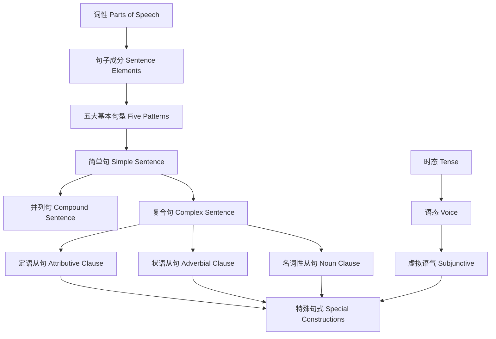

# 语法概念关系图

> 本图展示语法模块的依赖关系与学习路径

## 1. 核心概念层次

```
Sentence (句子)
  ├─ Structure (结构)
  │   ├─ Subject (主语)
  │   ├─ Predicate (谓语)
  │   │   ├─ Tense (时态)
  │   │   ├─ Voice (语态)
  │   │   └─ Mood (语气)
  │   ├─ Object (宾语)
  │   └─ Complement (补语)
  ├─ Type (类型)
  │   ├─ Simple Sentence (简单句)
  │   ├─ Compound Sentence (并列句)
  │   └─ Complex Sentence (复合句)
  │       └─ Clause (从句)
  │           ├─ Attributive (定语从句)
  │           ├─ Adverbial (状语从句)
  │           └─ Noun Clause (名词性从句)
  └─ Function (功能)
      ├─ Declarative (陈述句)
      ├─ Interrogative (疑问句)
      ├─ Imperative (祈使句)
      └─ Exclamatory (感叹句)
```

## 2. 时态系统矩阵

```
              │ 一般 (Simple) │ 进行 (Continuous) │ 完成 (Perfect) │ 完成进行 (Perfect Continuous)
──────────────┼───────────────┼───────────────────┼────────────────┼──────────────────────────────
现在 (Present) │ do/does       │ am/is/are doing   │ have/has done  │ have/has been doing
过去 (Past)    │ did           │ was/were doing    │ had done       │ had been doing
将来 (Future)  │ will do       │ will be doing     │ will have done │ will have been doing
```

## 3. 从句功能映射

```
名词性从句 ────────────────────────────────────────────────
  │
  ├─ 主语从句：That he came surprised me.
  │            ~~~~~~~~ (主语)
  │
  ├─ 宾语从句：I know that he is kind.
  │                  ~~~~~~~~~~~~ (宾语)
  │
  ├─ 表语从句：The fact is that we need help.
  │                      ~~~~~~~~~~~~~ (表语)
  │
  └─ 同位语从句：The news that he won spread quickly.
                       ~~~~~~~~~~~ (同位语)

定语从句 ──────────────────────────────────────────────────
  │
  └─ 修饰名词：The book which I bought is interesting.
                      ~~~~~~~~~~~~~ (修饰 book)

状语从句 ──────────────────────────────────────────────────
  │
  ├─ 时间：When I arrived, he had left.
  ├─ 原因：Because it rained, we stayed home.
  ├─ 条件：If you study hard, you will pass.
  ├─ 让步：Although he is young, he is capable.
  ├─ 目的：So that we can succeed, we must try.
  └─ 结果：He was so tired that he fell asleep.
```

## 4. 学习路径依赖



## 5. 关键节点

- **时态入口**：[modules/Tenses.md](modules/Tenses.md)
- **从句入口**：[modules/Clauses.md](modules/Clauses.md)
- **语态入口**：[modules/Voice.md](modules/Voice.md)
- **常见错误**：[modules/CommonErrors.md](modules/CommonErrors.md)

---

> 返回：[索引.md](索引.md) | [README.md](README.md) | [../英语索引.md](../英语索引.md)
