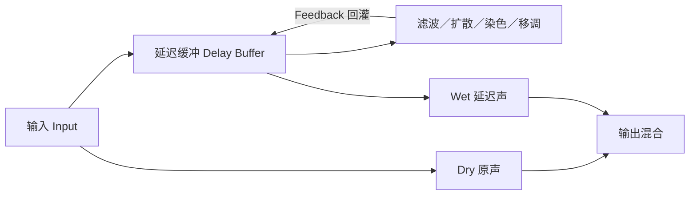

# 延迟与空间

导航：[[音乐/00-音乐索引|音乐索引]]｜[[音乐/practice/production/README|制作索引]]｜[[音乐/practice/production/音色|音色与效果器]]｜[[音乐/practice/production/混音|混音实践]]

## 1. 核心结论

**Delay 的本质是把输入声音复制一份，延迟一段时间后播放；再把一部分延迟输出送回输入，就形成会逐次衰减或增长的重复。**

滤波、扩散、饱和、移调和调制改变的是“复制品每重复一次会变成什么样”；声像、左右时间差和干湿比决定它在空间中如何出现。

> [!important]
> 选择 Delay 预设不是在选择一个玄学名称，而是在决定复制品要**多久后出现、重复多少次、清楚还是模糊、静止还是运动、居中还是向两侧展开**。

## 2. 第一性原理：延迟与反馈回路



可用一个简化关系理解反馈：

$$
w[n] = x[n] + g \cdot P\bigl(w[n-D]\bigr)
$$

- $D$：延迟时间，决定下一次重复何时出现。
- $g$：反馈量，决定重复衰减、维持还是增长。
- $P(\cdot)$：反馈回路中的滤波、扩散、饱和、移调等处理。
- Dry/Wet：决定原声与延迟声各占多少。

当反馈小于稳定边界时，重复会逐渐消失；接近边界时会形成长尾；超过边界时可能自激并越来越响。具体边界还受回路内的滤波、压缩和饱和影响，不能只看旋钮百分比。

## 3. Delay 的五个坐标轴

| 坐标轴   | 核心问题       | 主要控制                               | 听感结果                   |
| ----- | ---------- | ---------------------------------- | ---------------------- |
| 时间    | 复制品多久后出现？  | Delay Time、Sync、左右时间差              | 厚度、Slapback、节奏回声、长距离回应 |
| 反馈    | 会重复多少次？    | Feedback、Cross Feedback、Freeze     | 单次回声、衰减尾巴、持续循环、自激      |
| 重复音色  | 每次重复长什么样？  | Filter、Diffuse、Drive、Lo-Fi、Pitch   | 越来越暗、模糊、失真、破碎或移调       |
| 运动    | 重复是否随时间变化？ | LFO、Envelope、Delay Time Modulation | 晃动、Chorus、漂移、动态扩散      |
| 空间与混合 | 出现在哪里、占多少？ | Stereo、Ping-Pong、Pan、Dry/Wet、Send  | 居中、左右跳动、加宽、远近与前后层次     |

可以把“重复音色”按处理模块分成六种常见方向：

| 方向            | 每次反馈发生什么                       |
| ------------- | ------------------------------ |
| Clean         | 尽量保持原样                         |
| Filtered      | 高频或低频逐次减少，回声退到背景               |
| Diffused      | 瞬态逐次被打散，回声从颗粒变成雾状尾巴            |
| Saturated     | Drive 或 Dynamics 使谐波、压缩或失真逐次累积 |
| Lo-Fi         | 降采样或位深失真逐次累积                   |
| Pitch-shifted | 每次反馈继续移调，音高逐轮升高、降低或改变音程        |

## 4. 同一套延迟网络为何能产生不同效果

时间很短时，人耳不一定把复制品识别成独立回声，而会把它与原声融合为音色、宽度或厚度。随着时间和反馈增加，复制品才逐渐成为可辨认的节奏与空间层。

| 大致区域 | 主要感知 | 常见用途 |
| --- | --- | --- |
| 极短延迟 | 相位、梳状滤波、宽度或调制色彩 | Doubling、Chorus、Flanger 类效果 |
| 短延迟，约几十至一百多毫秒 | 原声变厚，或出现单次短回声 | Slapback、人声／吉他增厚 |
| 与拍速同步的中等延迟 | 能听清节奏性重复 | 1/8、1/4、附点 1/8 回声 |
| 长延迟与较高反馈 | 明显回应和远距离拖尾 | Delay Throw、氛围、段落打开 |
| 高扩散的反馈网络 | 重复颗粒逐渐融合成空间尾巴 | Diffuse Delay、Reverb-like Tail |

因此下面这些不是完全独立的“效果器盒子”，而是延迟网络不同参数区域形成的连续谱：

`Delay → Slapback → Doubling → Chorus → Diffuse Delay → Reverb-like Tail`

> [!note] Diffuse Delay 不等于所有 Reverb
> 扩散可以让回声变得像混响，但传统混响还会建模早期反射、反射密度和空间衰减等关系。这里强调的是听感与结构的连续性，不是说两者算法完全相同。

## 5. 不看预设名的选择流程

先问“原声后面多出来的东西承担什么功能”，再选预设范围：

1. **需要听见一颗颗回声吗？**
   - 不需要：先看 Slapback、Doubling、Modulation、Widening 或高扩散空间。
   - 需要：继续判断回声时间和节奏。
2. **回声离原声多远？**
   - 很近：短 Delay／Slapback。
   - 成为律动：与拍速同步的 1/8、1/4、附点或三连音。
   - 成为远处回应：Long Delay／Delay Throw。
3. **回声清楚还是模糊？**
   - 清楚：低扩散、较少回路处理。
   - 模糊：增加 Diffuse，并控制反馈和频谱。
4. **回声稳定还是运动？**
   - 稳定：保持时间、音高和声像相对静止。
   - 运动：调制 Delay Time、Pitch、Pan、Filter 或 Diffuse。
5. **中心还是左右展开？**
   - 中心／单声道安全：Mono 或较窄 Stereo Width。
   - 展开：左右时间差、Ping-Pong、Cross Feedback 或轻微调制。

## 6. 常见任务的参数方向

| 音乐需求 | 时间 | 反馈 | 重复音色 | 运动 | 空间／混合 |
| --- | --- | --- | --- | --- | --- |
| 主唱太干，但不想听见回声 | 短 | 低 | Clean 或轻滤波 | 无或极少 | Wet 小，必要时做左右差异 |
| 人声或吉他需要增厚 | Slapback | 低 | 保留音头 | 静止 | 居中或窄立体声 |
| 明显的节奏性回声 | 与拍速同步 | 中等 | 逐次变暗通常更让位 | 可少量 | 按编曲选择 Mono／Ping-Pong |
| 副歌突然打开梦幻空间 | 中长 | 中高 | 高扩散、适度滤波 | 缓慢运动 | 宽，使用自动化控制进入与退出 |
| 主唱中心清楚、两侧变宽 | 极短左右差异 | 低 | Clean | 少量调制 | Wet 主要放两侧并检查 Mono |
| 转场或 Sound Design | 自由或自动化 | 高或 Freeze | Lo-Fi、Pitch、Drive、Diffuse | 明显 | 配合声像和自动化 |

这些是方向，不是固定数值。Delay 是否成立，取决于拍速、音符密度、声源包络和其他声部留下的空间。

## 7. 如何翻译预设名称

不要背完整名称，只提取能够映射到五个坐标轴的词。

以 `Bright Super Diffused bM` 为例：

- **Bright**：延迟尾巴保留较多高频，频谱较亮。
- **Super Diffused**：重复的瞬态被强烈打散，不再是清楚的“哒—哒—哒”，而更接近明亮、宽、朦胧的尾巴。
- **bM**：仅凭名称无法可靠推出音乐功能；除非界面或官方说明给出定义，否则不要硬猜。

功能翻译是：

> [!example]
> 给人声、Pad 或 Lead 后面铺一层明亮、宽、扩散的空间；不适合需要逐颗听清 Echo 的任务。

预设浏览器中即使某个分类叫 `Reverb`，也可能出现 Chorus、Widener 或 Thickening。这通常是按最终用途和听感归类，而不是宣称它们属于互斥的算法类型。

## 8. 项目里真正应该记录什么

不要只写“用了某某 Preset”。至少记录以下信息：

```markdown
- 声源／轨道：
- 音乐功能：增厚／节奏回声／空间尾巴／加宽／转场
- Delay Time：毫秒或拍值，是否左右不同
- Feedback：大致强度，是否 Cross Feedback／Freeze
- 重复音色：Clean／Filtered／Diffused／Saturated／Lo-Fi／Pitch-shifted
- 运动来源：无／LFO／Envelope／自动化／输入跟随
- 空间：Mono／Stereo Width／Ping-Pong／声像
- 路由：Insert 或 Send；Dry/Wet 或发送量
- Mono 检查：是否出现相位抵消或宽度塌陷
- 使用理由：它解决了哪一个编曲或混音问题
```

值得保存的是**决策与听感坐标**；只有当某个预设是项目复现所必需时，才额外记录插件版本和完整预设名。

## 9. 常见误区

- **只凭预设名选效果**：名称描述的是一个参数点，不能替代音乐功能判断。
- **只记 Wet，不记路由**：Insert 的 20% Mix 与 Send 轨的 100% Wet 不是同一设置。
- **反馈越多越有空间**：高反馈也会遮挡后续歌词、和弦和鼓点，并可能进入自激。
- **加宽后不检查 Mono**：极短左右延迟会改变相位关系，折叠到单声道时可能变薄或产生梳状滤波。
- **把 Diffuse 当成普通 Reverb 替代品**：它能产生混响般尾巴，但时间结构和空间暗示未必相同。
- **忽略 Delay Time 自动化模式**：改变延迟时间时，磁带式滑音与时间伸缩补偿对音高的处理不同，记录自动化时应把模式一并记下。
- **先选大空间，再写声部**：空间效果无法替代节奏、音区和留白上的编曲分工。

## 10. 相关模块

- 效果器与声音塑形的总框架：[[音乐/practice/production/音色|音色与效果器]]
- 多轨空间与频率关系：[[音乐/practice/production/混音|混音实践]]
- 效果进入段落和密度变化：[[音乐/practice/arrangement/README|编曲实践]]
- 具体 DAW 与插件操作笔记：[[音乐/practice/production/fl-studio/README|FL Studio]]
