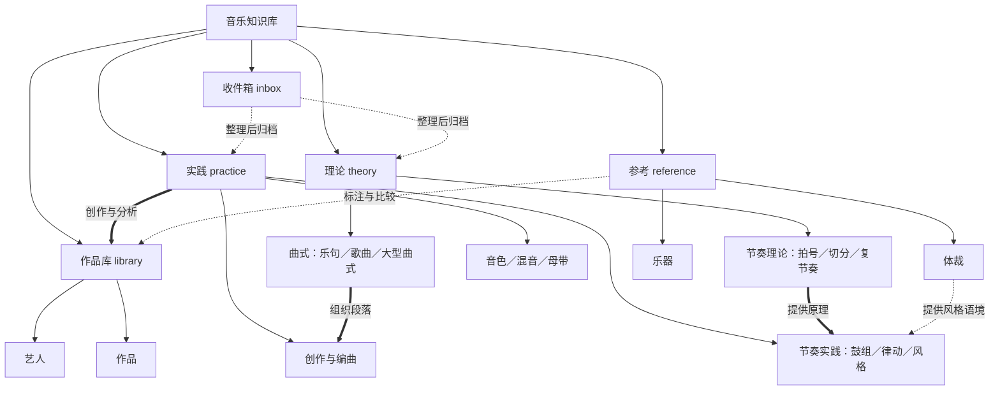

# 音乐知识库概念图

导航：[[音乐/README|组织说明]]｜[[音乐/00-音乐索引|音乐索引]]

## 关键入口

- 理论总览：[[音乐/theory/README]]
- 节奏理论：[[音乐/theory/03-rhythm/拍号]]
- 节奏实践：[[音乐/practice/rhythm/README]]
- 曲式索引：[[音乐/theory/05-form/索引]]
- 创作与编曲：[[音乐/practice/composition/旋律]]｜[[音乐/practice/arrangement/README|编曲]]
- 体裁与乐器：[[音乐/reference/索引]]
- 作品与艺人：[[音乐/library/works/索引]]｜[[音乐/library/artists/索引]]
